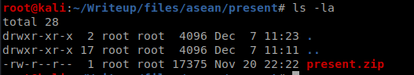
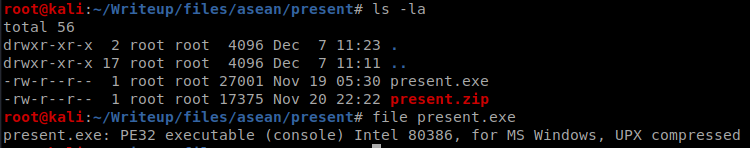
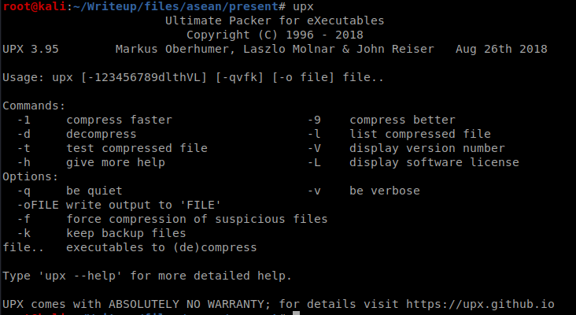
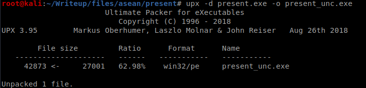
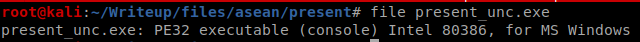
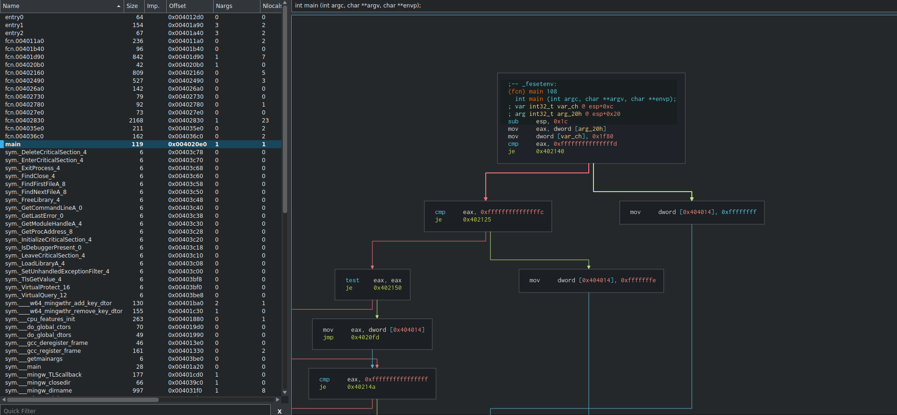
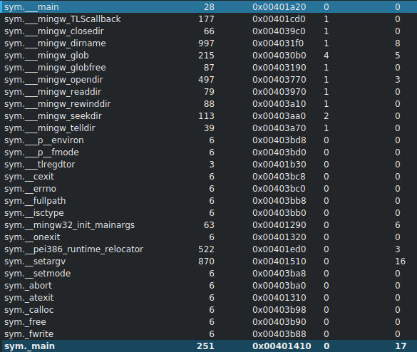
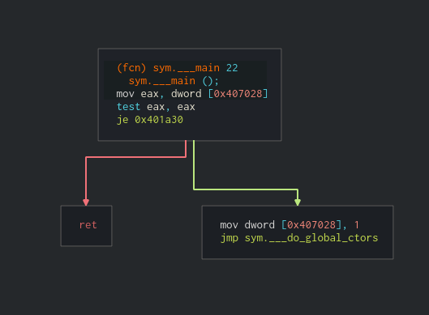
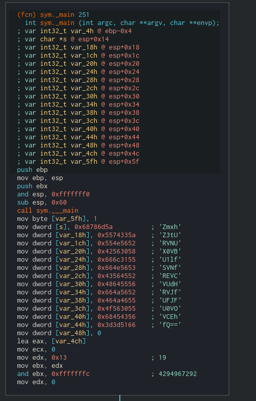

# [BINARY] Present - 100 Pts.
<br />
We were given this file:
<br />


<br />
After extracting the contents, we got present.exe.
We can also see what kind of file type it is. A PE binary but packed with UPX (Ultimate Packer for eXecutables)


<br />

We can unpack this using the UPX tool.


<br />

After unpacking, we can now see that it is a windows PE 32 bit. We can do static analysis against the unpacked PE to investigate what it really does.




<br />

To investigate the binary, we used Cutter (radare2 w/ GUI)

{:height="100%" width="100%"}

First, we have to find the main. From the image above, it is concluded
that the "main" identified by the Cutter (highlighted)
doesn't really do that's interesting. Therefore, we proceeded finding
other interesting functions

<br />
In the image below, we can see there are two mains:

```C
sym.__main and sym._main
```



Let's see what 

```sym.__main``` 

does... It looks like it only goes to the .ctors of the binary



Let's check ```sym._main```... There's an interesting string that's encoded in base64



<br />
After decoding, we got the flag.


:D :D :D

Thank you for reading!


