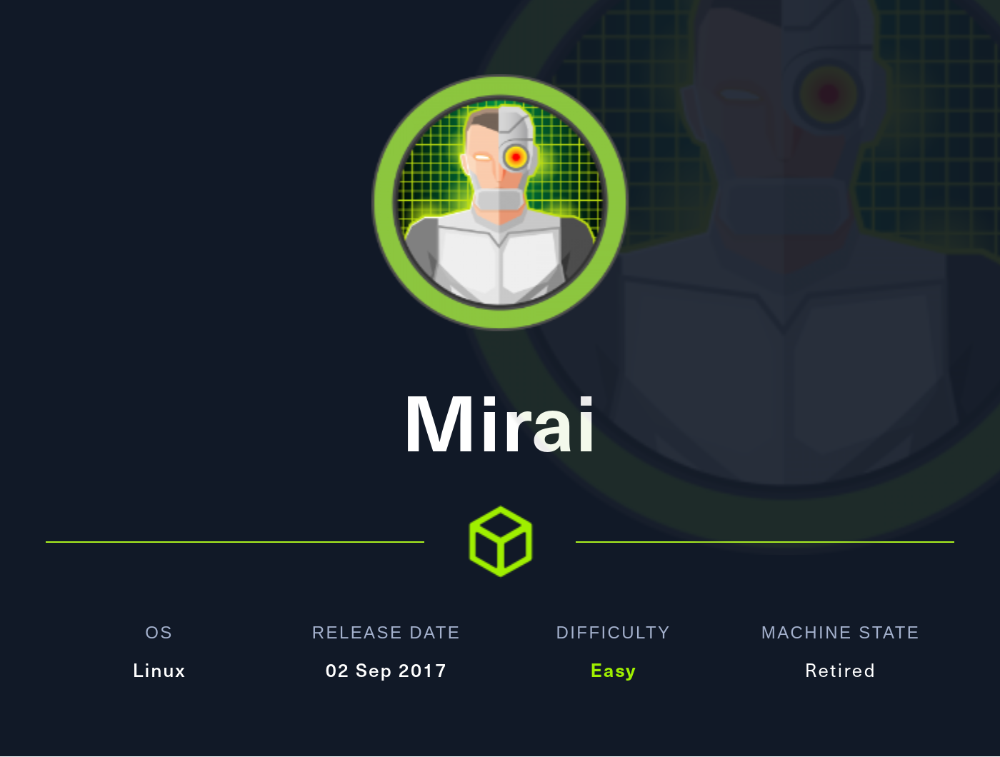
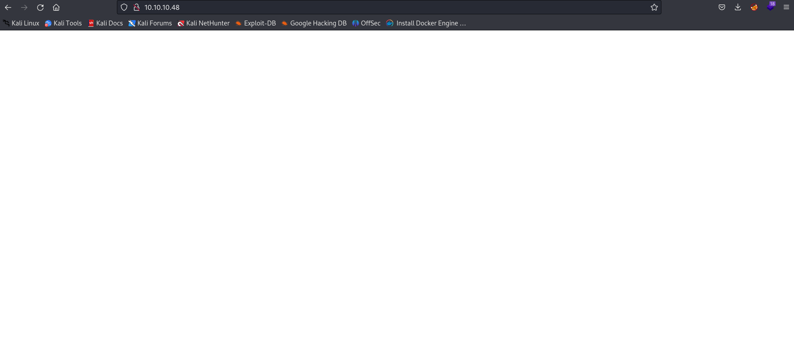
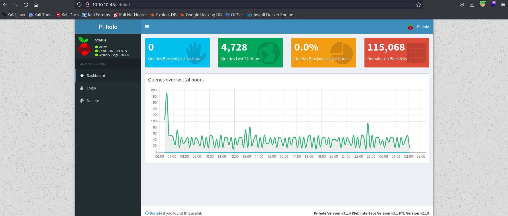
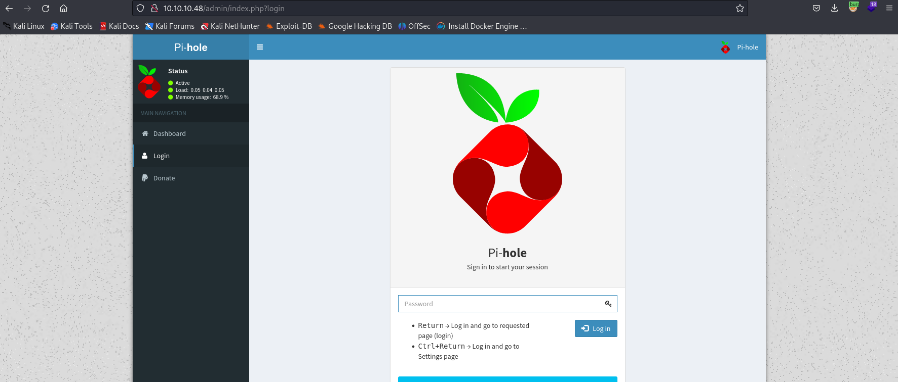

# [EASY] Mirai <br/>



# [EASY] Mirai <br/>


# <span style="color:red">Introduction</span> 


**Mirai** turned out to be quite an approachable box! Bagging the user flag was a breeze, although I did stumble a bit on the root.txt part – not my usual forte, but that's what makes CTFs exciting, right? Exploring new challenges was an absolute blast, and I had a great time with it!


# <span style="color:red">Box Info</span>

<table>
  <thead>
    <tr>
      <th>Name</th>
    <th style="text-align: right"><a href="https://affiliate.hackthebox.com/box?box=Mirai" target="_blank" style="font-size: xx-large; : 0 0 5px #ffffff, 0 0 3px #ffffff; color: #ffffff">
      Mirai
      </a><br /></th>
    </tr>
  </thead>
  <tbody>
    <tr>
      <td>OS</td>
      <td style="text-align: right"><a style="font-size: x-large; : 0 0 5px #ffffff, 0 0 7px #ffffff; color: #2020E">
      Linux
      </a></td>
    </tr>
     <tr>
      <td>1st User blood</td>
      <td style="text-align: right"><a href="https://www.hackthebox.eu/home/users/profile/1453"></a></td>
    </tr>
    <tr>
      <td>1st System blood</td>
      <td style="text-align: right"><a href="https://www.hackthebox.eu/home/users/profile/8467"></a></td>
    </tr>
  </tbody>
</table>


# <span style="color:red">Basic Enuemeration</span>
## Scanning for open ports using Nmap

Nmap found port 22, 53, 80, 1238, 32400, and 32469 open:
<br />

```bash                          
┌──(yoon㉿kali)-[~/Documents/htb/mirai/nmap]
└─$ cat allport-Pn       
# Nmap 7.93 scan initiated Thu Nov  2 22:53:21 2023 as: nmap -p- --min-rate 10000 -oN /home/yoon/Documents/htb/mirai/nmap/allport-Pn -vv 10.10.10.48
Nmap scan report for 10.10.10.48 (10.10.10.48)
Host is up, received echo-reply ttl 63 (0.27s latency).
Scanned at 2023-11-02 22:53:21 EDT for 10s
Not shown: 65529 closed tcp ports (reset)
PORT      STATE SERVICE REASON
22/tcp    open  ssh     syn-ack ttl 63
53/tcp    open  domain  syn-ack ttl 63
80/tcp    open  http    syn-ack ttl 63
1238/tcp  open  hacl-qs syn-ack ttl 63
32400/tcp open  plex    syn-ack ttl 63
32469/tcp open  unknown syn-ack ttl 63

Read data files from: /usr/bin/../share/nmap
# Nmap done at Thu Nov  2 22:53:31 2023 -- 1 IP address (1 host up) scanned in 10.54 seconds
```

## Nmap version scan

I should check on port 80, 1238(Platinum UPnP 1.0.5.13), 32400(Plex Media Server httpd), 32469(Platinum UPnP 1.0.5.13).
<br />
> Platinum UPnP is an open-source Universal Plug and Play (UPnP) library that **enables devices to discover each other on a local network and communicate**. UPnP is a set of networking protocols that allow devices to discover each other and establish functional network services. Platinum UPnP provides developers with a library to integrate UPnP capabilities into their software and devices, making it easier for different devices to communicate and share resources like files, media, and more.
<br />
> Plex Media Server is a multimedia server and platform that allows you to **organize, manage, and stream your media content** (such as movies, TV shows, music, photos) across various devices. It has a built-in web-based user interface (HTTP server) that enables users to control and configure the Plex Media Server, access their media library, and stream content using a web browser.
<br />

```
┌──(yoon㉿kali)-[~/Documents/htb/mirai/nmap]
└─$ cat sVC-openport-only 
# Nmap 7.93 scan initiated Thu Nov  2 22:55:31 2023 as: nmap -sVC -p 22,53,80,1238,32400,32469 -vv -oN sVC-openport-only 10.10.10.48
Nmap scan report for 10.10.10.48 (10.10.10.48)
Host is up, received echo-reply ttl 63 (0.29s latency).
Scanned at 2023-11-02 22:55:32 EDT for 24s

PORT      STATE SERVICE REASON         VERSION
22/tcp    open  ssh     syn-ack ttl 63 OpenSSH 6.7p1 Debian 5+deb8u3 (protocol 2.0)
| ssh-hostkey: 
|   1024 aaef5ce08e86978247ff4ae5401890c5 (DSA)
| ssh-dss AAAAB3NzaC1kc3MAAACBAJpzaaGcmwdVrkG//X5kr6m9em2hEu3SianCnerFwTGHgUHrRpR6iocVhd8gN21TPNTwFF47q8nUitupMBnvImwAs8NcjLVclPSdFJSWwTxbaBiXOqyjV5BcKty+s2N8I9neI2coRBtZDUwUiF/1gUAZIimeKOj2x39kcBpcpM6ZAAAAFQDwL9La/FPu1rEutE8yfdIgxTDDNQAAAIBJbfYW/IeOFHPiKBzHWiM8JTjhPCcvjIkNjKMMdS6uo00/JQH4VUUTscc/LTvYmQeLAyc7GYQ/AcLgoYFHm8hDgFVN2D4BQ7yGQT9dU4GAOp4/H1wHPKlAiBuDQMsyEk2s2J+60Rt+hUKCZfnxPOoD9l+VEWfZQYCTOBi3gOAotgAAAIBd6OWkakYL2e132lg6Z02202PIq9zvAx3tfViuU9CGStiIW4eH4qrhSMiUKrhbNeCzvdcw6pRWK41+vDiQrhV12/w6JSowf9KHxvoprAGiEg7GjyvidBr9Mzv1WajlU9BQO0Nc7poV2UzyMwLYLqzdjBJT28WUs3qYTxanaUrV9g==
|   2048 e8c19dc543abfe61233bd7e4af9b7418 (RSA)
| ssh-rsa AAAAB3NzaC1yc2EAAAADAQABAAABAQCpSoRAKB+cPR8bChDdajCIpf4p1zHfZyu2xnIkqRAgm6Dws2zcy+VAZriPDRUrht10GfsBLZtp/1PZpkUd2b1PKvN2YIg4SDtpvTrdwAM2uCgUrZdKRoFa+nd8REgkTg8JRYkSGQ/RxBZzb06JZhRSvLABFve3rEPVdwTf4mzzNuryV4DNctrAojjP4Sq7Msc24poQRG9AkeyS1h4zrZMbB0DQaKoyY3pss5FWJ+qa83XNsqjnKlKhSbjH17pBFhlfo/6bGkIE68vS5CQi9Phygke6/a39EP2pJp6WzT5KI3Yosex3Br85kbh/J8CVf4EDIRs5qismW+AZLeJUJHrj
|   256 b6a07838d0c810948b44b2eaa017422b (ECDSA)
| ecdsa-sha2-nistp256 AAAAE2VjZHNhLXNoYTItbmlzdHAyNTYAAAAIbmlzdHAyNTYAAABBBCl89gWp+rA+2SLZzt3r7x+9sXFOCy9g3C9Yk1S21hT/VOmlqYys1fbAvqwoVvkpRvHRzbd5CxViOVih0TeW/bM=
|   256 4d6840f720c4e552807a4438b8a2a752 (ED25519)
|_ssh-ed25519 AAAAC3NzaC1lZDI1NTE5AAAAILvYtCvO/UREAhODuSsm7liSb9SZ8gLoZtn7P46SIDZL
53/tcp    open  domain  syn-ack ttl 63 dnsmasq 2.76
| dns-nsid: 
|_  bind.version: dnsmasq-2.76
80/tcp    open  http    syn-ack ttl 63 lighttpd 1.4.35
|_http-title: Site doesn't have a title (text/html; charset=UTF-8).
| http-methods: 
|_  Supported Methods: OPTIONS GET HEAD POST
|_http-server-header: lighttpd/1.4.35
1238/tcp  open  upnp    syn-ack ttl 63 Platinum UPnP 1.0.5.13 (UPnP/1.0 DLNADOC/1.50)
32400/tcp open  http    syn-ack ttl 63 Plex Media Server httpd
|_http-cors: HEAD GET POST PUT DELETE OPTIONS
|_http-title: Unauthorized
|_http-favicon: Plex
| http-auth: 
| HTTP/1.1 401 Unauthorized\x0D
|_  Server returned status 401 but no WWW-Authenticate header.
32469/tcp open  upnp    syn-ack ttl 63 Platinum UPnP 1.0.5.13 (UPnP/1.0 DLNADOC/1.50)
Service Info: OS: Linux; CPE: cpe:/o:linux:linux_kernel

Read data files from: /usr/bin/../share/nmap
Service detection performed. Please report any incorrect results at https://nmap.org/submit/ .
# Nmap done at Thu Nov  2 22:55:56 2023 -- 1 IP address (1 host up) scanned in 24.46 seconds
```

# <span style="color:red">In-depth Enuemeration</span>

## Port 80

On port 80, very weirdly, it shows empty white screen with no content inside of it. 
<br />



<br />
Expecting to find any interesting directories from http://10.10.10.48, I ran feroxbuster towards it. 
<br />
Feroxbuster found directory /admin, which reveals what this box is about.
<br />

```bash
┌──(yoon㉿kali)-[~/Documents/htb/mirai/nmap]
└─$ feroxbuster -u http://10.10.10.48

 ___  ___  __   __     __      __         __   ___
|__  |__  |__) |__) | /  `    /  \ \_/ | |  \ |__
|    |___ |  \ |  \ | \__,    \__/ / \ | |__/ |___
by Ben "epi" Risher 🤓                 ver: 2.10.0
───────────────────────────┬──────────────────────
 🎯  Target Url            │ http://10.10.10.48
 🚀  Threads               │ 50
 📖  Wordlist              │ /usr/share/seclists/Discovery/Web-Content/raft-medium-directories.txt
 👌  Status Codes          │ All Status Codes!
 💥  Timeout (secs)        │ 7
 🦡  User-Agent            │ feroxbuster/2.10.0
 💉  Config File           │ /etc/feroxbuster/ferox-config.toml
 🔎  Extract Links         │ true
 🏁  HTTP methods          │ [GET]
 🔃  Recursion Depth       │ 4
───────────────────────────┴──────────────────────
 🏁  Press [ENTER] to use the Scan Management Menu™
──────────────────────────────────────────────────
200      GET        1l        1w       13c http://10.10.10.48/versions
200      GET      145l     2311w    14164c http://10.10.10.48/admin/LICENSE
200      GET       20l      170w     1085c http://10.10.10.48/admin/scripts/vendor/LICENSE
200      GET       20l      170w     1085c http://10.10.10.48/admin/style/vendor/LICENSE
[####################] - 4m    210000/210000  0s      found:4       errors:3286   
[####################] - 4m     30000/30000   120/s   http://10.10.10.48/ 
[####################] - 4m     30000/30000   124/s   http://10.10.10.48/admin/ 
[####################] - 4m     30000/30000   119/s   http://10.10.10.48/admin/scripts/ 
[####################] - 4m     30000/30000   122/s   http://10.10.10.48/admin/img/ 
[####################] - 4m     30000/30000   120/s   http://10.10.10.48/admin/style/ 
[####################] - 4m     30000/30000   122/s   http://10.10.10.48/admin/scripts/vendor/ 
[####################] - 4m     30000/30000   122/s   http://10.10.10.48/admin/style/vendor/   
```

### /admin

**/admin** page shows pihole web interface page:
<br />


<br />
I tried logging in using default credentials, which didn't work, so I decided there's not much to do here:
<br />



# <span style="color:red">Initial foothold</span>


Now knowing that there's pi hole running on this box, I tried sshing to the box using default credential (pi:raspberry).
<br />
Surprising, it worked, and I now have access as user pi.
<br />

```bash
┌──(yoon㉿kali)-[~/Documents/htb/mirai]
└─$ ssh pi@10.10.10.48
pi@10.10.10.48's password: 

The programs included with the Debian GNU/Linux system are free software;
the exact distribution terms for each program are described in the
individual files in /usr/share/doc/*/copyright.

Debian GNU/Linux comes with ABSOLUTELY NO WARRANTY, to the extent
permitted by applicable law.
Last login: Fri Nov  3 01:50:19 2023 from 10.10.14.6

SSH is enabled and the default password for the 'pi' user has not been changed.
This is a security risk - please login as the 'pi' user and type 'passwd' to set a new password.


SSH is enabled and the default password for the 'pi' user has not been changed.
This is a security risk - please login as the 'pi' user and type 'passwd' to set a new password.

pi@raspberrypi:~ $ id
uid=1000(pi) gid=1000(pi) groups=1000(pi),4(adm),20(dialout),24(cdrom),27(sudo),29(audio),44(video),46(plugdev),60(games),100(users),101(input),108(netdev),117(i2c),998(gpio),999(spi)
```
<br />
Weirdly, it seems that user **pi** has sudo rights as well. 
<br />

```bash
Matching Defaults entries for pi on localhost:
    env_reset, mail_badpass, secure_path=/usr/local/sbin\:/usr/local/bin\:/usr/sbin\:/usr/bin\:/sbin\:/bin

User pi may run the following commands on localhost:
    (ALL : ALL) ALL
    (ALL) NOPASSWD: ALL
```

# <span style="color:red">Gaining root flag</span>

Without further privilege escalation, I can access **/root** folder:
<br />

```bash
pi@raspberrypi:~ $ sudo su
root@raspberrypi:/home/pi# cd /root
root@raspberrypi:~# pwd
/root
```
<br />

Trying to read **root.txt**, I realized there's a little more to be done to get root.txt:
<br />

```bash
root@raspberrypi:~# cat root.txt 
I lost my original root.txt! I think I may have a backup on my USB stick...
```
<br />

It seems like I have to recover root.txt from somewhere. 
<br />

I knew that usb mounts to **/media** so I checked, and there was **usbstick** mounted.
<br />

However, it seemed like James accidently deleted the file so I have to restore it:

<br />

```bash
root@raspberrypi:/media/usbstick# cat damnit.txt 
Damnit! Sorry man I accidentally deleted your files off the USB stick.
Do you know if there is any way to get them back?

-James
```
<br />

From ```df -lh``` command, I know **usbstick** is on **/dev/sdb**:

<br />

```bash
root@raspberrypi:/media/usbstick# df -lh
Filesystem      Size  Used Avail Use% Mounted on
aufs            8.5G  2.9G  5.2G  36% /
tmpfs           100M  4.8M   96M   5% /run
/dev/sda1       1.3G  1.3G     0 100% /lib/live/mount/persistence/sda1
/dev/loop0      1.3G  1.3G     0 100% /lib/live/mount/rootfs/filesystem.squashfs
tmpfs           250M     0  250M   0% /lib/live/mount/overlay
/dev/sda2       8.5G  2.9G  5.2G  36% /lib/live/mount/persistence/sda2
devtmpfs         10M     0   10M   0% /dev
tmpfs           250M  8.0K  250M   1% /dev/shm
tmpfs           5.0M  4.0K  5.0M   1% /run/lock
tmpfs           250M     0  250M   0% /sys/fs/cgroup
tmpfs           250M  8.0K  250M   1% /tmp
/dev/sdb        8.7M   93K  7.9M   2% /media/usbstick
tmpfs            50M     0   50M   0% /run/user/999
tmpfs            50M     0   50M   0% /run/user/1000
```
<br />

I can read the disk with **strings** command which reads all human readable content:
<br />

```bash
root@raspberrypi:/media/usbstick# strings /dev/sdb
>r &
/media/usbstick
lost+found
root.txt
damnit.txt
>r &
>r &
/media/usbstick
lost+found
root.txt
damnit.txt
>r &
/media/usbstick
2]8^
lost+found
root.txt
damnit.txt
>r &
3d3e483143ff12ec505d026fa13e020b
Damnit! Sorry man I accidentally deleted your files off the USB stick.
Do you know if there is any way to get them back?
-James
```

Now I have the flag.

## Sources
