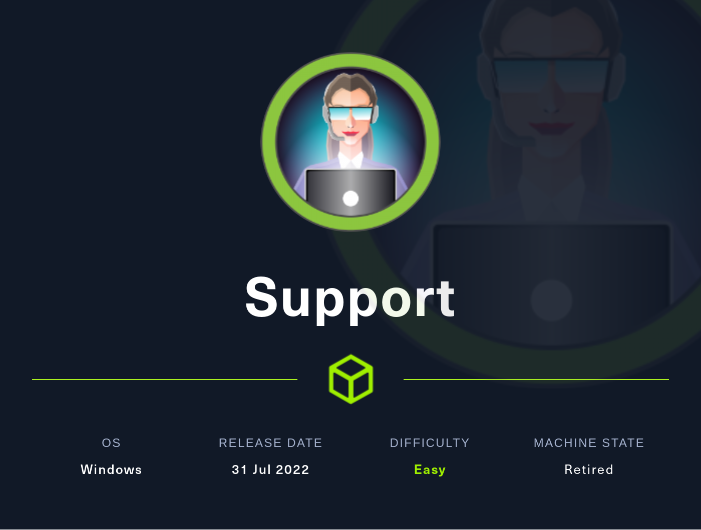
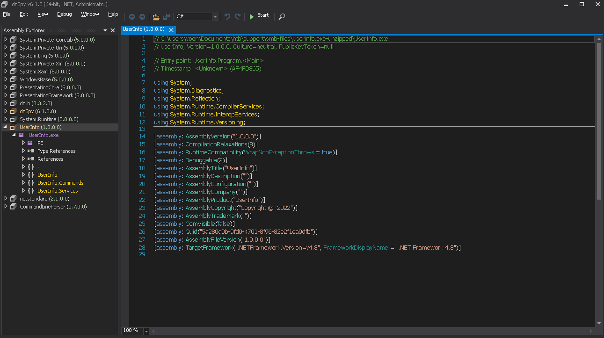
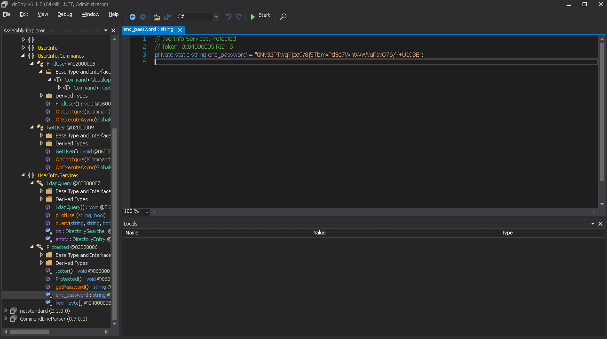

# [EASY] Support <br/>





# <span style="color:red">Introduction</span> 

**Support**, labeled as "*Easy*" on HackTheBox, proved to be a challenging yet instructive endeavor. 


# <span style="color:red">Box Info</span>

<table>
  <thead>
    <tr>
      <th>Name</th>
    <th style="text-align: right"><a href="https://affiliate.hackthebox.com/box?box=support" target="_blank" style="font-size: xx-large; : 0 0 5px #ffffff, 0 0 3px #ffffff; color: #ffffff">
      Support
      </a><br /></th>
    </tr>
  </thead>
  <tbody>
    <tr>
      <td>OS</td>
      <td style="text-align: right"><a style="font-size: x-large; : 0 0 5px #ffffff, 0 0 7px #ffffff; color: #2020E">
      Windows
      </a></td>
    </tr>
     <tr>
      <td>1st User blood</td>
      <td style="text-align: right"><a href="https://www.hackthebox.eu/home/users/profile/2761"></a></td>
    </tr>
    <tr>
      <td>1st System blood</td>
      <td style="text-align: right"><a href="https://www.hackthebox.eu/home/users/profile/357237"></a></td>
    </tr>
  </tbody>
</table>


# <span style="color:red">Nmap Enumerationn</span>
## Scanning for open ports using Nmap


Nmap found so many port open: **3,88,135,139,389,445,464,593,636,3268,3269,5985,9389,49664,49667,49674,49686,49700,64527**. 
<br />
This box looks like a typically Domain controller. 
<br />

```nmap
┌──(yoon㉿kali)-[~/Documents/htb/support]
└─$ cat nmap/open-pport-scan 
# Nmap 7.93 scan initiated Thu Oct 12 11:24:39 2023 as: nmap -sS -p- -oN nmap/open-pport-scan -vv 10.10.11.174
Nmap scan report for localhost (10.10.11.174)
Host is up, received echo-reply ttl 127 (0.34s latency).
Scanned at 2023-10-12 11:24:40 EDT for 950s
Not shown: 65516 filtered tcp ports (no-response)
PORT      STATE SERVICE          REASON
53/tcp    open  domain           syn-ack ttl 127
88/tcp    open  kerberos-sec     syn-ack ttl 127
135/tcp   open  msrpc            syn-ack ttl 127
139/tcp   open  netbios-ssn      syn-ack ttl 127
389/tcp   open  ldap             syn-ack ttl 127
445/tcp   open  microsoft-ds     syn-ack ttl 127
464/tcp   open  kpasswd5         syn-ack ttl 127
593/tcp   open  http-rpc-epmap   syn-ack ttl 127
636/tcp   open  ldapssl          syn-ack ttl 127
3268/tcp  open  globalcatLDAP    syn-ack ttl 127
3269/tcp  open  globalcatLDAPssl syn-ack ttl 127
5985/tcp  open  wsman            syn-ack ttl 127
9389/tcp  open  adws             syn-ack ttl 127
49664/tcp open  unknown          syn-ack ttl 127
49667/tcp open  unknown          syn-ack ttl 127
49674/tcp open  unknown          syn-ack ttl 127
49686/tcp open  unknown          syn-ack ttl 127
49700/tcp open  unknown          syn-ack ttl 127
64527/tcp open  unknown          syn-ack ttl 127

Read data files from: /usr/bin/../share/nmap
# Nmap done at Thu Oct 12 11:40:30 2023 -- 1 IP address (1 host up) scanned in 950.82 seconds
```

## nmap version scan

Version scan found nothing that special.
<br />
There's services such as LDAP, MSRPC, and kerberos running on this box.
<br />

```nmap
┌──(yoon㉿kali)-[~/Documents/htb/support]
└─$ cat nmap/verion-scan    
# Nmap 7.93 scan initiated Thu Oct 12 11:44:02 2023 as: nmap -sVC -p 53,88,135,139,389,445,464,593,636,3268,3269,5985,9389,49664,49667,49674,49686,49700,64527 -oN nmap/verion-scan -vv 10.10.11.174
Nmap scan report for localhost (10.10.11.174)
Host is up, received echo-reply ttl 127 (0.35s latency).
Scanned at 2023-10-12 11:44:03 EDT for 113s

PORT      STATE SERVICE       REASON          VERSION
53/tcp    open  domain        syn-ack ttl 127 Simple DNS Plus
88/tcp    open  kerberos-sec  syn-ack ttl 127 Microsoft Windows Kerberos (server time: 2023-10-12 15:44:11Z)
135/tcp   open  msrpc         syn-ack ttl 127 Microsoft Windows RPC
139/tcp   open  netbios-ssn   syn-ack ttl 127 Microsoft Windows netbios-ssn
389/tcp   open  ldap          syn-ack ttl 127 Microsoft Windows Active Directory LDAP (Domain: support.htb0., Site: Default-First-Site-Name)
445/tcp   open  microsoft-ds? syn-ack ttl 127
464/tcp   open  kpasswd5?     syn-ack ttl 127
593/tcp   open  ncacn_http    syn-ack ttl 127 Microsoft Windows RPC over HTTP 1.0
636/tcp   open  tcpwrapped    syn-ack ttl 127
3268/tcp  open  ldap          syn-ack ttl 127 Microsoft Windows Active Directory LDAP (Domain: support.htb0., Site: Default-First-Site-Name)
3269/tcp  open  tcpwrapped    syn-ack ttl 127
5985/tcp  open  http          syn-ack ttl 127 Microsoft HTTPAPI httpd 2.0 (SSDP/UPnP)
|_http-server-header: Microsoft-HTTPAPI/2.0
|_http-title: Not Found
9389/tcp  open  mc-nmf        syn-ack ttl 127 .NET Message Framing
49664/tcp open  msrpc         syn-ack ttl 127 Microsoft Windows RPC
49667/tcp open  msrpc         syn-ack ttl 127 Microsoft Windows RPC
49674/tcp open  ncacn_http    syn-ack ttl 127 Microsoft Windows RPC over HTTP 1.0
49686/tcp open  msrpc         syn-ack ttl 127 Microsoft Windows RPC
49700/tcp open  msrpc         syn-ack ttl 127 Microsoft Windows RPC
64527/tcp open  msrpc         syn-ack ttl 127 Microsoft Windows RPC
Service Info: Host: DC; OS: Windows; CPE: cpe:/o:microsoft:windows

Host script results:
|_clock-skew: 0s
| smb2-security-mode: 
|   311: 
|_    Message signing enabled and required
| p2p-conficker: 
|   Checking for Conficker.C or higher...
|   Check 1 (port 59515/tcp): CLEAN (Timeout)
|   Check 2 (port 19493/tcp): CLEAN (Timeout)
|   Check 3 (port 45724/udp): CLEAN (Timeout)
|   Check 4 (port 10954/udp): CLEAN (Timeout)
|_  0/4 checks are positive: Host is CLEAN or ports are blocked
| smb2-time: 
|   date: 2023-10-12T15:45:07
|_  start_date: N/A

Read data files from: /usr/bin/../share/nmap
Service detection performed. Please report any incorrect results at https://nmap.org/submit/ .
# Nmap done at Thu Oct 12 11:45:56 2023 -- 1 IP address (1 host up) scanned in 114.28 seconds
```

# <span style="color:red">SMB Enumerationn</span>

Except for **suport-tools** share, all the others are windows default SMB share. 
<br />

```smb
┌──(yoon㉿kali)-[~/Documents/htb/support]
└─$ smbclient -L //10.10.11.174 --no-pass 

	Sharename       Type      Comment
	---------       ----      -------
	ADMIN$          Disk      Remote Admin
	C$              Disk      Default share
	IPC$            IPC       Remote IPC
	NETLOGON        Disk      Logon server share 
	support-tools   Disk      support staff tools
	SYSVOL          Disk      Logon server share 
Reconnecting with SMB1 for workgroup listing.
do_connect: Connection to 10.10.11.174 failed (Error NT_STATUS_RESOURCE_NAME_NOT_FOUND)
Unable to connect with SMB1 -- no workgroup available
```
<br />

Looking into **support-tools**, there are several zip files and common softwares that are used in Windows.
<br />

Interestingly, **UserInfo.exe.zip**, I don't think this is a common file on windows, so I'll be looking into it:

<br />

```bash
┌──(yoon㉿kali)-[~/Documents/htb/support]
└─$ smbclient //10.10.11.174/support-tools
Password for [WORKGROUP\yoon]:

Try "help" to get a list of possible commands.
smb: \> ls
  .                                   D        0  Wed Jul 20 13:01:06 2022
  ..                                  D        0  Sat May 28 07:18:25 2022
  7-ZipPortable_21.07.paf.exe         A  2880728  Sat May 28 07:19:19 2022
  npp.8.4.1.portable.x64.zip          A  5439245  Sat May 28 07:19:55 2022
  putty.exe                           A  1273576  Sat May 28 07:20:06 2022
  SysinternalsSuite.zip               A 48102161  Sat May 28 07:19:31 2022
  UserInfo.exe.zip                    A   277499  Wed Jul 20 13:01:07 2022
  windirstat1_1_2_setup.exe           A    79171  Sat May 28 07:20:17 2022
  WiresharkPortable64_3.6.5.paf.exe      A 44398000  Sat May 28 07:19:43 2022

		4026367 blocks of size 4096. 962960 blocks available
```
<br />

I downloaded entire **support-tools** share to my local machine. 

<br />

```bash
┌──(yoon㉿kali)-[~/Documents/htb/support/smb-files]
└─$ ls       
7-ZipPortable_21.07.paf.exe  UserInfo.exe.zip
npp.8.4.1.portable.x64.zip   windirstat1_1_2_setup.exe
putty.exe                    WiresharkPortable64_3.6.5.paf.exe
SysinternalsSuite.zip
```

## crackmapexec

I tried running **crackmapexec** and found nothing interesting other than the domain name **support.htb**.

<br />

I added domain name to /etc/hosts.
<br />

```
┌──(yoon㉿kali)-[~/Documents/htb/support]
└─$ crackmapexec smb 10.10.11.174 --shares -u 'jadu' -p ''
SMB         10.10.11.174    445    DC               [*] Windows 10.0 Build 20348 x64 (name:DC) (domain:support.htb) (signing:True) (SMBv1:False)
SMB         10.10.11.174    445    DC               [+] support.htb\jadu: 
SMB         10.10.11.174    445    DC               [+] Enumerated shares
SMB         10.10.11.174    445    DC               Share           Permissions     Remark
SMB         10.10.11.174    445    DC               -----           -----------     ------
SMB         10.10.11.174    445    DC               ADMIN$                          Remote Admin
SMB         10.10.11.174    445    DC               C$                              Default share
SMB         10.10.11.174    445    DC               IPC$            READ            Remote IPC
SMB         10.10.11.174    445    DC               NETLOGON                        Logon server share 
SMB         10.10.11.174    445    DC               support-tools   READ            support staff tools
SMB         10.10.11.174    445    DC               SYSVOL                          Logon server share 
```


# <span style="color:red">Enumeration on UserInfo.exe</span>


>**Binary Files in .NET**: In .NET, like in many other programming languages and frameworks, binary files typically refer to files that contain **non-textual data**, such as compiled code (e.g., **DLL** or **EXE** files), serialized data, or proprietary file formats. These binary files are **not human-readable** and are often used to store or distribute compiled applications or data that needs to be preserved in a specific binary format.
<br />

**UserInfo.exe** is a .NET file which couldn't be ran on Linux system. However, I can run it using softwares such as Wine or I can look into it by using .NET analyzer such as **DNSpy** or **IlSpy**.

<br />

## Method 1: DNSpy






```NET
// UserInfo.Services.Protected
// Token: 0x04000005 RID: 5
private static string enc_password = "0Nv32PTwgYjzg9/8j5TbmvPd3e7WhtWWyuPsyO76/Y+U193E";
```
## Method 2: Wireshark with Wine


# <span style="color:red">Enumeration on kerberos</span>

## kerbrute

```
┌──(yoon㉿kali)-[/opt]
└─$ ./kerbrute_linux_amd64 userenum --dc 10.10.11.174 -d support.htb /usr/share/wordlists/SecLists/Usernames/xato-net-10-million-usernames.txt 

    __             __               __     
   / /_____  _____/ /_  _______  __/ /____ 
  / //_/ _ \/ ___/ __ \/ ___/ / / / __/ _ \
 / ,< /  __/ /  / /_/ / /  / /_/ / /_/  __/
/_/|_|\___/_/  /_.___/_/   \__,_/\__/\___/                                        

Version: v1.0.3 (9dad6e1) - 10/17/23 - Ronnie Flathers @ropnop

2023/10/17 08:50:58 >  Using KDC(s):
2023/10/17 08:50:58 >  	10.10.11.174:88

2023/10/17 08:51:13 >  [+] VALID USERNAME:	 support@support.htb
2023/10/17 08:51:21 >  [+] VALID USERNAME:	 guest@support.htb
2023/10/17 08:52:12 >  [+] VALID USERNAME:	 administrator@support.htb
```

## Sources
- https://github.com/dnSpy/dnSpy/releases
- 